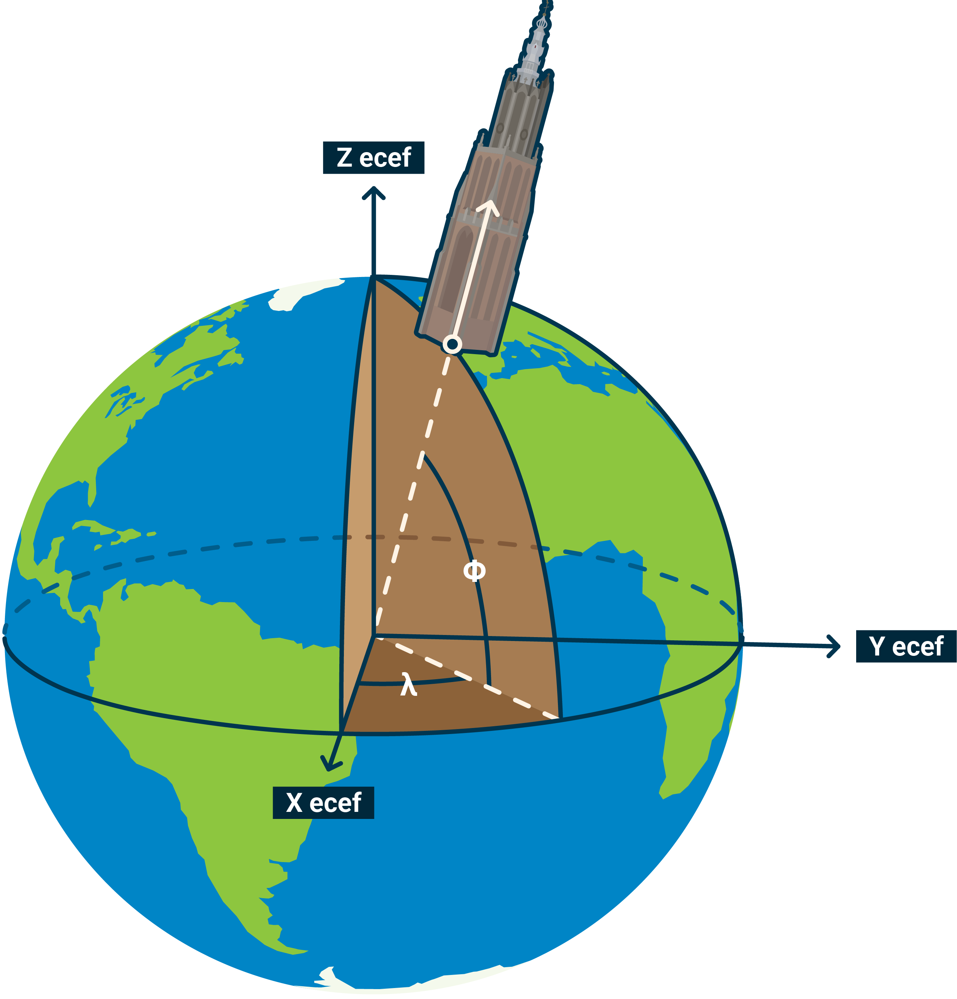
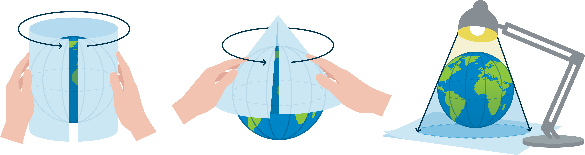
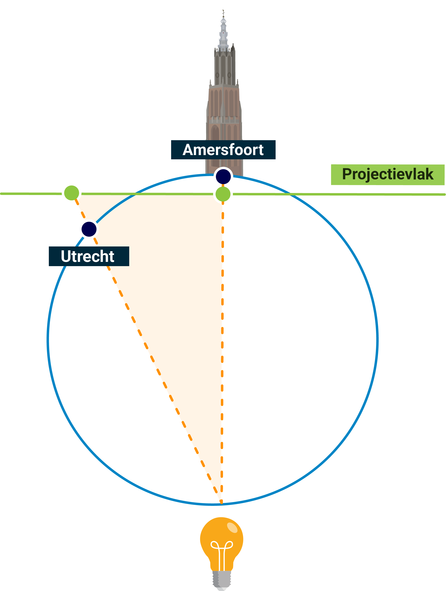
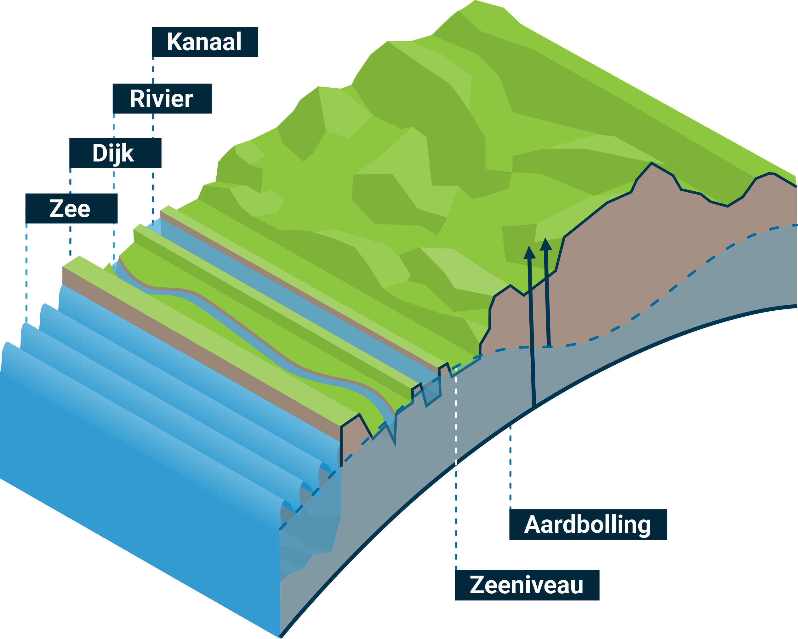
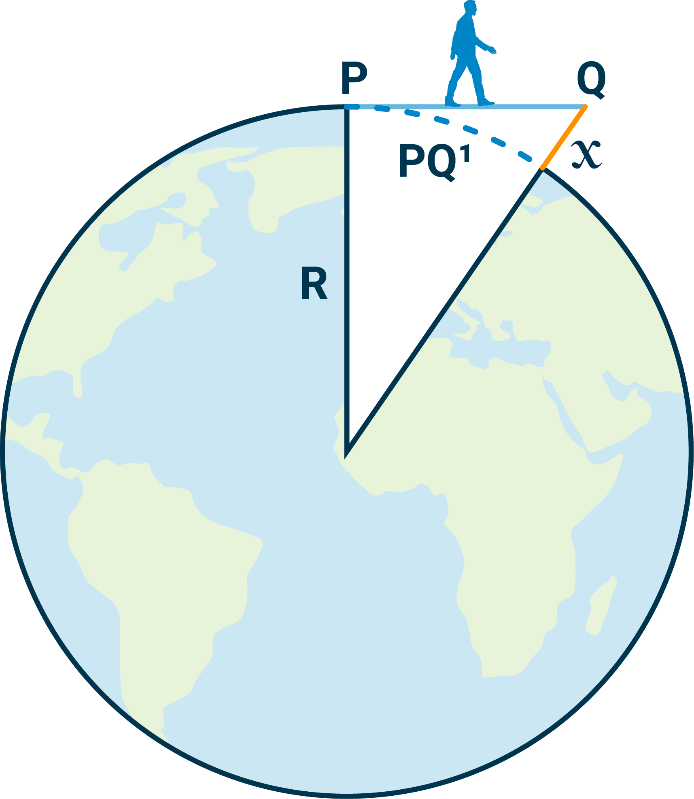
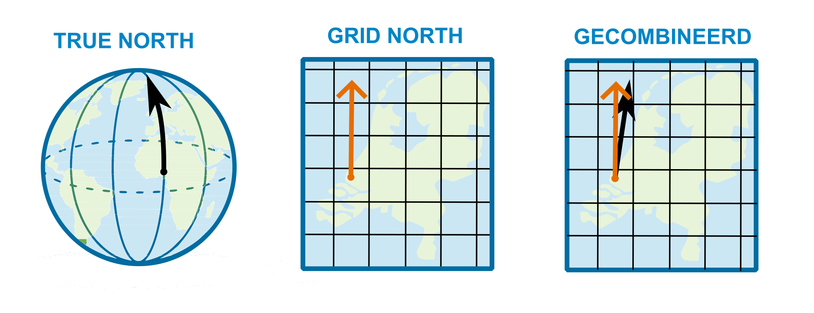
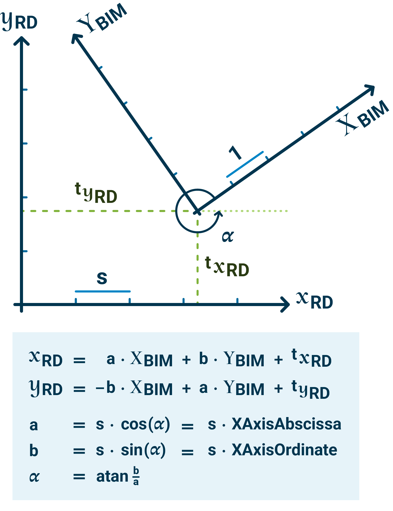
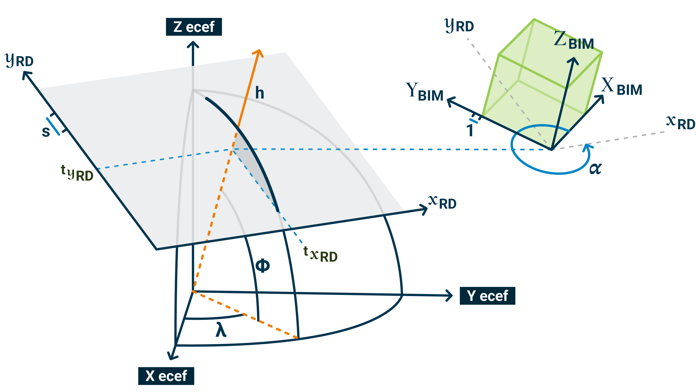

# Coördinaatreferentiesystemen en Coördinatentransformatie

Om informatie te koppelen aan een locatie op aarde worden geodetische coördinaatreferentiesystemen (CRS-en) gebruikt. In nederland worden meerdere CRS-en gebruikt, de <a>Geodetische CRS</a>-en die relevant zijn voor het georefereren van BIM in Nederland zijn opgenomen in onderstaande tabel:

<table>
  <caption>Relevante coördinatiesystemen voor het georefereren Geo en BIM in Nederland</caption>
  <thead>
    <tr>
      <th>Naam</th>
      <th>Omschrijving</th>
      <th>EPSG-code</th>
    </tr>
  </thead>
  <tbody>
    <tr>
      <td>RD</td>
      <td><a href="#geprojecteerd-crs">Geprojecteerd CRS</a> voor Nederland</td>
      <td>EPSG:28992</td>
    </tr>
    <tr>
      <td>NAP</td>
      <td><a href="#vertikaal-crs">Vertikaal CRS</a> (hoogte) voor Nederland</td>
      <td>EPSG:5709</td>
    </tr>
    <tr>
      <td>RDNAP</td>
      <td><a href="#samengesteld-crs">Samengesteld CRS</a> voor Nederland</td>
      <td>EPSG:7415</td>
    </tr>
    <tr>
      <td>ETRS89</td>
      <td><a href="#geografische-en-geocentrisch-crs">Geografisch CRS</a> voor Europa en precieze (centimeter niveau) plaatsbepaling in Nederland</td>
      <td>EPSG:4258 (2D-code)</td>
    </tr>
    <tr>
      <td>WGS 84</td>
      <td>Geografisch CRS voor de aarde en niet precieze (meter niveau) plaatsbepaling in Nederland, niet geschikt voor uitwisseling van data, alleen voor visualisaties</td>
      <td>EPSG:4326 (2D-code)</td>
    </tr>
  </tbody>
</table>

De <a>EPSG-code</a> is een unieke identificatie van het CRS binnen de zogenaamde EPSG-database, een wereldwijde verzameling van coördinaatsystemen en -transformaties.

Voor BIM-toepassingen wordt vaak gebruik gemaakt van een <a>Lokaal CRS</a>. Door een link te leggen tussen het lokale assenstelsel in BIM en een <a>geprojecteerd CRS</a> kan een BIM-model gebruikt worden in GEO/GIS systemen met zo min mogelijk verlies van data. Vanaf hier kan GIS/GEO-software gebruik maken van projecties en andere GIS-tools om het BIM model te projecteren in de wereld en hier aanvullende analyse op te doen. Het omzetten van het ene CRS naar het andere CRS wordt een <a>Coördinatentransformatie</a> genoemd.

Zoals hierboven aangegeven worden in Nederland meerder CRS-en gebruikt. Bij het gebruik van meerdere CRS-en bestaat risico op introductie van fouten door onjuiste implementatie van de relaties tussen CRS-en. Binnen Nederland worden aanbieders van data daarom geadviseerd om data aan te bieden in de verschillende CRS-en gericht op de eindgebruikers. Eindgebruikers worden juist geadviseerd data waar mogelijk op te vragen in hetzelfde CRS. Dit is ook een nadrukkelijke aanbeveling voor gebruikers van BIM-software. 

<aside class="note" title="Gebruik hetzelfde CRS">
  
**AANBEVELING** Vraag als eindgebruiker geodata waar mogelijk op in hetzelfde CRS

</aside>

De meeste BIM software is namelijk niet in staat om transformaties uit te voeren tussen verschillende geprojecteerde CRS'en. Wanneer GIS data dus naar BIM moet worden uitgewisseld is het belangrijk dat dit al geprojecteerd is in het coördinatensysteem dat de BIM Software verwacht. Afhankelijk van de BIM Software kan het zelfs nodig zijn te transformeren naar het lokale stelsel dat gebruikt wordt door de BIM software. Hier dienen binnen projecten duidelijke afspraken over gemaakt te worden.

<aside class="note" title="Maak vooraf afspraken over de te gebruiken CRS-en en transformatie">
  
**AANBEVELING** Maak afspraken met projectpartners over de te gebruiken CRS-en

</aside>

De volgende pargrafen gaan dieper in op de verschillende CRS-typen, de relaties tussen CRS-en die direct relevant zijn voor deze praktijkrichtlijn en introduceert de gangbare terminologie voor CRS-en. Voor nog gedetailleerdere informatie en adviezen wordt verwezen naar de [Handreiking Gebruik coördinaatreferentiesystemen bij uitwisseling en visualisatie van geo-informatie](https://docs.geostandaarden.nl/crs/crs/).

## Geodetische CRS-en

### Geografische en geocentrisch CRS

Geodetische CRS-en gebruiken een vereenvoudigd 3D-model van de aarde om locaties vast te leggen ten opzichte van het aardoppervlak. Het vereenvoudigd model is een omwentelingsellipsoïde (een afgeplatte bol). 
Coördinaten worden uitgedrukt in ellipsoïdsche breedte (&#981;), lengte (&lambda;) en hoogte (<i>h</i>) of rechthoekige coördinaten <i>X</i>, <i>Y</i> en <i>Z</i> ten opzichte van het middelpunt van de ellpisoïde. In onderstaande figuur zijn de hoeken en assen van de ellipsoïdische en rechthoekige coördinaten weergegeven.

<table>
  <caption>Componenten waarmee men coördinaten uit kan drukken</caption>
  <tr>
    <td>
      
<strong><i>Z</i>ecef</strong>: de rotatieas van de ellipsoïde vanaf de oorsprong

      
<strong><i>X</i>ecef</strong>: de as vanaf de oorsprong richting de nulmeridiaan in het equatorvlak loodrecht op de rotatieas

      
<strong><i>Y</i>ecef</strong>: de as vanaf de oorsprong loodrecht op de nulmeridiaan en de rotatieas

      
<strong><i>&#981;</i></strong>: de hoek die de loodlijn vanaf het oppervlak van de ellipsoïde maakt met het <strong><i>XY</i></strong>-vlak (= equatorvlak) 
      <mark>(let op: in dit plaatje is niet goed zichtbaar dat de loodlijn niet per se door het nulpunt hoeft te gaan)</mark>

      
<strong><i>&lambda;</i></strong>: de hoek met de nulmeridiaan

      
<strong><i>h</i></strong>: de hoogte boven de ellipsoïde

    </td>
    <td>
      <figure id="3D_CRS">
                
                <figcaption><a class="self-link" href="#fig-3D-CRS"></bdi></a>3D CRS</figcaption>
      </figure>
    </td>
  </tr>
</table>

<a>Ellipsoïdische coördinaten</a> worden ook wel geografische coördinaten genoemd, rechthoekige coördinaten worden ook wel <a>geocentrische coördinaten</a> genoemd.

### Geprojecteerd CRS

Om geo-informatie vanaf het gekromde aardoppervlak op een plat vlak weer te geven, worden kaartprojecties gebruikt. Veel gebruikte projectievlakken zijn een cilinderopperlvlak, kegeloppervlak en een plat vlak.

<figure id="Projecties">
   </a>
    <figcaption><a class="self-link" href="#fig-Projecties"></bdi></a>Projecties</figcaption>
</figure>

Elke <a>kaartprojectie</a> introduceert vervormingen in hoeken, afstanden en/of oppervlakten, omdat het onmogelijk is om het gekromde aardoppervlak af te beelden in een plat vlak en daarbij alle drie eigenschappen tegelijk exact te behouden. De keuze van een geschikte projectie hangt af van het doel van de kaart en welke eigenschappen het belangrijkst zijn voor de toepassing.

In Nederland wordt het geprojecteerde RD-stelsel gebruikt. Het RD-stelsel heeft als eigenschap dat hoeken onvervormd worden weergegeven en afwijkingen in afstanden en oppervlakte beperkt zijn binnen Nederland. Voor nauwkeurige toepassingen kan de variabele schaal van het RD-stelsel leiden tot lijnvergroting. Wanneer voor georeferentie een precisie van milimeters belangrijk is dient men een correctie $\Delta{\ell}$ van horizontale afstanden voor lijnvergroting mee te nemen. De formule om de toe te passen correctie  op werkelijke afstanden naar afstanden in het RD-stelsel te berekenen is: 
$$ \Delta \ell = -9,2 + \frac{(x_{RD}-155000)^2 + (y_{RD}-155000)^2}{1629 \cdot 10^{-9}} \text{ mm per 100 m} $$
waarbij:  $ x_{RD} $ en $ y_{RD} $ de gemiddelde RD-coördinaten in meter zijn van locatie van het BIM-project.
<table>
  <tr>
    <td>
      <figure id="RD_Projectie">
        </a>
        <figcaption><a class="self-link" href="#fig-RD-Projectie"></bdi></a>Een punt op het aardoppervlak (zwart) wordt op het RD-projectievlak geprojecteerd (groen) vanaf het punt diametraal tegenover Amersfoort. Waar het projectievlak binnen de ellipsoïde valt worden afstanden korter weergegeven dan in werkelijkheid, waar het projectievlak buiten de ellipsoïde valt worden afstanden langer weergegeven dan in werkelijkheid. Het maximale effect is 10 millimeter  per 100 meter op het vaste land.</figcaption>
      </figure> 
    </td>
    <td>
      <figure id="RD_Projectie">
         
        <figcaption><a class="self-link" href="#fig-RD-Projectie"></bdi></a>Correcties aan gemeten afstanden voor de RD-projectie inmm per 100m.</figcaption>
      </figure> 
    </td>
  </tr>
</table>

### Vertikaal CRS 

<a>Ellipsoïdische hoogte</a> heeft geen fysieke betekenis, het geeft de hoogte van een punt of object aan boven een vereenvoudigd model van de aarde. Orthometrische hoogtesystemen die een relatie hebben met zwaartekracht hebben wel een fysieke betekenis. Tussen punten met exact dezelfde <a>orthometrische hoogte</a> zal in theorie geen water stromen. De relatie tussen de orthometrische hoogte en ellipoidische hoogte wordt gevormd door een <a>quasi-geoïdemodel</a>. Een quasi-geoïdemodel geeft de hoogte van het referentievlak voor de orthometrische hoogte boven de ellipsoïde. Het orthometrische hoogte systeem voor Nederlands is het Normaal Amsterdams Peil (NAP).

Figuur ellips, geoide, aardoppervlak
<figure id="Ellips,_Geoide,_aardoppervlak">
  
  <figcaption><a class="self-link" href="#fig-Ellips,-Geoide,-aardoppervlak"></bdi></a>Ellips, Geoide, aardoppervlak</figcaption>
</figure> 

Het referentievlak voor de orthometrische hoogte volgt het zwaartekrachtveld en daarmee globaal de kromming van de aarde. Terwijl voor de horizontale component de kromming van het aardoppervlak vaak genegeerd kan worden, geldt die niet voor de vertikale component. Onderstaande figuur illustreert afwijkingen bij het verwaarlozen van de aardkromming voor de afstand en het hoogteverschil tussen punten P en Q. Bij het verwaarlozen van de aardkromming snijden de lijn RQ en de raaklijn aan de ellips vanuit P elkaar in het punt Q. <mark>De werkelijke afstand PQ over het aardoppervlak is korter dan de afstand PQ', op een afstand van 10 kilometer is het verschil echter slecht 1 centimeter.</mark> Punt P en Q hebben beide dezelfde hoogte ten opzichte van het aardoppervlak, punt Q'ligt echter x meter boven het aardoppervlak. Het hoogteverschil is 10 meter bij 10 km of 1 cm bij 400 meter.
<figure id="Afwijking_van_aardkromming">
  
  <figcaption><a class="self-link" href="#fig-Afwijking-door-aardkromming"></bdi></a>Afwijking door aardkromming</figcaption>
</figure> 

### Samengesteld CRS

Een CRS dat bestaat uit de combinatie van CRS-en, bijvoorbeeld een geprojecteerd CRS en een verticaal CRS, noemen we een <a>Samengesteld CRS</a>. Een <a>Coördinatentransformatie</a> van of naar een samengesteld CRS wordt afzonderlijk uitgevoerd. Bijvoorbeeld voor de transformatie van 3D geografische ETRS89 naar het samengestelde RDNAP, wordt apart van ETRS89 naar RD en apart van ETRS89 naar NAP getransformeerd. Samengestelde CRS-en in Nederland die relevant zijn voor BIM-modellen zijn:
* RDNAP (EPSG:7415), de samenstelling van geprojecteerd RD (EPSG:28992) en het verticale CRS NAP (ESPG:5709).
* ETRS89 + NAP height (EPSG:9286), de samenstelling van geografisch 2D ETRS89 *EPSG:4258 en het verticale CRS NAP (ESPG:5709).

## Lokaal CRS

Een <a>lokaal CRS</a> is een arbitrair gekozen assenstelsel. De oorsprong, de oriëntatie en het vertikale referentievlak van het stelsel worden gekozen op basis van praktische overwegingen <mark>en kan voordelen hebben bij bepaalde 3D modeleer software (BIM) <i> is dat zo</i></mark>. <mark> Sommige applicaties voorzien ook alleen in een lokaal assenstelsel om in te modelleren</mark> Dit kan project afhankelijk zijn, bijvoorbeeld een hoekpunt, voorgevel en begane grond van een gebouw. De eenheden zijn vaak in meters of millimeters. Er is geen directe relatie met de echte wereld tenzij er een coördinatentransformatie wordt toegepast.

### Benadering van RD in lokaal CRS

In sommige software pakketen zoals AutoCAD is het gebruikelijk om met het lokale stelsel het RD-stelsel en het NAP-niveau te benaderen, bijvoorbeeld door het gebruik van bekende punten of door de oorsprong te verschuiven. AutoCAD gaat er alleen niet bewust mee om dat dit RD-coördinaten en NAP-hoogten zijn. Wat de software betreft is dit een lokaal stesel zonder verdere betekenis en worden de aardkromming, zwaartkeracht en eigenschappen van de kaartprojectie, zoals de locatieafhankelijke schaalfactor en gridcorrecties, niet toegepast. De link tussen de lokale coördinaten en het geprojecteerd CRS is in dit geval dat coördinaten bij benadering overeen komen (Xbim &cong; xRD, Ybim &cong; yRD, Zbim &cong; HNAP).

### True North, Grid North, Project North

Soms wordt de relatie van het lokale CRS ten opzicht van het Noorden gegeven. In de BIM-sector worden de termen <a>True North</a>, <a>Grid North</a> en <a> Project North </a> gebruikt om de relatie met de oriëntatie van een geodetisch CRS aan te geven. Deze hebben afhankelijk van het type CRS de volgende betekenis.

* CRS obv ellipsoïde: true north is in de richting van de rotatie as van de ellipsoïde (<i>Z</i>ecef in eerdere figuur)
* CRS obv projectie: true north is in de richting noorden van geprojecteerde stelsel vaak de Y-as of Northing-as, ook wel grid north genoemd.

<figure id="True_North_en_Grid_North">
   
  <figcaption><a class="self-link" href="#fig-True-North-en-Grid-North"></bdi></a>True North en Grid North</figcaption>
</figure>

* Het Project North is normaliter gebaseerd op de voornaamste as van het bouwwerk. Het beïnvloedt hoe je schetst in views in software en hoe views op tekenbladen worden geplaatst.Het Project North richt zich vaak richting de bovenkant van een tekengebied. Dit vereenvoudigt het modelleren. 

<figure id="Project_North">
   
  <figcaption><a class="self-link" href="#fig-Project-North"></bdi></a>Project North</figcaption>
</figure> 

## Coördinatentransformatie tussen lokaal CRS en geodetisch

De coördinatentransformatie tussen lokaal CRS een geodetisch CRS en een wordt, binnen de huidige BIM-standaarden, apart gegeven voor de horizontale en de vertikale component. Dit is dus hetzelfde als voor transformaties van samengestelde CRS-en.

<aside class="note" title="Aparte Horizontale en Vertikale coördinatentransformatie">
  
**AANBEVELING** Gebruik aparte transformaties voor de horizontale en vertikale componenten. Dit betekent één 2D transformatie voor het horizontale vlak en één 1D transformatie voor het verticale vlak resulteert in een 3D transformatie.

</aside>

### Horizontaal - 2D gelijkvormigheidstransformatie

De relatie tussen het lokale CRS en een geprojecteerd CRS wordt gelegd via een <a>2D gelijkvormigheidstransformatie</a> (ook wel <a>2D Helmert transformatie genoemd</a>).

<table>
  <tr>
    <td>
    <figure id="2D gelijkvormigheidstransformatie">
      
    <figcaption><a class="self-link" href="#fig-Relatie-GeoBIM"></bdi></a>Relatie GeoBIM</figcaption>
    </figure> 
    </td>
  </tr>
  <tr>

  <td>
  2D relatie tussen geprojecteerd CRS en lokaalstelselsel. Parameters voor de 2D gelijkvormighedistransformatie zijn translaties (tx, ty), schaal (s) en rotatie (alpha). Er is een eenduidige relatie tussen de parameters rotatiehoek (alpha) en de inIFC/BIM gebruikte termen XAxisAbscissa (cos(alpha)) en XAxisOrdinate (sin(alpha)).
  </td>
  </tr>
</table>

De parameters voor de 2D gelijkvormigheidstransformatie kunnen worden berekend wanneer van minimaal 2 punten de coördinaten bekend zijn zowel in het geprojecteerde en het lokale CRS. Wanneer voor meer dan 2 gemeenschappelijke punten de coördinaten in beide stelsels beschikbaar zijn, kunnen de parameters worden berekend met behulp van een <a>kleinste kwadratenschatting</a>. Door de <a>overbepaaldheid</a> kan dan ook worden getoetst op eventuele fouten in de coördinaten van één van de punten in een van de stelsels. De toetsing kan bijvoorbeeld door naar de grote van de sluitvectoren/residuen van de gebruikte punten te kijken of, zoals gebruikelijk in de landmeetkunde, een statistische toetsting uit te voeren.

### Vertikaal - vast hoogteverschil

Voor de relatie tussen vertikale referentievlakken is het uitgangspunt in de huidge standaarden dat de relatie is vast te leggen via een vast hoogteverschil.

<table>
  <tr>
    <td>
    <figure id="Horizontale en vertikale_transformatie">
      
          <figcaption><a class="self-link" href="#fig-2D-Transformatie"></bdi></a>2D Transformatie</figcaption>
    </figure>
    </td>
  </tr>
  <tr>
  <td>
  Relatie tussen geografisch, geocentrisch en geprojecteerd CRS en lokaalstelselsel voor horizontaal (2D) en verikaal (hoogte). Parameters voor de 2D gelijkvormighedistransformatie zijn translaties (tx, ty), schaal (s) en rotatie (alpha). Er is een eenduidige relatie tussen de parameters rotatiehoek (alpha) en de inIFC/BIM gebruikte termen XAxisAbscissa (cos(alpha)) en XAxisOrdinate (sin(alpha)). Voor de hoogte is er een vast hoogteverschil, de parameter tH</a>.
  </td>
  </tr>
</table>

