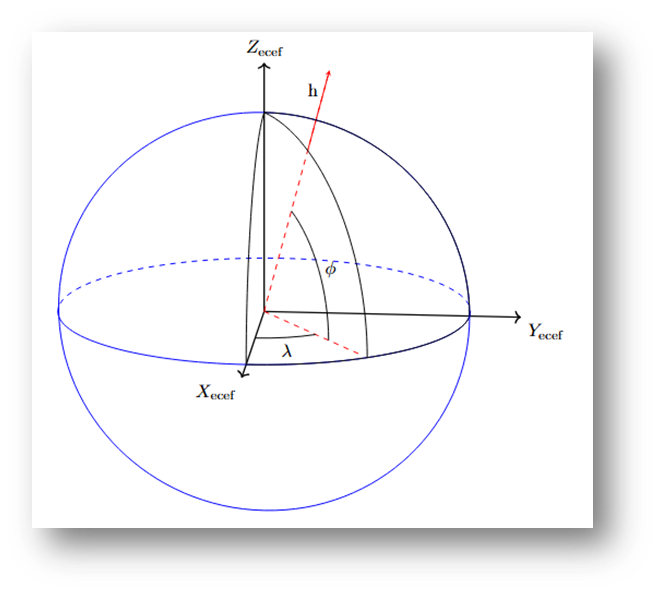
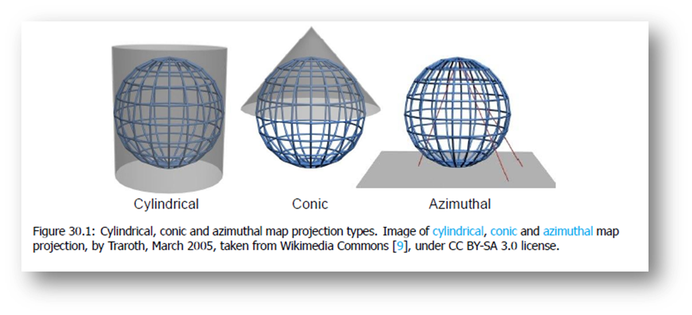
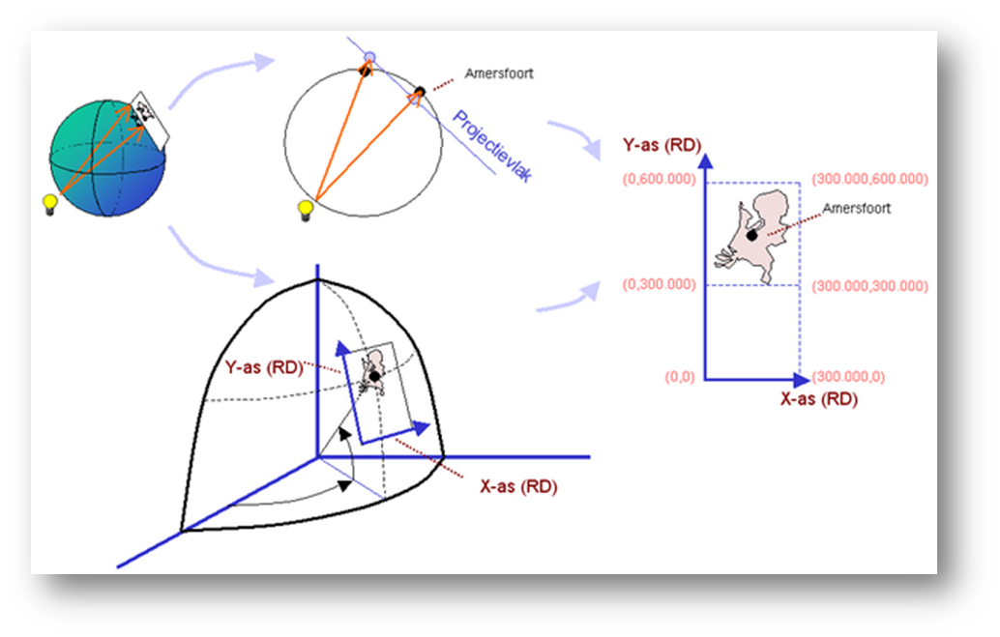
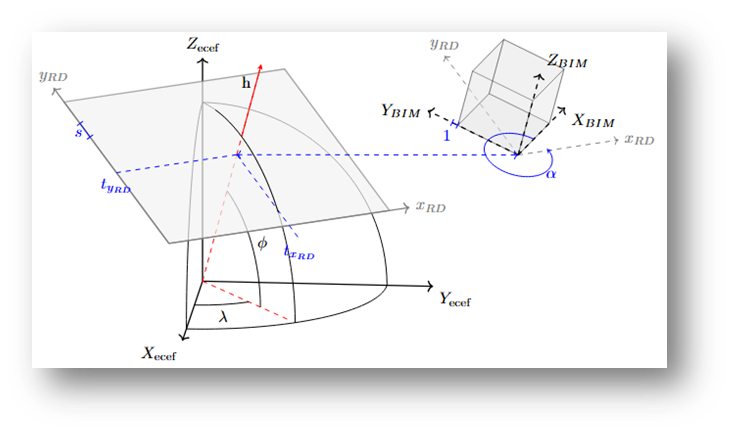

## Coördinaatreferentiesystemen
Om informatie te koppelen aan een locatie op aarde worden geodetische coördinaatreferentiesystemen gebruikt. Geodetische CRS-en die relevant zijn voor het georefereren van BIM zijn:

* RD ([geprojecteerd CRS](#geprojecteerd-crs) voor Nederland)
* NAP ([vertikaal CRS](#vertikaal-crs) (hoogte) voor Nederland)
* RDNAP ([samengesteld CRS](#samengesteld-crs) voor Nederland)
* ETRS89 ([Geografisch CRS](#geografische-en-geocentrisch-crs) voor Europa en precieze (centimeter niveau) plaatsbepaling in Nederland)
* WGS 84 (Geografisch CRS voor de aarde enniet precieze (meter niveau) plaatsbepaling in Nederland, niet geschikt voor uitwisseling van data alleen voor visualisaties)

Binnen BIM wordt vaak gebruik gemaakt van [lokale CRS-en](#lokaal-crs). 

Dit hoofdstuk geeft een introductie op de verschillende typen CRS en de relaties.

### Geodetische CRS-en
#### Geografische en geocentrisch CRS
Geodetische CRS-en gebruiken een vereenvoudigd 3D-model van de aarde om locaties vast te leggen ten opzichte van het aardoppervlak. Het vereenvousdigd model is een omwentelings ellipsoide (een afgelplatte bol). Coördinaten worden uitgedrukt in ellipsoïdsche breedte ($\varphi$), lengte ($\lambda$) en hoogte ($h$) of rechthoekige coördinaten $X$, $Y$ en $Z$ ten opzichte van het middelpunt van de ellpisoïde. [REF starng van hees?]. Hierbij zijn

<table>
  <tr>
    <td>
      <table>
        <tr><td>$Z$: de rotatieas van de ellipsoïde vanaf de oorsprong</td></tr>
        <tr><td>$X$: de as vanaf de oorsprong richting de nulmeridiaan in het equatorvlak loodrecht op de rotatieas</td></tr>
        <tr><td>$Y$: de as vanaf de oorsprong loodrecht op de nulmeridiaan en de rotatieas</td></tr>
        <tr><td>$\varphi$: de hoek die de loodlijn vanaf het oppervlak van de ellipsoïde maakt met het $XY$-vlak (= equatorvlak) (let op in dit plaatje is niet goed zichtbaar dat de loodlijn niet per se door het nulpunt hoet te gaan)</td></tr>
        <tr><td>$\lambda$: de hoek met de nulmeridiaan</td></tr>
        <tr><td>$h$: de hoogte boven de ellipsoïde</td></tr>
      </table>
    </td>
    <td>
      
    </td>
  </tr>
</table>

Ellipoïdische coördinaten worden ook wel geografische coördianten genoemd, rechthoekige coördinaten worden ook wel geocentrische coördinaten genoemd.

#### Geprojecteerd CRS
Om geo-informatie op een plat vlak weer te geven, worden kaartprojecties gebruikt. Veel gebruikte projectievlakken zijn een cilinderopperlvlak, kegeloppervlak en een plat vlak.

PLAATJE TER ILLUSTRATIE, MOOIER OM ANDER PLAATJE TE MAKEN
<a href="https://books.open.tudelft.nl/plugins/generic/pdfJsViewer/pdf.js/web/viewer.html?file=https%3A%2F%2Fbooks.open.tudelft.nl%2Fhome%2Fcatalog%2Fdownload%2F163%2F281%2F530%3Finline%3D1#page=301">
Bron: Tiberius et. al.

Elke kaartprojectie introduceert vervormingen in hoeken, afstanden en/of oppervlakten, omdat het onmogelijk is om het gekromde aardoppervlak af te beelden in een plat vlak en daarbij alle drie eigenschappen tegelijk exact te behouden. De keuze van een geschikte projectie hangt af van het doel van de kaart en welke eigenschappen het belangrijkst zijn voor de toepassing.

het nederlandse RD-stelsel dubbelporjectie bla bla
DIT PLAATJE OOK ANDERE VERSIE VAN MAKEN
<a href="https://commons.wikimedia.org/wiki/File:Het_RD_co%C3%B6rdinaten_stelsel_opgehangen_aan_het_geografische_co%C3%B6rd_stelsel.PNG">
Bron: Wikimedia
</a>

#### Vertikaal CRS 
Figuur ellips, geoide, aardoppervlak
DIT PLAATJE GEEFT HET IDEE

Figuur afwijking hoogte: horizontaal PQ-PQ' 1 cm bij 10 km, verticaal 10 meter bij 10 km of 1 cm bij 400 meter
DIT PLAATJE GEEFT HET IDEE

#### Samengesteld CRS

* geprojecteerd + hoogte  (RDNAP)
* geografisch 2D + hoogte (ETSR89_NAP)

### Lokaal CRS
Een lokaal CRS is een arbitrair gekozen assenstelsel. Het nulpunt en de oriëntatie worden gekozen op basis van praktische overwegingen (bijv. een hoekpunt en voorgevel van een gebouw), de eenheden zijn vaak in meters of millimeters. Er is geen directe relatie met de echte wereld tenzij er een coördinaattransformatie wordt toegepast. 

### Relatie geodetisch CRS en lokaal CRS

De relatie tussen het geprojecteerde CRS en het lokale CRS kan worden gelegd via een 2D gelijkvormigheidstransformatie (ook wel 2D Helmert transformatie genoemd).

<table>
  <tr>
    <td>
      
    </td>
    <td>
      
    </td>
  </tr>
  <tr>
  <td>
  3D relatie tussen geografisch, geocentrisch en geprojecteerd CRS en lokaalstelselsel. Paramters voor de 2D gelijkvormighedistransformatie zijn translateies (t), schaal (s) en rotatie (alpha)
  </td>
  <td>
  2D relatie tussen geprojecteerd CRS en lokaalstelselsel. Parameters voor de 2D gelijkvormighedistransformatie zijn translateies (t), schaal (s) en rotatie (alpha). Er is een eenduidige relatie tussen de parameters rotatiehoek (alpha) en de inIFC/BIM gebruikte termen XAxisAbscissa (cos(alpha)) en XAxisOrdinate (sin(alpha))
  </td>
  </tr>
</table>

De parameters voor de 2D gelijkvormigheidstransformatie kunnen worden berekend wanneer van minimaal 2 punten de coördinaten bekend zijn in het geprojecteerde en het lokale CRS. De parameters kunnen worden berekend met behulp van een kleinste kwadratenschatting, wanneer voor meer dan 2 gemeenschappelijke punten de coördinaten in bedie stelsels beschikbaar zijn, kan door de overbepaaldheid worden getoetst op eventuele fouten in de coördinaten van 1 van de punten in een van de stelsels. De toetosing kan bijvoorbeeld door naar de  grootte sluitvectoren/resiuden te kijken of, zoals gebruikelijk in de landmeetkunde, een statistische toetsting uit te voeren. De overbepaalde gelijkvormigheidstransformatie tussen een bron- en een doelstelsel word ook wel eens een Helmert-transformatie genoemd, het model van de Helmert-transformatie is een [speciaal geval van de gelijkvormigsheidtransformatie](https://www.kadaster.nl/documents/1953498/2914454/Handleiding_Technische+Werkzaamheden+Kadaster+%28HTW%29.pdf/#page=193) waarbij:

* de coordinaten van de gemeenschappelijke punten in het bronstelsel geen onzekerheid hebben en dus exact bekend worden verondersteld
* de onzekerheid van de coordinaten van de gemeenschappelijke punten allemaal gelijk zijn en er geen correlatie is tussen de coordinaten

Hoewel deze aannames niet altijd realistisch zijn geeft het model van de Helmert transformatie een eenvoudige manier om de parameters te berekenen met lineaire vergelijkingen.

#### True North, Grid North

* CRS obv ellipsoide: true north is in de richting van de rotatie as van de ellipsoïde ($Z_ecef$ in eerdere figuur)
* CRS obv projectie: true north is in de richting noorden van geprojecteerde stelsel vaak de Y-as of Northing-as, ook wel grid north genoemd.

### Coördinaattransformatie, datumtransformatie en coördinaatconversie

ELEMENTEN VAN ONDERSTAANDE OPNEMEN IN BOVENSTAANDE

Bij het gebruik van meerdere CRS-en bestaat risico op introductie van fouten door onjuiste implementatie van de relaties tussen CRS-en. Eindgebruikers worden geadviseerd data waar mogelijk op te vragen in hetzelfde CRS.

Aanbieders van data worden geadviseerd om data aan te bieden in de verschillende CRS-en gericht op de eindgebruikers. Hierbij is het advies zo nauwkeurig mogelijk te transformeren, omdat het niet altijd duidelijk is wie de eindgebruiker is.

Wanneer voor opslag, uitwisseling en/of visualisatie andere CRS-en worden gebruikt zijn er een aantal aandachtspunten, de belangrijkste zijn:

Voorkom dat te grote geometrische of topologische verschillen ontstaan
Maak gebruik van een eenduidige coördinaatransformatie (en leg dit vast)

bron: https://docs.geostandaarden.nl/crs/crs/

### Gebruik CRS in GEO en BIM

In GEO wordt dus gebruik gemaakt van geodetische CRS-en, terijl bij BIM in een lokaal (XYZ) coordinatenstelsel gewerkt. Afhankelijk van het project wordt bepaald waar de oorsprong van het XYZ stelsel ligt. Er wordt meestal een oorsprong gekozen relatief dicht bij het te bouwen object. Dit is wenselijk voor het toepassen van 3D modeleer software.

### BIM naar GIS/GEO

Zoals hierboven beschreven komt de werkwijze van een geprojecteerd CRS overeen met de werkwijze in BIM. Beide maken gebruik van het XYZ Stelsel. Door een link te maken tussen het lokale coordinaten stelsel in BIM en een geprojecteerd CRS kan een BIM model verder gebruikt worden in GEO/GIS systemen met zo min mogelijk verlies van data. Vanaf hier kan GIS/GEO software gebruik maken van projecties en andere GIS tools om het BIM model te projecteren in de wereld en hier aanvullende analyse op te doen.

Hierbij moet wel aandacht besteed worden aan de onderstaande punten
- De oorsprong van het BIM coordinatenstels moet dicht bij de geometrie liggen zodat gridcorrecties beperkte inmpact hebben
- Er treed een onnauwkeurigheid op van ??mm per m tussen de oorsprong en het verste punt in het model *TODO, is dit waar?*

In sommige software pakketen zoals AutoCAD is het gebruikelijk wel op RD-coordinaten te werken. AutoCAD is alleen zelf niet bewust dat dit RD-coordinaten zijn. Wat de software betreft is dit een lokaal stesel zonder verdere betekenis. De link tussen de lokale coorditen en het geprojecteerd CRS is in dit geval X~bim~ = X~gis~, Y~bim~ = Y~gis~, Z~bim~ = Z~gis~

### GIS/GEO naar BIM

De meeste BIM software is niet instaat translaties uit te voeren tussen verschillende geprojecteerde CRS'en. Wanneer GIS data dus naar BIM moet worden uitgewisseld is het belangrijk dat dit al geprojecteerd is in het coordinatensysteem wat de BIM Software verwacht. Afhankelijk van de BIM Software kan het zelf nodig zijn te transleren naar het lokale stelsel wat gebruikt wordt door de BIM Software. Hier dienen duidelijk afspraken over gemaakt worden.