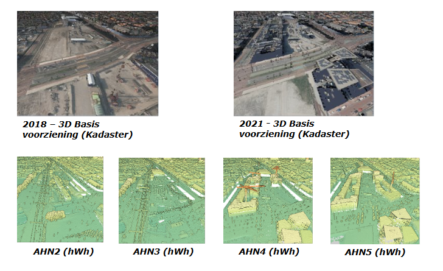

# Methodes van Georeferentie

Er zijn verschillende methodes beschikbaar om een BIM en GEO modellen bij elkaar te brengen op de kaart. Deze methoden verschillen in nauwkeurigheid en mogelijkheid voor het bijeenbrengen van modellen. Dit wordt door Clemen Christian beschreven als Levels van georefereren [[Christian2019]].

Het is mogelijk om een BIM-model op de kaart te zetten door alleen het adres van waar het BIM-model dient te komen te duiden. Deze informatie geeft een indicatie van waar het model moet komen. De informatie is niet toereikend om het model exact te plaatsen, roteren en schalen. Een andere methode zoals het model plaatsen in een officieel coordinatenstelsel is hiervoor wel geschikt. Afhankelijk van de behoefte zijn verschillende methodes geschikt.

De beschikbaarheid van informatie voor het berekenen van georeferentie-parameteres voor de verschillende methoden is onderzocht door de TU Delft. [[Hakim2024]] 

| Methode                                                   | Plaatsing     |  Rotatie      | Schaal        |
| -------------------------------------------------------   | ------------- | ------------- | ------------- |
| Benoemen van locatie                                      | Niet mogelijk | Niet mogelijk | Niet mogelijk | 
| Punt op de kaart zetten                                   | Mogelijk      | Niet mogelijk | Niet mogelijk |
| Locatie koppelen aan één element in het model             | Mogelijk      | Eventueel mogelijk | Niet mogelijk |
| Locatie koppelen aan geheel model en noorden aangeven     | Mogelijk      | Eventueel mogelijk | Niet mogelijk |
| Het model plaatsen in een officieel coördinatenstelsel    | Mogelijk      | Mogelijk              | Mogelijk |
| Het afspreken van controlepunten tussen BIM, Bouw en GEO  | Mogelijk      | Mogelijk | Mogelijk |

## 1D 2D en 3D Geo en BIM modellen

Zowel BIM- als GEO-modellen kunnen een 1D, 2D als 3D coordinatenstelsel gebruiken. Om een juiste  

Een GEO coordinatenstelsel kan 3D (EPSG:7415), 2D (EPSG:28992) of 1D (EPSG:5709) zijn. 

| Van           | Naar      |  Mogelijkheid | 
| -----------   | -------   | ------------- |
| 2D BIM        | 2D GEO    | ... | 
| 2D BIM        | 3D GEO    | ... | 
| 3D BIM        | 2D GEO    | ... | 
| 3D BIM        | 3D GEO    | ... | 

## Het hoogtecomponent 
Het planimetrische- en hoogte-component in een geo-databestand is een fundamenteel onderdeel van de dataset. Afwijkingen in deze informatie of verschillen tussen diverse momenten van inwinning of ontwerp kunnen een grote impact hebben. Het correct refereren van het bestand ten opzichte van deze as is daarom essentieel om de juiste stappen te kunnen nemen.

Twee definities zijn hierbij van belang: het lokale en het globale coördinatensysteem. Zoals eerder omschreven, wordt een BIM-model in de toegewezen softwarepakketten vaak in een 0,0,0-referentiesysteem geplaatst. Daarentegen bevatten globale coördinaten grotere waarden, wat ertoe kan leiden dat een dataset vastloopt binnen een applicatie. De documentatie van het gebruikte coördinatensysteem is eveneens cruciaal. Wanneer dit systeem niet correct is vastgelegd, kunnen er problemen ontstaan tijdens de conversie van de hoogtecomponent.

Zelfs als het planimetrische component correct is gerefereerd binnen het bestand, kan er nog steeds een fout in de hoogte voorkomen. Afhankelijk van de wijze waarop het model is opgebouwd, zijn er verschillende benaderingen mogelijk om de hoogtecomponent te refereren.

Er kunnen drie methoden worden onderscheiden waarmee het altimetrische component van het model gerefereerd kan worden:

1. gebruik van survey points in combinatie met de Helmert-transformatie,
2. scan-to-BIM, en
3. geautomatiseerde footprint alignment.

### Kwaliteits kenmerken
Voor het gebruik van een dataset uit het GiS domein zijn er verschillende kenmerken die van belang zijn voor het gebruik binnen een BIM systeem. Niet iedere data is even geschikt om gebruikt te kunnen worden. Om een stap terug te nemen zijn puntenwolken vaak de basis voor veel inwinningen die ook gekoppeld zijn aan BIM modelen. Vanuit de onderzoeken en inniatieven [Bron: IHN/Geonuvmn/DigiGo] kunnen de volgende primaire componenten meegenomen worden:
1. Geografisch distributie van de punten in een puntenwolk;
   Hoeveel punten zijn er beschikbaar in de dataset, en wat is de afstand tussen deze punten? Deze primaire component is direct gekoppeld aan het opstellen van een BIM-model. Hoe meer punten er per oppervlak aanwezig zijn, hoe kleiner de onderlinge afstand wordt, en hoe beter er onderscheid gemaakt kan worden tussen de verschillende objecten. In de praktijk is een hoge puntdichtheid gekoppeld aan een hoger detailniveau van het 3D-model.
3. De absolute en relative nauwkeurigheid van een geo datatset;
4. De classificatie parameters in een geo-dataset.
Daarnaast is de leeftijd van de dataset van belang, aangezien iedere geodataset die wordt weergegeven in een GiS omgeving een moment opname is. Het is nooit het daadwerkelijke realiteit, maar een benadering van de omgeving. Hierdoor kan een omgeving sterk of minder sterk zijn veranderden over tijd van zoals weergegeven in de onderstaande figuren. Waarbij de stations regio van delft is weergeven in het AHN (HwH) en de 3D basis voorziening (kadaster).

### Hoogte nauwkeurigheden
Het refereren van modellen aan de hand van deze drie opties is in alle gevallen afhankelijk van de betrouwbaarheid van het model zelf. Er zijn verschillende datasets beschikbaar die gebruikt kunnen worden voor het positioneren van de hoogtecomponent. Daarnaast zijn er in Nederland ook verschillende mogenlijkheden voor het gebruik van een coördinatensysteem, wordt er een nieuwe fout geïntroduceerd. Deze fout kan variëren in grootte, van enkele centimeters tot meerdere meters.

Bijvoorbeeld: bij het gebruik van het Actueel Hoogtebestand Nederland (AHN) is er een systematische fout aanwezig in de hoogtecomponent. Voor 95% van de punten bedraagt deze afwijking circa 8 cm ten opzichte van de werkelijkheid. Dit houdt in dat het model in de hoogte al een afwijking van 8 cm kan vertonen wanneer deze dataset wordt toegepast.

### Refereren aan de hand van het hoogtecomponent
Als de planimetrische componenten van de dataset op juiste plek liggen, is het nog steeds van belang om het hoogte component op de juiste manier te referen. Net als het planimetrische component kan de helmert transformatie [BuildingSMART et al. (2020)] en benchmarks gebruikt worden om het de geo data op de juiste plek te krijgen binnen de BIM omgeving. Zie voor de verder uitwerking van de helmert transformatie [PAGINA]. 
De benchmarks kunnne gezien worden als aanknopings punten, die stabiel zijn in het terrein. Hiervoor kan de landmeter een specifiek punt hebben ingewonnen, de gebruiker gebruikt een externe dataset of gebruikt stabiele punten die zowel beschikbaar zijn in het BIM model als de Geo dataset. Hieronder wordt gekeken naar welke "stabiele" punten er beschikbaar zijn:

*Vaste meetpunten in RDNAP*
Voor kleine netwerken worden vaste meetpunten op plekken waarvan met een bepaalde zekerheid gezegd kan worden dat deze niet verstoord of weg kunnen gaan. De meetpunten worden in XYZ bepaald. De bepaling in XY wordt door middel van GNSS uitgevoerd met een nauwkeurigheid van 2-3cm. Er kan gekozen worden om de meetpunten direct via GNSS te bepalen indien dit mogelijk is. Wanneer dit niet mogelijk is, bv als de meetpunten in de muur/wand zitten, worden er tijdelijke punten gemaakt en via tachymetrie de XY bekend gemaakt. Door middel van waterpassing wordt de hoogte (Z) in mm nauwkeurigheid bepaald.

Bij het verwerken van lange netwerken kan er gekozen worden voor referentievelden, deze wordt op dezelfde manier bepaald, maar alleen via GNSS aan elkaar gekoppeld in XY. Voor de hoogte kan een waterpassing uitgevoerd worden per veld.
Het geodetisch netwerk wordt gebruikt om een puntenwolk te geo-refereren, hiervan wordt een BIM model gemaakt. Er kan een controle uitgevoerd worden door de coördinaten en het BIM model te vergelijken.

*Noklijnen*
Uit het IHN-project is gebleken dat er in Nederland belangrijke methoden beschikbaar zijn om data die niet zijn gerefereerd of die geen 3D-informatie bevatten, te koppelen aan bestaande referentiesystemen. Hiervoor kan bijvoorbeeld gebruik worden gemaakt van noklijnen die zijn geëxtraheerd uit het Actueel Hoogtebestand Nederland (AHN). [source: https://www.ahn.nl/integrale-hoogtevoorziening-nederland]
Deze methode, vrij beschikbaar via de dataroom van het AHN, maakt het mogelijk om de beschikbare noklijnen binnen het projectgebied te gebruiken als referentie voor het positioneren van het model ten opzichte van de GIS-laag.
Een aandachtspunt is echter dat deze datasets beschikbaar zijn in GPKG-formaat, waardoor de gebruiker de data handmatig moet converteren naar een DWG-bestand om deze binnen gangbare BIM-software te kunnen gebruiken.

*Straatmeubilair*
Omdat een ingewonnen weg vaak geen woningen bevat, is het gebruik van noklijnen beperkt voor de hoogteregistratie in infrastructurele BIM-modellen buiten stedelijke gebieden. In dergelijke gevallen kan straatmeubilair worden gebruikt, zoals wegmarkeringen, kantverharding of objecten met een duidelijk herkenbare vorm.
Datasets die hierbij van cruciaal belang zijn, zijn het DTB (Digitaal Topografisch Bestand) en het AHN (Actueel Hoogtebestand Nederland). Deze datasets bevatten informatie in 2.5D, wat betekent dat er slechts één hoogtecomponent per coördinaat beschikbaar is. De waarde van dit hoogtecomponent varieert per objecttype. Daarom is het raadzaam om bij grote infrastructuurprojecten het handboek van het DTB te raadplegen. Er wordt onderscheid gemaakt van objecten met een hoge prioriteit en met lage. Dit kan een nauwkuerigheids verschil opleveren tussen de YY cm en ZZ cm. 
In de onderstaande figuur is een BIM-model weergegeven in combinatie met het DTB, waarbij de wegmarkeringen in dit geval goed op elkaar aansluiten. Deze overeenkomst kan worden gebruikt om het hoogtecomponent te realiseren, mits het planimetrische vlak reeds correct is vastgesteld.
Het AHN of een andere puntenwolk in de omgeving kan hiervoor eveneens worden gebruikt. Dit komt doordat de intensiteit, die de basis vormt van een puntenwolk, significant lager is op de weg dan op het omliggende meubilair. Daardoor is het vinden van deze objecten eenvoudiger en kunnen zij gemakkelijk uit de dataset worden geëxtraheerd.

# Georeferentie in uitwisseling
# IFC
- IfcPostalAddress
- IfcSite RefLatitude RefLongitude RefElevation
- IfcAxis2Placement3D
- IfcGeometricRepresentationContext
- IfcMapConversion 
- Het gebruik van generic property sets voor 

- IFC 5 (JSON?)
IFC 5 maakt gebruik van USD-formaat (Universal Scene Description), voor geometrie, bijvoorbeeld usdgeom::mesh – veelhoekig oppervlaktemodel.

calculated transformation parameters could may be stored -without extending IFC schema- through generic property sets

- IFC 5 (JSON?)
IFC 5 maakt gebruik van USD-formaat (Universal Scene Description), voor geometrie, bijvoorbeeld usdgeom::mesh – veelhoekig oppervlaktemodel.

# DXF
De objecten in de DXF worden getekend in een coördinatenruimte die matcht met een geprojecteerd CRS (zoals EPSG:28992 of EPSG:3857).

De coördinaten zijn dan in meters, zoals in GIS.

Voorbeeld: een lijn van (110000, 450000) naar (110500, 450500) is dan correct gepositioneerd in RD-coördinaten.

Maar: het DXF-bestand zelf bevat geen metadata die zegt: "dit is RD-coördinaten".

| Bestand	| Inhoud | 	Doel| 
| bestand.dxf	| De geometrie	| CAD-weergave| 
| bestand.prj	| CRS-informatie (in WKT)	| Georeferentie door GIS-software| 

# CityGML 

Individuele georeferentie:
<gml:Point srsName="urn:ogc:def:crs:EPSG::28992">
  <gml:pos>123456 456789</gml:pos>
</gml:Point>

Totaal georeferentie van model: 
<gml:boundedBy>
  <gml:Envelope srsName="urn:ogc:def:crs:EPSG::28992">
<gml:boundedBy>
=======

# Geopackage
Opslag van dit CRS in de tabel gpkg_spatial_ref_sys in het bestand

# API

Accessing Collections using HTTP GET returns a response that contains at least the list of collections. For each Collection, a link to the items in the collection (Features, path /collections/{collectionId}/items, link relation items) as well as key information about the collection. This information includes:

A local identifier for the collection that is unique for the dataset;

A list of coordinate reference systems (CRS) in which geometries may be returned by the server: the first CRS is the default coordinate reference system (in the Core, the default is always WGS 84 with axis order longitude/latitude);

▪ GET /collections/{collectionId}/items/{featureId}
  ▪ Opvragen individueel item
▪ GET /collections/buildings/items?crs={crsuri}
  ▪ Opvragen in specifiek CRS
  ▪ De default is CRS84