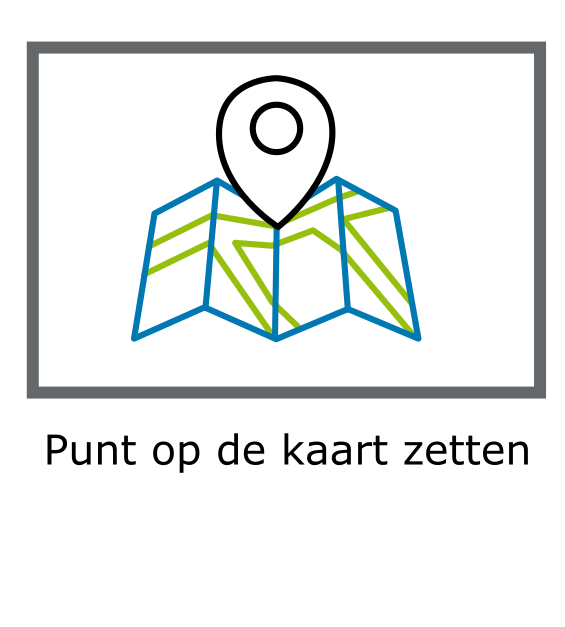
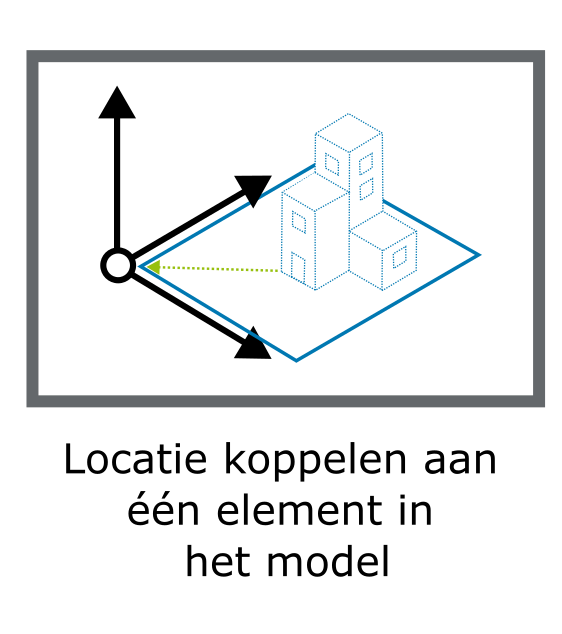
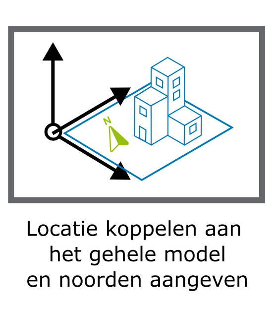
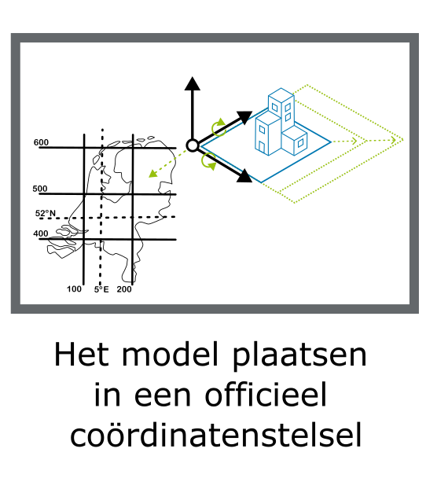

# Methodes van Georeferentie

Er zijn verschillende methodes beschikbaar om een BIM en GEO modellen bij elkaar te brengen op de kaart. Deze methoden verschillen in nauwkeurigheid en mogelijkheid voor het bijeenbrengen van modellen. Dit wordt door Clemen Christian beschreven als Levels van georefereren [[Christian2019]].

Het is mogelijk om een BIM-model op de kaart te zetten door alleen het adres van waar het BIM-model dient te komen te duiden. Deze informatie geeft een indicatie van waar het model moet komen. De informatie is niet toereikend om het model exact te plaatsen, roteren en schalen. Een andere methode zoals het model plaatsen in een officieel coordinatenstelsel is hiervoor wel geschikt. Afhankelijk van de behoefte zijn verschillende methodes geschikt.


De beschikbaarheid van informatie voor het berekenen van georeferentie-parameteres voor de verschillende methoden is onderzocht door de TU Delft [[Hakim2024]]. 

| Methode                                       | Level | Beschrijving | Plaatsing     |  Rotatie      | Schaal        |
|-----------------------------------------------| ----  | ------------ | ------------- |-------------- | ------------- |
|  | 10 |Met deze methode wordt alleen de locatie waar een model moet komen benoemd. Bijvoorbeeld een adres als "Barchman Wuytierslaan 10, Amersfoort" in een model op te nemen. Men weet hierdoor op welk adres het model moet komen, maar exacte plaatsing, rotatie en schaling is hier niet uit te bepalen.     | Niet mogelijk | Niet mogelijk | Niet mogelijk | 
|   | 20 | Met deze methode duidt men één enkel (lat-lon) punt waar het model geplaatst moet worden. Bijvoorbeeld met het coordinaat "52.152494076977185, 5.3720554951931385". Plaatsing van het model op de juiste plek, zowel in 2D als 3D wordt hiermee mogelijk. Rotatie en schalen van het model blijft niet mogelijk. | Mogelijk      | Niet mogelijk | Niet mogelijk |
|                 | 30 | Met deze methode wordt aan het grondvlak van een model een coordinaat toegekend. Ook is het mogelijk om de rotatie ten opzichte van het Noorden te duiden. Het schalen van het model is niet mogelijk.  | Mogelijk      | Eventueel mogelijk | Niet mogelijk |
|          | 40| Met deze methode wordt haan het totaal model een coordinaat toegekend, en ook de rotatie ten opzichte van Noorden kan men duiden. Het schalen van het model is niet mogelijk.  | Mogelijk      | Eventueel mogelijk | Niet mogelijk |
|       | 50 | Met deze methode geeft men aan wat het oorspronkelijk coordinatenstelsel was waarin het model is gemodelleerd. Daarnaast geeft men in het model aan naar welk coordinatenstelsel een coversie gedaan  wordt. Heeft men bijvoorbeeld gemodelleerd vanuit een lokaal assenstelsel (0,0,0) dan kan men beschrijven welke verplaatsing, rotatie en verschaling men moet toepassen om op de bedoelde locatie in het RijksDriehoeksstelsel (RD) te landen. | Mogelijk      | Mogelijk              | Mogelijk |
|       | 60| Met deze methode koppelt men punten in model aan ingemeten punten tijdens constructie aan coordinaten in een specifiek coordinatenstelsel.   | Mogelijk      | Mogelijk | Mogelijk |

<div class="advisement">
_AANBEVELING_ Gebruik minimaal Georeferentie level 50 in de combinatie van Geo en BIM. Gebruik tooling om modellen die hier niet aan voldoen te verrijken met georeferentie informatie conform level 50.  
</div>

Deze methodes, gefocused op gebouwen, kunnen worden opgeschaalt naar infrastructuur projecten. Zodoende kunnen de voorbeelden van Figuur YY, vertaald worden naar de volgende 3 onderdelen: (1) Gebruik van survey points, (2) Footprint alignment en (3) scan-to-BIM. Om deze methodes te kunnen toepassen legt dit hoofdstuk uit, welke datasets, kwaliteitsparameters en toepassingen nodig zijn om een BIM te kunnen georefrenen. 

## Geo datasets voor het referen van modellen in Infrastructuur
Voor het refrenen van datasets naar een geo domein, zijn de volgend datasets beschikbaar, die zijn weergegeven in Tabel YY. Hier is de bestandsnaam, eigenaar, nauwkeuigheid, dimiensie en locatie weergegeven. 

**Tabel YY.** Overzicht van nationale datasets beschikbaar voor geo-referentie van project data of modelen
| Naam             | Eigenaar            | Nauwkeurigheid        | Dimensie | Locatie / Dekking            |
| ---------------- | ------------------- | ---------------------- | -------- | ---------------------------- |
| **DTB / 1GiS / BGT** | Rijkswaterstaat | cm-nauwkeurig op objectniveau | 2.5D       | Landelijk, beheerde water/wegen-infrastructuur |
| **BGT**          | Kadaster | cm-nauwkeurig op objectniveau | 2D       | Landelijk|
| **AHN**          | Het Waterschapshuis | 5–10 cm (verticaal)   | 3D       | Landelijk               |
| **PMG**          | Rijkswaterstaat       | ± 2 cm (relatief)     | 3D       | RWS-wegennet, selectieve locaties |
| **NWB**          | Het Nationaalwegenbestand        | ± 1 m (topologisch)   | 2D       | Landelijk, wegennet (NL)     |
| **SpoorInBeeld** | ProRail    | ± 2 cm (relatief)     | 3D       | Spoortracés Nederland        |
| **Beeldmateriaal** | Het Waterschapshuis | ± 5–10 cm (projectie) | 2.5D     | Landelijk / stedelijk        |
| **NAP-netwerk**  | Kadaster / Rijkswaterstaat      | < 1 cm (verticaal)    | 1D (Z)   | Landelijk meetnet (peilmerken) |
| **BAG**          | Kadaster            | ± 10 cm (objectpositie) | 2D/2.5D  | Landelijk (NL)               |

Naast deze primaire geo datasets, kunnen geementes, provicies en centrale overheden andere datasets beschikbaar hebben, die kleiner van scope zijn. Ook zijn er datasets die zijn gextraheerd uit de bovenbenoemde datasets. Een voorbeeld is de 3DBAG, waar het AHN de basis is voor het maken van de deze dataset. Een analyse is in de verschillende hoogtedatasets in Nederland [source] en vanuit europa zijn de volgende hoogte datasets beschikbaar, die terug te vinden zijn via de volgende link. [https://3d.bk.tudelft.nl/europeantopography]

## 1D-, 2D- en 3D-Geo- en -BIM-modellen

Zowel BIM- als GEO-modellen kunnen een 1D, 2D als 3D coordinatenstelsel gebruiken. Om een juiste transformatie van coordinaten van 2D en 3D modellen te krijgen kunnen verschillende methoden worden toegepast.  

| Van           | Naar      |  Mogelijkheid | 
| -----------   | -------   | ------------- |
| 2D BIM        | 2D GEO    | 2D Helmert transformatie | 
| 2D BIM        | 3D GEO    | 2D Helmert transformatie + Interpolatie van z waarde | 
| 3D BIM        | 2D GEO    | Optie 1: 3D Helmert transformatie + Maaiveld BIM-model transformeren naar z-waarde 0. <br>  Optie 2: Voetafdruk extraheren en 2D Helmert transformatie | 
| 3D BIM        | 3D GEO    | 3D Helmert transformatie | 
| 2D GEO        | 2D BIM    | 2D Helmert transformatie | 
| 2D GEO        | 3D BIM    | 2D Helmert transformatie + Interpolatie van z waarde | 
| 3D GEO        | 2D BIM    | Optie 1: 3D Helmert transformatie + Maaiveld Geomodel naar z-waarde 0. <br> Optie 2: Voetafdruk Geo extraheren en 2D Helmert transformatie | 
| 3D GEO        | 3D BIM    | 3D Helmert transformatie| 

Om van geprojecteerd CRS naar een Geografische CRS te gaan is een coordinaatconversie nodig i.p.v. transformatie. 

## Kwaliteits kenmerken voor geobestanden naar bim
De verschillende datasets die gebruikt kunnen worden, zijn van elkaar te onderscheiden. Het planimetrische en hoogtecomponent in een geo-databestand vormt een fundamenteel onderdeel van de dataset. Afwijkingen in deze informatie, of verschillen tussen diverse momenten van inwinning of ontwerp, kunnen een grote impact hebben. Het correct refereren van het bestand ten opzichte van deze assen is daarom essentieel om de juiste stappen te kunnen nemen.

Het doel van het refereren van een model binnen het geo-domein is het positioneren ervan in de echte wereld. Deze echte wereld bestaat uit een lokaal en een globaal coördinatensysteem. Zoals eerder beschreven, wordt een BIM-model in de toegepaste softwarepakketten vaak in een 0,0,0-referentiesysteem geplaatst. Daarentegen bevatten globale coördinaten aanzienlijk grotere waarden, wat ertoe kan leiden dat een dataset vastloopt binnen een applicatie. De documentatie van het gebruikte coördinatensysteem is eveneens van cruciaal belang. Wanneer dit systeem niet correct is vastgelegd, kunnen er problemen ontstaan tijdens de conversie van de hoogtecomponent. De meest gebruikte coördinatenstelsels in Nederland zijn weergegeven in Tabel YY. 

**Tabel YY.** Overzicht van de globale coordinatensystemen gebruikt in Nederland
| Naam      | Orientatie | EPSG      | Toelichting                                                                                                                                                              |
| --------- | ---------- | --------- | ------------------------------------------------------------------------------------------------------------------------------------------------------------------------ |
| **RDNAP** | XYZ        | **7415**  | Dit is een *compound coordinate reference system* (CRS) dat RD (XY, EPSG:28992) combineert met NAP (Z, EPSG:5709). Dus: X=Easting (RD), Y=Northing (RD), Z=hoogte (NAP). |
| **RD**    | XY         | **28992** | Planimetrisch systeem (Rijksdriehoeksstelsel) — X is oost, Y is noord.                                                                                                   |
| **NAP**   | Z          | **5709**  | Verticaal referentiesysteem, hoogte in meters t.o.v. Normaal Amsterdams Peil.                                                                                            |

*Voor meer informatie naar het gebruik van coordinaterefrentie systemen, zie de handreiking: https://docs.geostandaarden.nl/crs/crs/ *

### Primaire kwaliteits kenmerken voor geobestanden naar bim
Voor het gebruik van een dataset uit het **GIS-domein** zijn verschillende kenmerken van belang voor de toepassing binnen een **BIM-systeem**. Niet alle data is even geschikt om gebruikt te worden, naast het gerbuik van het juiste coordinaten systeem, spelen er kwailiteits kenmerken mee die van invloed zijn op zowel de ingewonnen als de gerbruikte referenetie data. Op basis van de onderzoeken en initiatieven  
*[Bron: IHN / Geonovum / DigiGo]* kunnen de volgende componenten worden meegenomen, let wel er zijn meer componenten die van invloed zijn op de kwaliteit en bruikbarheid van de data. 

### 1. Geografische distributie van de meet punten
Afhankelijk van de inwin methode, is de geografische distributie van de meetpunten van belang. Dit heeft namelijk een direct effect van het onderscheiden van objecten in het terrein, maar ondersteunt ook in correct vinden van de refrenetie punten. De distributie wordt omschreven door de hoeveelheid punten per vierkante meter of door de minimale afstand tussen de punten. De leert praktijk is een hoge puntdichtheid gekoppeld aan een hoger detailniveau van het 3D-model.

### 2. De absolute en relatieve nauwkeurigheid van een geo-dataset
In de literatuur en uitvraag­specificaties wordt een onderscheid gemaakt tussen de **absolute** en **relatieve** nauwkeurigheid van een geo-dataset. De **absolute nauwkeurigheid** beschrijft de afwijking tussen de inwinning of het model en de werkelijkheid, terwijl de **relatieve nauwkeurigheid** vaak wordt gebruikt om de afwijking tussen meetpunten binnen overlappende inwinningen te omschrijven. Een voorbeeld hiervan is een dwarsprofiel over een ingewonnen stuk snelweg. Beide typen nauwkeurigheden worden uitgedrukt in een planimetrische (XY) en een altimetrische (Z) component. De verschillende uitvraag­specificaties laten zien dat de relatieve nauwkeurigheid altijd kleiner is dan de absolute nauwkeurigheid.

### 3. De classificatieparameters in een geo-dataset
De wijze waarop objecten binnen een geo-dataset worden geclassificeerd, is essentieel voor de bruikbaarheid binnen een BIM-context. De toegepaste classificatiemethode vormt een belangrijke kwaliteitsparameter, bijvoorbeeld wanneer classificatie wordt uitgevoerd door kunstmatige intelligentie (AI) of door menselijke experts. Daarnaast zijn de gebruikte definities een cruciaal startpunt binnen dit proces. Zo kan de classificatie van vegetatie in de referentiedataset niet automatisch dezelfde definitie hebben als in de ingewonnen dataset, wat kan leiden tot interpretatieverschillen of inconsistenties in het uiteindelijke model.

### 4. De inwindatum van de geo-dataset
Het moment van inwinning bepaalt de bruikbaarheid van de dataset, aangezien iedere geo-dataset die wordt weergegeven in een GIS-omgeving een momentopname is. Een geo-dataset vertegenwoordigt nooit de volledige werkelijkheid, maar vormt slechts een benadering van de omgeving. Hierdoor kan de omgeving, afhankelijk van de mate van verandering, in de loop van de tijd sterk of minder sterk afwijken van de oorspronkelijke weergave. Dit wordt geïllustreerd in de onderstaande figuren aan de hand van de stationsregio van Delft, zoals weergegeven in het Actueel Hoogtebestand Nederland en de 3D Basisvoorziening, waarbij de bouw van de stationsregio een ingrijpende verandering in het terrein laat zien.


## Georeferentie toepassingen voor BIM naar Geo

Om een model te georefereren, zijn er drie mogelijkheden om dit toe te passen: (1) Gebruik van survey points, (2) Footprint alignment en (3) scan-to-BIM gebaseerd op [BuildingSMART et al. (2020)]  [HAKIM]. Voor iedere methode van georeferentie wordt in de theorie nader toegelicht hoe deze kan worden toegepast. Let wel, bij de derde mogelijkheid is het model reeds gerefereerd, en is er in de meeste gevallen een conversiebestand beschikbaar dat het model vertaalt van een BIM-softwareomgeving naar het coördinatensysteem waarin de puntenwolk is ingewonnen.

Daarom wordt geadviseerd om uitsluitend bij optie 1 en 2 een beoordelingstoets uit te voeren, om te verifiëren of het model zich daadwerkelijk op de correcte locatie bevindt

### Het gebruik van survey points
Voor kleine netwerken worden vaste meetpunten op plekken waarvan met een bepaalde zekerheid gezegd kan worden dat deze niet verstoord of weg kunnen gaan. De meetpunten worden in XYZ bepaald, en kunnen beschouwd worden als stabiel in het terrein. De bepaling in XY wordt door middel van GNSS uitgevoerd met een nauwkeurigheid van 2-3cm. Er kan gekozen worden om de meetpunten direct via GNSS te bepalen indien dit mogelijk is. Wanneer dit niet mogelijk is, bv als de meetpunten in de muur/wand zitten, worden er tijdelijke punten gemaakt en via tachymetrie de XY bekend gemaakt. Door middel van waterpassing wordt de hoogte (Z) in mm nauwkeurigheid bepaald.

Bij het verwerken van lange netwerken kan er gekozen worden voor referentievelden, deze wordt op dezelfde manier bepaald, maar alleen via GNSS aan elkaar gekoppeld in XY. Voor de hoogte kan een waterpassing uitgevoerd worden per veld. Het geodetisch netwerk wordt gebruikt om een puntenwolk te geo-refereren, hiervan wordt een BIM model gemaakt. Er kan een controle uitgevoerd worden door de coördinaten en het BIM model te vergelijken.

### Footprint alignment
Voor de footprint alignment moet rekening worden gehouden met zowel het planimetrische als het altimetrische component. Om het ongerefereerde model naar een gerefereerde omgeving te brengen op basis van de footprint, dient een iteratief proces te worden opgezet. Dit proces start met een grove schatting van het planimetrische component, waarna aan de hand van patroonherkenning het hoogtecomponent verder wordt gerefereerd. Om dit te kunnen uitvoeren binnen Infrastructuur projecten, kunnen de volgende 2 objecten gebruikt worden: (1) noklijnen en (2) straatmeubilair. 

*Noklijnen*
Als de planimetrische componenten van de dataset op juiste plek liggen, is het nog steeds van belang om het hoogte component op de juiste manier te referen. Vanuit het IHN-project is gebleken dat er in Nederland belangrijke methoden beschikbaar zijn om data die niet zijn gerefereerd of die geen 3D-informatie bevatten, te koppelen aan bestaande referentiesystemen. Hiervoor kan bijvoorbeeld gebruik worden gemaakt van noklijnen die zijn geëxtraheerd uit het Actueel Hoogtebestand Nederland (AHN). [source: https://www.ahn.nl/integrale-hoogtevoorziening-nederland]
Deze methode, vrij beschikbaar via de dataroom van het AHN, maakt het mogelijk om de beschikbare noklijnen binnen het projectgebied te gebruiken als referentie voor het positioneren van het model ten opzichte van de GIS-laag. Een aandachtspunt is echter dat deze datasets beschikbaar zijn in GPKG-formaat, waardoor de gebruiker de data handmatig moet converteren naar een DWG-bestand om deze binnen gangbare BIM-software te kunnen gebruiken.

*Straatmeubilair*
Omdat een ingewonnen weg vaak geen woningen bevat, is het gebruik van noklijnen beperkt voor de hoogteregistratie in infrastructurele BIM-modellen buiten stedelijke gebieden. In dergelijke gevallen kan straatmeubilair worden gebruikt, zoals wegmarkeringen, kantverharding of objecten met een duidelijk herkenbare vorm.
Datasets die hierbij van cruciaal belang zijn, zijn het DTB (Digitaal Topografisch Bestand) en het AHN (Actueel Hoogtebestand Nederland). Deze datasets bevatten informatie in 2.5D, wat betekent dat er slechts één hoogtecomponent per coördinaat beschikbaar is. De waarde van dit hoogtecomponent varieert per objecttype. Daarom is het raadzaam om bij grote infrastructuurprojecten het handboek van het DTB te raadplegen. Er wordt onderscheid gemaakt van objecten met een hoge prioriteit en met lage. Dit kan een nauwkuerigheids verschil opleveren tussen de YY cm en ZZ cm. 
In de onderstaande figuur is een BIM-model weergegeven in combinatie met het DTB, waarbij de wegmarkeringen in dit geval goed op elkaar aansluiten. Deze overeenkomst kan worden gebruikt om het hoogtecomponent te realiseren, mits het planimetrische vlak reeds correct is vastgesteld.
Het AHN of een andere puntenwolk in de omgeving kan hiervoor eveneens worden gebruikt. Dit komt doordat de intensiteit, die de basis vormt van een puntenwolk, significant lager is op de weg dan op het omliggende meubilair. Daardoor is het vinden van deze objecten eenvoudiger en kunnen zij gemakkelijk uit de dataset worden geëxtraheerd.

# Georeferentie in uitwisseling
Wanneer men in een bepaalde toepassing of softwarepakket werkt, bevindt het model zich in een assenstelsel. Dit is nodig om op een systematische, eenduidige en wiskundige manier locaties en vormen in ruimte te kunnen vastleggen, verwerken en communiceren. Wanneer men modellen wil delen of combineren buiten deze toepassing of softwarepakket kan men dit in open uitwisselformaat uitwisselen. Hieronder volgt een overzicht van verschillende open uitwisselformaten en de manieren waarop men georeferentie hierin kan doen. 

## Industry Foundation Classes (IFC)
IFC is een uitwisselformaat bedoeld voor het uitwisselen van de Architectuur, Bouwwerk en Constructie Informatie. Het is een software-onafhankelijk open dataformaat. Binnen het IFC-schema is het mogelijk om de volgende attributen voor georeferentie te gebruiken: 

- Binnen IFC (4X3) kan men [IfcPostalAddress](https://ifc43-docs.standards.buildingsmart.org/IFC/RELEASE/IFC4x3/HTML/lexical/IfcPostalAddress.htm) gebruiken om level 10 georeferentie modellen uit te wisselen. 
- Binnen IFC (4X3) kan men met de attributen RefLatitude, RefLongitude en RefElevation [IfcSite](https://ifc43-docs.standards.buildingsmart.org/IFC/RELEASE/IFC4x3/HTML/lexical/IfcSite.htm) Level 20 georeferentie modellen uitwisselen. 
- Binnen IFC (4X3) kan men [IfcAxis2Placement3D](https://ifc43-docs.standards.buildingsmart.org/IFC/RELEASE/IFC4x3/HTML/lexical/IfcAxis2Placement3D.htm) gebruiken om level 30 georeferentie modellen uit te wisselen. Met de attributen Location, Axis en RefDirection kan locatie en richting meegegeven worden.
- Voor Georeferentie level 40 kan men [IfcGeometricRepresentationContext](https://ifc43-docs.standards.buildingsmart.org/IFC/RELEASE/IFC4x3/HTML/lexical/IfcGeometricRepresentationContext.htm) gebruiken. 
- [IfcMapConversion](https://ifc43-docs.standards.buildingsmart.org/IFC/RELEASE/IFC4x3/HTML/lexical/IfcMapConversion.htm) gebruikt men binnen IFC (4X3) voor het beschrijven van georeferentie op level 50. Er is een attribuut SourceCRS, TargetCRS, attributen voor verplaatsing, verdraaiing en schaling. 
- Er is geen klasse binnen IFC (4X3) die ondersteunt in georeferentie 60. Een work-around is de mogelijkheid om gebruik te maken van generic property sets ([IfcPropertySet](https://ifc43-docs.standards.buildingsmart.org/IFC/RELEASE/IFC4x3/HTML/lexical/IfcPropertySet.htm)) voor het opslaan van informatie over de controlepunten voor deze methodiek. Dit wordt momenteel niet ondersteund.  

<div class="advisement">
_AANBEVELING_ Gebruik IfcMapConversion voor georeferentie van BIM in IFC.
</div>

<aside class="example" title="Voorbeeld van georeferentie met IfcMapConversion in IFC">
Voorbeeld van IfcMapConversion in IFC
```IFC 
#100= IFCCARTESIANPOINT((0.0, 0.0, 0.0));
#101= IFCMAPCONVERSION(
  'Local Engineering CRS',          -- Source CRS (coordinatenstelsel waarin gemodelleerd is)
  'EPSG:7415',                      -- Target CRS (coordinatenstelsel waarin gepositioneerd wordt)
  #100,                          -- Lokaal ankerpunt
  155000.0,                     -- Oostelijke verplaatsing
  463000.0,                     -- Noordelijke verplaatsing
  3.55,                        -- Hoogte verplaatsing
  1.0,                         -- Richting van de X-as
  0.0,                         -- Richting van de Y-as
  1.0                          -- Schaal
);
```
</aside>

- IFC 5 (JSON)
IFC 5 is een momenteel in ontwikkeling. Het is een herstructurering van het huidige IFC schemas. De functionaliteit van de huidige schema's wil men behouden, maar de technische basis en serialisatie veranderen. Waar de huidige IFC-schema's op STEP zijn gebaseerd, is het IFC 5 schema op JSON gebaseerd. 

Voor geometrie maakt IFC gebruik van USD-formaat (Universal Scene Description), voor geometrie, bijvoorbeeld usdgeom::mesh – veelhoekig oppervlaktemodel. Er zijn nog geen vastgestelde afspraken over georeferentie. Wel zijn in de eerste verkenningen de elementen van IfcMapConversion terug te zien, maar dan als json attributen. 

## DXF
Wanneer men in 2D vectorsoftware werkt die geen .ifc bestand kan exporteren zijn er ook mogelijkheden voor georeferentie. De objecten in de DXF worden bij voorkeur getekend in een coördinatenruimte die matcht met een geprojecteerd CRS (zoals EPSG:28992 of EPSG:3857). De coördinaten zijn dan in meters, zoals in het coordinatenstelsel. Voorbeeld: een lijn van punt(110000, 450000) naar punt (110500, 450500) is dan correct gepositioneerd in RD-coördinaten.

Dit is niet in alle software mogelijk. Bij software die alleen werkt met lokale coordinaten is het lastig om op coordinaat 110000 - 450000 te werken, omdat dit heel ver uit het centrale punt van deze software, punt 0,0 is. 

Een DXF-bestand zelf bevat geen informatie waarmee aangeduid wordt dat de waardes van de geometrie bedoeld is als RD-coördinaten. Het is mogelijk om de attributen vanuit IfcMapconversion als extra bestand mee te geven naast de .dxf als een .json file. 

<aside class="example" title="Voorbeeld van georeferentie metadatabestand in JSON">
Voorbeeld van georeferentie metadatabestand in JSON
```json 
{
  "MapConversion": {
    "SourceCRS": {
      "type": "Local Engineering CRS",
      "dimension": "2",
      "Precision": "0.001"
    },
    "TargetCRS": {
      "type": "ProjectedCRS",
      "identifier": "EPSG:28992",
      "name": "Amersfoort / RD New"
    },
    "Eastings": 155000.0,
    "Northings": 463000.0,
    "OrthogonalHeight": 3.55,
    "XAxisAbscissa": 1.0,       
    "XAxisOrdinate": 0.0,       
    "Scale": 1.0                
  }
}
```
</aside>

## CityGML en CityJSON
CityGML is een open datamodel en uitwisselformaat voor de representatie van 3D-geo-informatie. De CityGML standaard biedt twee mogelijkheden om een coordinatenstelsel te duiden voor het model. De voorkeur is om een totaal cordinatenstelsel voor een dataset te duiden. Dit doet men in de gml:Envelope die gebruikt wordt om de ruimtelijke begrenzing (bounding box) van de dataset aan te geven. 

<aside class="example" title="Voorbeeld van CRS van totaal model in de Envelope in CityGML">
  Onderstaande voorbeeld geeft aan hoe CityGML een Coordinatenstelsel voor het totaal model duidt.

  ```gml 
  <gml:boundedBy>
    <gml:Envelope srsName="urn:ogc:def:crs:EPSG::28992">
  </gml:boundedBy>
  ```
</aside>

  Ook is het mogelijk om per element een coordinatenstelsel mee te geven.
  Individuele georeferentie:

  <aside class="example" title="Voorbeeld van CRS van een enkel element in CityGML">
  Onderstaande voorbeeld geeft aan hoe in CityGML een Coordinatenstelsel voor een enkele elemeent duidt.

  ```gml 
  <gml:Point srsName="urn:ogc:def:crs:EPSG::28992">
    <gml:pos>123456 456789</gml:pos>
  </gml:Point>
  ```
</aside>

### Engineered CRS
GML geeft de mogelijkheid om een engineered CRS uit te drukken. Dit is een lokaal coördinatenstelsel dat niet op de aarde is gebaseerd. Het is mogelijk om dit lokaal coördinatenstelsel te verbinden aan een bekend coordinatenstelsel als RD-NAP waardoor het voor uitwisseling, visualisatie en analyse gebruikt kan worden. 

<aside class="example" title="Voorbeeld van CRS van een enkel element in CityGML">
  Onderstaande voorbeeld geeft aan hoe in CityGML een Coordinatenstelsel voor een enkele elemeent duidt.

  ```gml 
 <?xml version="1.0" encoding="UTF-8"?>
<core:CityModel
    xmlns:core="http://www.opengis.net/citygml/3.0"
    xmlns:bldg="http://www.opengis.net/citygml/building/3.0"
    xmlns:gml="http://www.opengis.net/gml/3.2"
    xmlns:xsi="http://www.w3.org/2001/XMLSchema-instance"
    xsi:schemaLocation="http://www.opengis.net/gml/3.2
                          http://schemas.opengis.net/gml/3.2.1/gml.xsd
                        http://www.opengis.net/citygml/building/3.0
                          https://schemas.opengis.net/citygml/building/3.0/building.xsd
                        http://www.opengis.net/citygml/3.0
                          https://schemas.opengis.net/citygml/3.0/core.xsd">

<gml:EngineeringCRS gml:id="localEngineeredCRS3D">
    <gml:name>Lokaal 3D Stelsel Project ABC<</gml:name>
    <gml:usesCS>
        <gml:CartesianCS gml:id="lokaal3DStelsel">
            <gml:csName> Lokaal 3D Cartesiaans Grid</gml:csName>
            <gml:axis>
                <gml:CoordinateSystemAxis gml:id="xAxis"
                    gml:uom="m"
                    gml:axisAbbrev="X"
                    gml:axisDirection="east"/>
            </gml:axis>
            <gml:axis>
                <gml:CoordinateSystemAxis gml:id="yAxis"
                    gml:uom="m"
                    gml:axisAbbrev="Y"
                    gml:axisDirection="north"/>
            </gml:axis>
            <gml:axis>
                <gml:CoordinateSystemAxis gml:id="zAxis"
                    gml:uom="m"
                    gml:axisAbbrev="Z"
                    gml:axisDirection="up"/>
            </gml:axis>
        </gml:CartesianCS>
    </gml:usesCS>
    <gml:usesEngineeringDatum>
        <gml:EngineeringDatum gml:id="localDatum3D">
            <gml:datumName>Local Datum – 3D Map Conversion</gml:datumName>
            <!-- Ankerpunt en orientatie in EPSG:7415 (X, Y, Z) -->
            <gml:anchorPoint>
                <gml:Point gml:id="anchor_7415" srsName="urn:ogc:def:crs:EPSG::7415">
                    <gml:pos>155000.0 463000.0 3.55</gml:pos>
                </gml:Point>
            </gml:anchorPoint>
            <gml:orientation>
                <gml:Vector gml:id="orientation_7415" srsName="urn:ogc:def:crs:EPSG::7415">
                    <gml:pos>1.0 0.0 0.0</gml:pos>
                </gml:Vector>
            </gml:orientation>
        </gml:EngineeringDatum>
    </gml:usesEngineeringDatum>
</gml:EngineeringCRS>

  <!-- Voorbeeld gebouwmodel dat het lokaal stelsel gebruikt -->
  <core:cityObjectMember>
    <bldg:Building gml:id="bldg_001">
      <gml:name> Vorbeeldgebouw </gml:name>
      <bldg:lod0Geometry>
        <gml:Point gml:id="pt_bldg" srsName="#Lokaal 3D Stelsel Project ABC">
          <gml:pos>10.0 20.0 0.0</gml:pos>
        </gml:Point>
      </bldg:lod0Geometry>
    </bldg:CityObject>
  </corelcityObjectMember>
</core:CityModel>
  ```
</aside>

## Geopackage
GeoPackage staat naast GML als uitwisselformaat op de Pas-toe-leg-uit lijst.

Opslag van dit CRS in de tabel gpkg_spatial_ref_sys in het bestand

## API

Accessing Collections using HTTP GET returns a response that contains at least the list of collections. For each Collection, a link to the items in the collection (Features, path /collections/{collectionId}/items, link relation items) as well as key information about the collection. This information includes:

A local identifier for the collection that is unique for the dataset;

A list of coordinate reference systems (CRS) in which geometries may be returned by the server: the first CRS is the default coordinate reference system (in the Core, the default is always WGS 84 with axis order longitude/latitude);

▪ GET /collections/{collectionId}/items/{featureId}
  ▪ Opvragen individueel item
▪ GET /collections/buildings/items?crs={crsuri}
  ▪ Opvragen in specifiek CRS
  ▪ De default is CRS84
