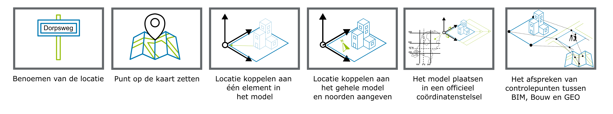

# Methodes van Georeferentie

Er zijn verschillende methodes beschikbaar om  BIM en GEO modellen bij elkaar te brengen op de kaart. Deze methoden verschillen in nauwkeurigheid en mogelijkheid voor het bijeenbrengen van modellen. Dit wordt door Clemen Christian beschreven als Levels van georefereren [[Christian2019]].

Het is mogelijk om een BIM-model op de kaart te zetten door alleen het adres, van waar het BIM-model dient te komen, te duiden. Deze informatie geeft een indicatie van waar het model moet komen. De informatie is niet toereikend om het model exact te plaatsen (transleren, roteren en schalen). Een andere methode zoals het model relateren aan een officieel coordinatenstelsel is hiervoor wel geschikt. Afhankelijk van de behoefte zijn verschillende methodes geschikt.



De beschikbaarheid van informatie voor het berekenen van georeferentie-parameters voor de verschillende methoden is onderzocht door de TU Delft [[Hakim2024]]. 

| Methode                                       | Level | Beschrijving | Translatie     |  Rotatie      | Schaal        |
|-----------------------------------------------| ----  | ------------ | ------------- |-------------- | ------------- |
|  | 10 |Met deze methode wordt alleen de locatie waar een model moet komen benoemd. Bijvoorbeeld een adres als "Barchman Wuytierslaan 10, Amersfoort" in een model op te nemen. Men weet hierdoor op welk adres het model moet komen, maar exacte plaatsing, rotatie en schaling is hier niet uit te bepalen.     | Niet mogelijk | Niet mogelijk | Niet mogelijk | 
|   | 20 | Met deze methode duidt men één enkel (lat-lon) punt waar het model geplaatst moet worden. Bijvoorbeeld met het coordinaat "52.152494076977185, 5.3720554951931385". Plaatsing van het model op de juiste plek, zowel in 2D als 3D wordt hiermee mogelijk. Rotatie en schalen van het model blijft niet mogelijk. | Mogelijk      | Niet mogelijk | Niet mogelijk |
|                 | 30 | Met deze methode wordt aan het grondvlak van een model een coordinaat toegekend. Ook is het mogelijk om de rotatie ten opzichte van het Noorden te duiden. Het schalen van het model is niet mogelijk.  | Mogelijk      | Eventueel mogelijk | Niet mogelijk |
|          | 40| Met deze methode wordt aan het totaal model een coordinaat toegekend, en ook de rotatie ten opzichte van Noorden kan men duiden. Het schalen van het model is niet mogelijk.  | Mogelijk      | Eventueel mogelijk | Niet mogelijk |
|       | 50 | Met deze methode geeft men aan wat het oorspronkelijk coordinatenstelsel was waarin het model is gemodelleerd. Daarnaast geeft men in het model aan naar welk coordinatenstelsel een coversie gedaan  wordt. Heeft men bijvoorbeeld gemodelleerd vanuit een lokaal assenstelsel (0,0,0) dan kan men beschrijven welke translatie, rotatie en verschaling men moet toepassen om te kunnen combineren met data in RijksDriehoeksstelsel (RD). | Mogelijk      | Mogelijk              | Mogelijk |
|       | 60| Met deze methode koppelt men punten in model aan ingemeten punten tijdens constructie aan coordinaten in een specifiek coordinatenstelsel.   | Mogelijk      | Mogelijk | Mogelijk |

Wanneer is welk niveau van georeferentie geschikt: 
| Level | Methode |  Toepassingsvoorbeeld | 
|-------- | -----| -----| 
| 10 | Benoemen Adres | Voor administratieve analyses of navigatie |
| 20 | Het specificeren van één punt | Voor het weergeven van een model als punt op de kaart en analyses zonder geometrische context |
| 30 | Het specificeren van punt en verdraaiing van het grondvlak| Voor niet geometrische analyses, navigatie of controle van rotatie |
| 40 | Het specificeren van punt en verdraaiing van het model | Voor niet geometrische analyses, navigatie of controle van rotatie
| 50 | Aangeven van Source-CRS en trasformatie naar target-CRS | Voor het combineren van Geo en BIM in applicaties t.b.v. visualisatie, analyse, coördinatie of integratie |
| 60 | Koppeling van punten in BIM, Geo en op het fysiek terrein | Als het BIM-model gebruikt moet worden voor constructie/landmeetkundige integratie, waar de positie van het model in het terrein meetkundig verifieerbaar moet zijn. |

<aside class="note" title="Gebruik van level van Georefereren">
  <p>_AANBEVELING_ Gebruik voor GeoBIM-integratie level 50 en voor GeoBIM-inzet voor constructiedoeleinde level 60.  </p>
  <p>_AANBEVELING_ Gebruik tooling om modellen die nog niet voldoen aan georeferentie 50, wanneer nodig, te verrijken met georeferentie informatie conform level 50. </p>
</aside>

Deze methodes, gefocused op gebouwen, kunnen worden opgeschaalt naar infrastructuur projecten. Zodoende kunnen de voorbeelden van Figuur YY, vertaald worden naar de volgende 3 onderdelen: (1) Gebruik van survey points, (2) Footprint alignment en (3) scan-to-BIM. Om deze methodes te kunnen toepassen legt dit hoofdstuk uit, welke datasets, kwaliteitsparameters en toepassingen nodig zijn om een BIM te kunnen georefrenen. 

## 1D-, 2D- en 3D-Geo- en -BIM-modellen
Zowel BIM- als GEO-modellen kunnen een 1D, 2D als 3D coordinatenstelsel gebruiken. Om een juiste transformatie van coordinaten van 2D en 3D modellen te krijgen kunnen verschillende methoden worden toegepast.  

Een GEO coordinatenstelsel kan 3D samengesteld (EPSG:7415), 2D (EPSG:28992) of 1D (EPSG:5709) zijn. 

| Van (bron)          | Naar (target)     |  Mogelijkheid | 
| Van           | Naar      |  Mogelijkheid | 
| -----------   | -------   | ------------- |
| 2D GEO of BIM        | 2D GEO of BIM    | 2D Helmert (gelijkvormigheidstransformatie Refereren aan stuk Lennard) transformatie | 
| 2D GEO of BIM   | 3D GEO of BIM     | 2D Helmert transformatie + Interpolatie van z waarde naar target | 
| 3D GEO of BIM        | 2D GEO of BIM    | Optie 1: 3D Helmert transformatie + Maaiveld bron-model transformeren naar z-waarde 0. <br>  Optie 2: Voetafdruk bron-model extraheren en 2D Helmert transformatie | 
| 3D GEO of BIM        | 3D GEO of BIM    | 3D Helmert transformatie | 


Om van geprojecteerd CRS naar een Geografische CRS te gaan is een coordinaatconversie nodig i.p.v. transformatie. Het is mogelijk om conversies van 2D naar 2D of van 3D naar 3D te doen.

De mogelijkheden zijn:
| Van (bron)         | Naar (target)     |  Mogelijkheid | 
| -----------   | -------   | ------------- |
| 2D GEO/BIM (geprojecteerd)       | 2D GEO/BIM (geografisch)   | RDNAPTRANS    |
| 3D GEO/BIM (geprojecteerd)        | 3D GEO/BIM (geografisch)   | RDNAPTRANS    |

## Schaal: 
Een Geo of BIM bronmodel kan in een andere eenheid getekend zijn dan de eenheid van een targetmodel waarin het bronmodel moet landen. Het is daarom van belang om de juiste verschaling van model aan te geven. Wanneer een bron in milimeters is getekend en de target omgeving in meters, dan kan men dat met een schaal, waarde 0.001, aangeven. Of wanneer men van inches naar meter gaat met een schaal, waarde 0.0254.

Wanneer voor georeferentie een precisie van milimeters belangrijk is dient men daarnaast een correctie van horizontale afstanden voor lijnvergroting mee te nemen. 

De formule om deze correctie te berekenen is: 
$$
\Delta \ell = -9,2 + \frac{r_i^2}{1629^2} \text{ mm per 100 m}
$$
gemiddelde coördinaten in km van de eindpunten in het RD-stelsel zijn.

<mark> Graag het beeld gebruiken uit: https://www.bruna.nl/images/active/InkijkPDF/eboekhuis/9789071301872.pdf#page=23 </mark>

# Geo datasets voor het refereren van modellen
Voor het refereren van datasets naar een geo domein, zijn de volgende datasets beschikbaar, die zijn weergegeven in Tabel YY. Hier is de bestandsnaam, eigenaar, nauwkeuigheid, dimensie en locatie weergegeven. 

**Tabel YY.** Overzicht van nationale datasets beschikbaar voor geo-referentie van project data of modelen
| Naam             | Eigenaar            | Nauwkeurigheid        | Dimensie | Locatie / Dekking            |
| ---------------- | ------------------- | ---------------------- | -------- | ---------------------------- |
| **DTB / 1GiS / BGT** | Rijkswaterstaat | cm-nauwkeurig op objectniveau | 2.5D       | Landelijk, beheerde water/wegen-infrastructuur |
| **BGT**          | Kadaster | cm-nauwkeurig op objectniveau | 2D       | Landelijk|
| **AHN**          | Het Waterschapshuis | 5–10 cm (verticaal)   | 3D       | Landelijk               |
| **PMG**          | Rijkswaterstaat       | ± 2 cm (relatief)     | 3D       | RWS-wegennet, selectieve locaties |
| **NWB**          | Het Nationaalwegenbestand        | ± 1 m (topologisch)   | 2D       | Landelijk, wegennet (NL)     |
| **SpoorInBeeld** | ProRail    | ± 2 cm (relatief)     | 3D       | Spoortracés Nederland        |
| **Beeldmateriaal** | Het Waterschapshuis | ± 5–10 cm (projectie) | 2.5D     | Landelijk / stedelijk        |
| **NAP-netwerk**  | Kadaster / Rijkswaterstaat      | < 1 cm (verticaal)    | 1D (Z)   | Landelijk meetnet (peilmerken) |
| **BAG**          | Kadaster            | ± 10 cm (objectpositie) | 2D/2.5D  | Landelijk (NL)               |

Naast primaire geo datasets, kunnen gemeentes, provicies en centrale overheden andere datasets beschikbaar hebben, die kleiner van scope zijn. Ook zijn er datasets die zijn geextraheerd uit de bovenbenoemde datasets. Een voorbeeld is de 3DBAG, waar het <a>AHN</a> de basis is voor het maken van deze dataset. Een analyse is in de verschillende hoogtedatasets in Nederland [source] en vanuit europa zijn de volgende hoogte datasets beschikbaar, die terug te vinden zijn via de volgende link. [https://3d.bk.tudelft.nl/europeantopography]

## Kwaliteits kenmerken voor geobestanden naar bim
De verschillende datasets die gebruikt kunnen worden, zijn van elkaar te onderscheiden. Het planimetrische en hoogtecomponent in een geo-databestand vormt een fundamenteel onderdeel van de dataset. Afwijkingen in deze informatie, of verschillen tussen diverse momenten van inwinning of ontwerp, kunnen een grote impact hebben. Het correct refereren van het bestand ten opzichte van deze assen is daarom essentieel om de juiste stappen te kunnen nemen.

Het doel van het refereren van een model binnen het geo-domein is het positioneren ervan in de echte wereld. Deze echte wereld bestaat uit een lokaal en een globaal coördinatensysteem. Zoals eerder beschreven, wordt een BIM-model in de toegepaste softwarepakketten vaak in een 0,0,0-referentiesysteem geplaatst. Daarentegen bevatten globale coördinaten aanzienlijk grotere waarden, wat ertoe kan leiden dat een dataset vastloopt binnen een applicatie. De documentatie van het gebruikte coördinatensysteem is eveneens van cruciaal belang. Wanneer dit systeem niet correct is vastgelegd, kunnen er problemen ontstaan tijdens de conversie van de hoogtecomponent. De meest gebruikte coördinatenstelsels in Nederland zijn weergegeven in Tabel YY. 

**Tabel YY.** Overzicht van de globale coordinatensystemen gebruikt in Nederland
| Naam      | Orientatie | EPSG      | Toelichting                                                                                                                                                              |
| --------- | ---------- | --------- | ------------------------------------------------------------------------------------------------------------------------------------------------------------------------ |
| **RDNAP** | XYZ        | **7415**  | Dit is een *compound coordinate reference system* (CRS) dat RD (XY, EPSG:28992) combineert met NAP (Z, EPSG:5709). Dus: X=Easting (RD), Y=Northing (RD), Z=hoogte (NAP). |
| **RD**    | XY         | **28992** | Planimetrisch systeem (Rijksdriehoeksstelsel) — X is oost, Y is noord.                                                                                                   |
| **NAP**   | Z          | **5709**  | Verticaal referentiesysteem, hoogte in meters t.o.v. Normaal Amsterdams Peil.                                                                                            |

*Voor meer informatie naar het gebruik van coordinaterefrentie systemen, zie de handreiking: https://docs.geostandaarden.nl/crs/crs/ *

## Primaire kwaliteits kenmerken voor geobestanden naar bim
Voor het gebruik van een dataset uit het **GIS-domein** zijn verschillende kenmerken van belang voor de toepassing binnen een **BIM-systeem**. Niet alle data is even geschikt om gebruikt te worden, naast het gerbuik van het juiste coordinaten systeem, spelen er kwailiteits kenmerken mee die van invloed zijn op zowel de ingewonnen als de gerbruikte referenetie data. Op basis van de onderzoeken en initiatieven  
*[Bron: IHN / Geonovum / DigiGo]* kunnen de volgende componenten worden meegenomen, let wel er zijn meer componenten die van invloed zijn op de kwaliteit en bruikbarheid van de data. 

### 1. Geografische distributie van de meet punten
Afhankelijk van de inwin methode, is de geografische distributie van de meetpunten van belang. Dit heeft namelijk een direct effect van het onderscheiden van objecten in het terrein, maar ondersteunt ook in correct vinden van de refrenetie punten. De distributie wordt omschreven door de hoeveelheid punten per vierkante meter of door de minimale afstand tussen de punten. De leert praktijk is een hoge puntdichtheid gekoppeld aan een hoger detailniveau van het 3D-model.

### 2. De absolute en relatieve nauwkeurigheid van een geo-dataset
In de literatuur en uitvraag­specificaties wordt een onderscheid gemaakt tussen de **absolute** en **relatieve** nauwkeurigheid van een geo-dataset. De **absolute nauwkeurigheid** beschrijft de afwijking tussen de inwinning of het model en de werkelijkheid, terwijl de **relatieve nauwkeurigheid** vaak wordt gebruikt om de afwijking tussen meetpunten binnen overlappende inwinningen te omschrijven. Een voorbeeld hiervan is een dwarsprofiel over een ingewonnen stuk snelweg. Beide typen nauwkeurigheden worden uitgedrukt in een planimetrische (XY) en een altimetrische (Z) component. De verschillende uitvraag­specificaties laten zien dat de relatieve nauwkeurigheid altijd kleiner is dan de absolute nauwkeurigheid.

### 3. De classificatieparameters in een geo-dataset
De wijze waarop objecten binnen een geo-dataset worden geclassificeerd, is essentieel voor de bruikbaarheid binnen een BIM-context. De toegepaste classificatiemethode vormt een belangrijke kwaliteitsparameter, bijvoorbeeld wanneer classificatie wordt uitgevoerd door kunstmatige intelligentie (AI) of door menselijke experts. Daarnaast zijn de gebruikte definities een cruciaal startpunt binnen dit proces. Zo kan de classificatie van vegetatie in de referentiedataset niet automatisch dezelfde definitie hebben als in de ingewonnen dataset, wat kan leiden tot interpretatieverschillen of inconsistenties in het uiteindelijke model.

### 4. De inwindatum van de geo-dataset
Het moment van inwinning bepaalt de bruikbaarheid van de dataset, aangezien iedere geo-dataset die wordt weergegeven in een GIS-omgeving een momentopname is. Een geo-dataset vertegenwoordigt nooit de volledige werkelijkheid, maar vormt slechts een benadering van de omgeving. Hierdoor kan de omgeving, afhankelijk van de mate van verandering, in de loop van de tijd sterk of minder sterk afwijken van de oorspronkelijke weergave. Dit wordt geïllustreerd in de onderstaande figuren aan de hand van de stationsregio van Delft, zoals weergegeven in het Actueel Hoogtebestand Nederland en de 3D Basisvoorziening, waarbij de bouw van de stationsregio een ingrijpende verandering in het terrein laat zien.


# Georeferentie Level 60 voor BIM naar Geo

Om een model op level 60 te georefereren, zijn er drie mogelijkheden om dit toe te passen: (1) Gebruik van <a>survey points</a>, (2) <a>Footprint alignment</a> en (3) scan-to-BIM gebaseerd op [BuildingSMART et al. (2020)]  [HAKIM]. Voor iedere methode van georeferentie wordt in de theorie nader toegelicht hoe deze kan worden toegepast. Let wel, bij de derde mogelijkheid is het model reeds geogerefereerd, en is er in de meeste gevallen een conversiebestand beschikbaar dat het model vertaalt van een BIM-softwareomgeving naar het coördinatensysteem waarin de puntenwolk is ingewonnen.

Daarom wordt geadviseerd om uitsluitend bij optie 1 en 2 een beoordelingstoets uit te voeren, om te verifiëren of het model zich daadwerkelijk op de correcte locatie bevindt

### Het gebruik van survey points
Voor kleine netwerken worden vaste meetpunten op plekken waarvan met een bepaalde zekerheid gezegd kan worden dat deze niet verstoord of weg kunnen gaan. De meetpunten worden in XYZ bepaald, en kunnen beschouwd worden als stabiel in het terrein. De bepaling in XY wordt door middel van GNSS uitgevoerd met een nauwkeurigheid van 2-3cm. Er kan gekozen worden om de meetpunten direct via GNSS te bepalen indien dit mogelijk is. Wanneer dit niet mogelijk is, bv als de meetpunten in de muur/wand zitten, worden er tijdelijke punten gemaakt en via tachymetrie de XY bekend gemaakt. Door middel van waterpassing wordt de hoogte (Z) in mm nauwkeurigheid bepaald.

Bij het verwerken van lange netwerken kan er gekozen worden voor referentievelden, deze wordt op dezelfde manier bepaald, maar alleen via <a>GNSS</a> aan elkaar gekoppeld in XY. Voor de hoogte kan een waterpassing uitgevoerd worden per veld. Het geodetisch netwerk wordt gebruikt om een puntenwolk te geo-refereren, hiervan wordt een BIM model gemaakt. Er kan een controle uitgevoerd worden door de coördinaten en het BIM model te vergelijken.

### Footprint alignment
Voor de footprint alignment moet rekening worden gehouden met zowel het planimetrische als het altimetrische component. Om het ongerefereerde model naar een gerefereerde omgeving te brengen op basis van de footprint, dient een iteratief proces te worden opgezet. Dit proces start met een grove schatting van het planimetrische component, waarna aan de hand van patroonherkenning het hoogtecomponent verder wordt gerefereerd. Om dit te kunnen uitvoeren binnen Infrastructuur en B&U projecten, kunnen de volgende 2 objecten gebruikt worden: (1) noklijnen en (2) straatmeubilair. 

*Noklijnen*
Als de planimetrische componenten van de dataset op juiste plek liggen, is het nog steeds van belang om het hoogte component op de juiste manier te referen. Vanuit het IHN-project is gebleken dat er in Nederland belangrijke methoden beschikbaar zijn om data die niet zijn gerefereerd of die geen 3D-informatie bevatten, te koppelen aan bestaande referentiesystemen. Hiervoor kan bijvoorbeeld gebruik worden gemaakt van noklijnen die zijn geëxtraheerd uit het Actueel Hoogtebestand Nederland (AHN). [source: https://www.ahn.nl/integrale-hoogtevoorziening-nederland]
Deze methode, vrij beschikbaar via de dataroom van het AHN, maakt het mogelijk om de beschikbare noklijnen binnen het projectgebied te gebruiken als referentie voor het positioneren van het model ten opzichte van de GIS-laag. Een aandachtspunt is echter dat deze datasets beschikbaar zijn in GPKG-formaat, waardoor de gebruiker de data handmatig moet converteren naar een DWG-bestand om deze binnen gangbare BIM-software te kunnen gebruiken.

*Straatmeubilair*
Omdat een ingewonnen weg vaak geen woningen bevat, is het gebruik van noklijnen beperkt voor de hoogteregistratie in infrastructurele BIM-modellen buiten stedelijke gebieden. In dergelijke gevallen kan straatmeubilair worden gebruikt, zoals wegmarkeringen, kantverharding of objecten met een duidelijk herkenbare vorm.
Datasets die hierbij van cruciaal belang zijn, zijn het DTB (Digitaal Topografisch Bestand) en het AHN (Actueel Hoogtebestand Nederland). Deze datasets bevatten informatie in 2.5D,<mark>wat betekent dat er slechts één hoogtecomponent per coördinaat beschikbaar is.</mark> De waarde van dit hoogtecomponent varieert per objecttype. Daarom is het raadzaam om bij grote infrastructuurprojecten het handboek van het DTB te raadplegen. Er wordt onderscheid gemaakt van objecten met een hoge prioriteit en met lage. Dit kan een nauwkeurigheids verschil opleveren tussen de YY cm en ZZ cm. 
In de onderstaande figuur is een BIM-model weergegeven in combinatie met het DTB, waarbij de wegmarkeringen in dit geval goed op elkaar aansluiten. Deze overeenkomst kan worden gebruikt om het hoogtecomponent te realiseren, mits het planimetrische vlak reeds correct is vastgesteld.
Het AHN of een andere puntenwolk in de omgeving kan hiervoor eveneens worden gebruikt. Dit komt doordat de intensiteit, die de basis vormt van een puntenwolk, significant lager is op de weg dan op het omliggende meubilair. Daardoor is het vinden van deze objecten eenvoudiger en kunnen zij gemakkelijk uit de dataset worden geëxtraheerd.

# Georeferentie in de praktijk

## Georeferentie in de B&U
*todo*

## Georeferentie in de Infra

### Kenmerken van Infraprojecten
Infraprojecten kenmerken zicht vaak door langgerekte projecten. De noodzaak en de positie van de objecten die gebouwt worden wordt bepaald 
door de omgeving. Het is vaak ook noodzakelijk om aan te sluiten op de bestaande omgeving. Als gevolg hiervan zijn er veel raakvlakken moet 
de omgeving. Om deze raakvlakken goed in kaart te brengen is het goed in kaart brengen van de omgeving zeer belangrijk. Om alle objecten in 
de omgeving te positioneren wordt gebruik gemaakt van RD-Coordinaten.

Voorbeelden van Infra projecten zijn 
 - snelwegen, tunnel, dijkverstrekingen (lang gerekt)
 - burgen, viaducten en sluizen (locatie bepaald door omgeving)

### Werkwijze in Infa
Binnen een project in de Infra denken we in RD coordinaten ten opzichten van NAP. Er wordt niet in een lokaal coordinaten stelsel gewerkt. Dit wordt 
gedaan omdat er vaak aagesloten moet worden op bestaande infrastructuur. Deze infrastructuur wordt door onze maatvoerder opgemeten in 
het RD-stelsel. Op basis hiervan kan verder worden ontworpen. Ook andere geometrische informatie welke benodigd is voor het project wordt
vaak in RD beschikbaar gesteld. Het RD-Stelsel is dus een logische afspraak om te gebruiken voor het ontwerp van een infraproject.

Het ontwerp wordt direct in het RD stelsel (een Geprojecteerd CRS) uitgewerkt, op tekeningen staan RD coordinaten en NAP niveau aangegeven om 
de locaties van (een deel van) een kustwerk aan te geven. Translate van het ontwerp in het RD-stelsel naar de werkelijkse situatie buiten wordt 
gedaan door maatvoerders. Zij vertalen (middels gespecialiseerde software en total stations) de RD coordinaten van het ontwerp naar een Geografische 
CRS zodat het in de werkelijke wereld geplaatst kan worden. Hierbij wordt gebruik gemaakt van grondslagen om de nauwkeurigheid tot op het gewenste 
niveau te krijgen.

### Toepassing van 3D Software
Tijdens het ontwerp proberen we onze ontwerpsoftware af te stellen op het feit dat we in RD coordinaten werken zodat dit overeenkomt met de manier
waarop wij denken binnen het project. Afhakelijk van de software wordt binnen de software nog steeds een lokaal stelsel gebruikt maar dit heeft geen waarde
voor het project team. In Revit wordt bijvoorbeeld nog steeds een Basepoint gebruikt maar de locatie hiervan is niet persee relevent voor
het project. Vaak wordt een mooi afgerond RD-coordinaat genomen. In andere software zoals AutoCAD of Civil3D wordt direct gewerkt op RD-coordinaten.
Er wordt in dit geval zeer ver van het orginele nulpunt getekend in de software.

Uitwisseling tussen verschillende software systemen gebeurd ook standaard op basis van RD-Coordinaten. Dit werkt echter niet fijnloos binnen het 
huidige softwarelandschap omdat de gebruikte software niet altijd op de hoogte is of in staat is te begrijpen dat er op RD-Coordinaten gewerkt 
wordt. De software interpeteerd de uitwisselbestanden bijvoorbeeld als bestanden met een lokaal coordinatenstelsel met zeer grote coordinaten in 
plaatst van RD-Coordinaten. Positionering gaat hierdoor niet altijd goed.

# Georeferentie in uitwisseling
Wanneer men in een bepaalde toepassing of softwarepakket werkt, bevindt een model zich binnen deze toepassing in een assenstelsel. Dit is nodig om op een systematische, eenduidige en wiskundige manier locaties en vormen in ruimte te kunnen vastleggen, verwerken en communiceren. Wanneer men modellen wil delen of combineren buiten deze toepassing of softwarepakket kan men dit in open uitwisselformaat uitwisselen. Hieronder volgt een overzicht van verschillende open uitwisselformaten en de manieren waarop men georeferentie hierin kan doen. 

## Industry Foundation Classes (IFC)
IFC is een uitwisselformaat bedoeld voor het uitwisselen van de Architectuur, Bouwwerk en Constructie Informatie. Het is een software-onafhankelijk open dataformaat. Binnen het IFC-schema is het mogelijk om de volgende attributen voor georeferentie te gebruiken: 

- Binnen IFC (4X3) kan men [IfcPostalAddress](https://ifc43-docs.standards.buildingsmart.org/IFC/RELEASE/IFC4x3/HTML/lexical/IfcPostalAddress.htm) gebruiken om level 10 georeferentie modellen uit te wisselen. 
- Binnen IFC (4X3) kan men met de attributen RefLatitude, RefLongitude en RefElevation [IfcSite](https://ifc43-docs.standards.buildingsmart.org/IFC/RELEASE/IFC4x3/HTML/lexical/IfcSite.htm) Level 20 georeferentie modellen uitwisselen. 
- Binnen IFC (4X3) kan men [IfcAxis2Placement3D](https://ifc43-docs.standards.buildingsmart.org/IFC/RELEASE/IFC4x3/HTML/lexical/IfcAxis2Placement3D.htm) gebruiken om level 30 georeferentie modellen uit te wisselen. Met de attributen Location, Axis en RefDirection kan locatie en richting meegegeven worden.
- Voor Georeferentie level 40 kan men [IfcGeometricRepresentationContext](https://ifc43-docs.standards.buildingsmart.org/IFC/RELEASE/IFC4x3/HTML/lexical/IfcGeometricRepresentationContext.htm) gebruiken. 
- [IfcMapConversion](https://ifc43-docs.standards.buildingsmart.org/IFC/RELEASE/IFC4x3/HTML/lexical/IfcMapConversion.htm) gebruikt men binnen IFC (4X3) voor het beschrijven van georeferentie op level 50. Er is een attribuut SourceCRS, TargetCRS, attributen voor verplaatsing, verdraaiing en schaling. 
- Er is geen klasse binnen IFC (4X3) die ondersteunt in georeferentie 60. Een work-around is de mogelijkheid om gebruik te maken van generic property sets ([IfcPropertySet](https://ifc43-docs.standards.buildingsmart.org/IFC/RELEASE/IFC4x3/HTML/lexical/IfcPropertySet.htm)) voor het opslaan van informatie over de controlepunten voor deze methodiek. Dit wordt momenteel niet ondersteund.  

<aside class="note" title="Gebruik IfcMapConversion">
  <p>__AANBEVELING_ Gebruik IfcMapConversion voor georeferentie van BIM in IFC t.b.v combinatie Geo en BIM.</p>
</aside>

IFC MapConversion kan zowel gebruikt worden voor het transformeren van BIM naar Geo als van Geo naar BIM. Vanuit een digitaal 3D-stadsmodel in CityGML of CityJSON kan een deel van dit model naar IFC exporteren. Dit deel kan dan op een 0-punt worden gepositioneerd. In de IfcMapconversion-attributen kunnen de transformatiewaarden worden ingevuld. 

### IFC 5 (JSON)
IFC 5 is een momenteel in ontwikkeling. Het is een herstructurering van het huidige IFC schemas. De functionaliteit van de huidige schema's wil men behouden, maar de technische basis en serialisatie veranderen. Waar de huidige IFC-schema's op STEP zijn gebaseerd, is het IFC 5 schema op JSON gebaseerd. 

Voor geometrie maakt IFC 5 gebruik van USD-formaat (Universal Scene Description), voor geometrie, bijvoorbeeld usdgeom::mesh – veelhoekig oppervlaktemodel. Er zijn nog geen vastgestelde afspraken over georeferentie. Wel zijn in de eerste verkenningen de elementen van IfcMapConversion terug te zien, maar dan als json attributen. 

## DWG/DXF
Wanneer men in 2D vectorsoftware werkt die geen .ifc bestand kan exporteren zijn er ook mogelijkheden voor georeferentie. De objecten in de DXF worden bij voorkeur getekend in een coördinatenruimte die matcht met een geprojecteerd CRS (zoals EPSG:28992 of EPSG:3857). De coördinaten zijn dan in meters, zoals in het coordinatenstelsel. Voorbeeld: een lijn van punt(110000, 450000) naar punt (110500, 450500) is dan correct gepositioneerd in RD-coördinaten.

<aside class="note" title="Teken wanneer mogelijk op RD in 2D-Vectorsoftware">
  <p>__AANBEVELING_ Teken wanneer mogelijk in RD coordinaten in 2D vectorsoftware (CAD)</p>
</aside>

Dit is niet in alle software mogelijk. Bij software die alleen werkt met lokale coordinaten is het lastig om op coordinaat 110000 - 450000 te werken, omdat dit heel ver uit het centrale punt van deze software, punt 0,0 ligt. 

Een DXF-bestand zelf bevat geen informatie waarmee aangeduid wordt dat de waardes van de geometrie bedoeld is als RD-coördinaten. Het is mogelijk om de attributen vanuit IfcMapconversion als extra bestand mee te geven naast de .dxf als een .WKT, .PROJ of .JSON file. 

<aside class="note" title="Voorzie in een extra bestand voor Georeferentie">
  <p>_AANBEVELING_ Voorzie in een extra bestand in .WKT volgens [WKT-CRS](https://www.ogc.org/standards/wkt-crs/) of in een .PROJ conform [PROJ](https://proj.org/en/stable/specifications/) wanneer de georeferentie en het gebruikt crs niet in het bronbestand is gedefinieerd. </p>
</aside>

## GML 
[GML](https://www.ogc.org/standards/gml/) geeft de mogelijkheid om een verwijzing te maken naar een standaard CRS-en gedefinieerd door EPSG. Daarnaast geeft GML de mogelijkheid om een Engineering CRS te definieren. Het is mogelijk om dit lokaal coördinatenstelsel te verbinden aan een bekend coordinatenstelsel als RD-NAP waardoor het voor uitwisseling, visualisatie en analyse gebruikt kan worden. 

### CityGML 
CityGML is een open datamodel en uitwisselformaat voor de representatie van 3D-geo-informatie. Het gebruikt GML als onderliggende structuur. De CityGML standaard biedt twee mogelijkheden om een coordinatenstelsel te duiden voor het model. De voorkeur is om een totaal cordinatenstelsel voor een dataset te duiden. Dit doet men in de gml:Envelope die gebruikt wordt om de ruimtelijke begrenzing (bounding box) van de dataset aan te geven. 

<aside class="note" title="Teken wanneer mogelijk op RD in 2D-Vectorsoftware">
  <p>_AANBEVELING_ Refereer naar een URI van een standaard CRS of een uri van een zelf gehoste CRS. Wanneer dit niet mogelijk is kan men het Engineered CRS in een (City)GML bestand definieren. </p>
</aside>
  
Een voorbeeld van georeferentie in GML en CityGML vindt men in de Bijlage B

## CityJSON
In CityJSON moet, anders dan in CityGML, één coordinatenstelsel voor het totaalmodel worden geduid. Dit doet men in het attribuut "Metadata": { 
  ReferenceSystem: "https://www.opengis.net/def/crs/EPSG/0/7415",
}

Het is mogelijk om met het attribuut: "Transform" een verplaatsing en verschaling van een model te duiden. Dit kan voor een 0-punt Geo- dataset zorgen en de hoeveelheid data reduceren. 
 
## Geopackage
[GeoPackage](https://www.geopackage.org/spec140/index.html) staat naast GML als uitwisselformaat op de Pas-toe-leg-uit lijst. Dit formaat is een OGC Standaard  is geschikt voor georeferentie wanneer men werkt met 2D GeoBIM modellen die gemodelleerd worden op een al bekend crs (Bijvoorbeeld RD-NAP of WGS84). Geopackage is OGC standaard die zich baseert op een databaseformaat (SQL-lite). In de tabel gpkg_spatial_ref_sys waarin de informatie voor coordinatenstelsel kan worden opgeslagen. De geopackage standaard heeft geen vaste manier om een engineerdCRS te duiden. Wanneer de SourceCRS een lokaal gedefinieerd grid is, is dit uitwisselformaat minder geschikt.

Een Geopackage slaat in de tabel gpkg_spatial_ref_sys de volgende waarden op: 
| Kolom | Kolom Beschrijving |
|----|---|
| srs_name | mens-leesbare naam van de SRS |
| srs_id | id van een SRS |
| organization | naam van definierende organisatie |
| organization_coordsys_id | id van crs |
| definition | Well known text representatie van de SRS |

# API
Conform de [OGC-API's](https://ogcapi.ogc.org/) kan men een server bevragen op de collecties die deze aanbiedt. Door een HTTP GET request naar de collecties te doen krijgt men een lijst met de beschikbare collecties. Als men vervolgens een specifieke collectie bevraagt kan men een lijst van coordinaatreferentiesystemen inzien waarmee de items door de server geleverd kunnen worden. 

Zo kan men kiezen bij features van de BGT uit: 
```
 "crs": [
  "http://www.opengis.net/def/crs/OGC/1.3/CRS84",
  "http://www.opengis.net/def/crs/EPSG/0/28992",
  "http://www.opengis.net/def/crs/EPSG/0/3857",
  "http://www.opengis.net/def/crs/EPSG/0/4258"
 ],
 "storageCrs": "http://www.opengis.net/def/crs/EPSG/0/28992",
 ```

Zo levert 
▪ GET /collections/{collectionId}/items/{featureId}
  ▪ een specifiek item uit de collectie in de default CRS
▪ GET /collections/buildings/items?crs={crsuri}
  ▪ en specifiek item uit de collectie in de benoemde CRS

  ```
  Zo levert de call: 

  GET: https://api.pdok.nl/lv/bgt/ogc/v1/collections/pand/items/83acbb08-48d6-5f5f-aa45-d45d8a52a95d

  het model in CRS84, dat is de default

  en 

  GET: https://api.pdok.nl/lv/bgt/ogc/v1/collections/pand/items/83acbb08-48d6-5f5f-aa45-d45d8a52a95d?crs=http%3A%2F%2Fwww.opengis.net%2Fdef%2Fcrs%2FEPSG%2F0%2F28992

  Geeft dit Pand in EPSG:28992

Door, wanneer beschikbaar, een JSONFG te vragen geeft dit ook het gevraagde CRS in de reactie mee. 
https://api.pdok.nl/lv/bgt/ogc/v1/collections/pand/items/83acbb08-48d6-5f5f-aa45-d45d8a52a95d?crs=http%3A%2F%2Fwww.opengis.net%2Fdef%2Fcrs%2FEPSG%2F0%2F28992&f=jsonfg

```

De OGC-API features geeft geen beperking op het definiëren van CRS-en. Het is daarmee ook mogelijk om met de OGC-API features te leveren in een lokaal gedefinieerd eigen coordinatenstelsel. 

Om een dataset met een OGC API-features aan te bieden dient men met een URI de CRS te identificeren. 

```
Een bekende CRS is dan: 

"crs": "http://www.opengis.net/def/crs/EPSG/0/7415"

Een onbekende CRS kan zijn: 
"crs": "https://example.com/crs/Engineered_CRS_Project_ABC"
```
Die URI moet verwijzen naar een beschrijving van het CRS zodat een client het kan begrijpen of ophalen.

<mark> Nog uitzoeken of in een POST er ook een CRS meegegeven kan worden </mark>
