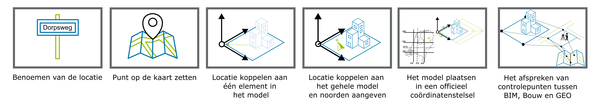

# Methodes van Georeferentie

Er zijn verschillende methodes beschikbaar om een BIM en GEO modellen bij elkaar te brengen op de kaart. Deze methoden verschillen in nauwkeurigheid en mogelijkheid voor het bijeenbrengen van modellen. Dit wordt door Clemen Christian beschreven als Levels van georefereren [[Christian2019]].

Het is mogelijk om een BIM-model op de kaart te zetten door alleen het adres van waar het BIM-model dient te komen te duiden. Deze informatie geeft een indicatie van waar het model moet komen. De informatie is niet toereikend om het model exact te plaatsen, roteren en schalen. Een andere methode zoals het model plaatsen in een officieel coordinatenstelsel is hiervoor wel geschikt. Afhankelijk van de behoefte zijn verschillende methodes geschikt.

De beschikbaarheid van informatie voor het berekenen van georeferentie-parameteres voor de verschillende methoden is onderzocht door de TU Delft. [[Hakim2024]] 

| Methode                                                   | Plaatsing     |  Rotatie      | Schaal        |
| -------------------------------------------------------   | ------------- | ------------- | ------------- |
| Benoemen van locatie                                      | Niet mogelijk | Niet mogelijk | Niet mogelijk | 
| Punt op de kaart zetten                                   | Mogelijk      | Niet mogelijk | Niet mogelijk |
| Locatie koppelen aan één element in het model             | Mogelijk      | Eventueel mogelijk | Niet mogelijk |
| Locatie koppelen aan geheel model en noorden aangeven     | Mogelijk      | Eventueel mogelijk | Niet mogelijk |
| Het model plaatsen in een officieel coördinatenstelsel    | Mogelijk      | Mogelijk              | Mogelijk |
| Het afspreken van controlepunten tussen BIM, Bouw en GEO  | Mogelijk      | Mogelijk | Mogelijk |

## 1D 2D en 3D Geo en BIM modellen

Zowel BIM- als GEO-modellen kunnen een 1D, 2D als 3D coordinatenstelsel gebruiken. Om een juiste  

Een GEO coordinatenstelsel kan 3D (EPSG:7415), 2D (EPSG:28992) of 1D (EPSG:5709) zijn. 

| Van           | Naar      |  Mogelijkheid | 
| -----------   | -------   | ------------- |
| 2D BIM        | 2D GEO    | ... | 
| 2D BIM        | 3D GEO    | ... | 
| 3D BIM        | 2D GEO    | ... | 
| 3D BIM        | 3D GEO    | ... | 

# Georeferentie in uitwisseling
# IFC

# CityGML 

# DXF

# Geopackage
