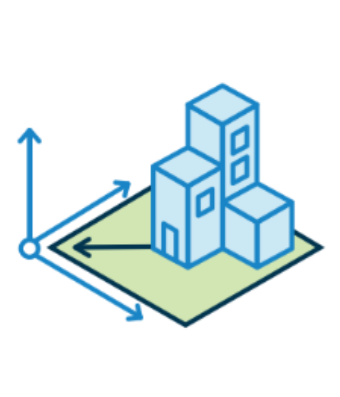
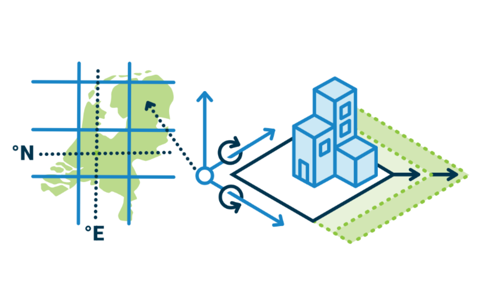
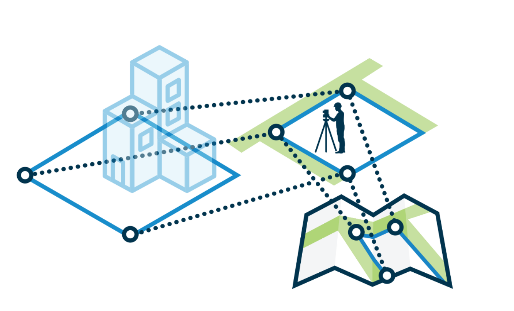
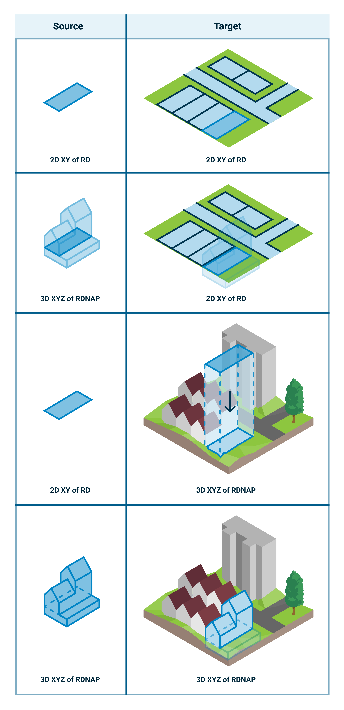

# Methodes van Georeferentie

Er zijn verschillende methodes beschikbaar om  BIM en GEO modellen bij elkaar te brengen op de kaart. 

## Methodes van Georeferentie 

### RD-gemodelleerd BIM naar RDNAP 
Het is mogelijk om "RD bewust" te modelleren in BIM. Wanneer men dit doet moet men rekening houden met de lijnvergroting of -reductie. Een project in de stad Amersfoort zal vanwege projectie een lijnreductie van +/-  9 mm per 100 meter in RD krijgen. Een lijn van 400 meter zal dan als een lijn van +/- 399,964 meter gemodelleerd moeten worden. De vergroting of reductie geldt niet voor de Z-waarde van lijnen in het model. Dit vereist veel discipline van de modelleur.  
De conversie van een RD-BIM naar een RDNAP is "null". 

### XYZ gemodeleerd BIM als RD naar RDNAP 
Het is mogelijk dat de conversie van XYZ in BIM naar RD + NAP coordinaten door software wordt ondersteund. Wanneer men dit doet zal de software bij een commando van een lijn van 400 meter in BIM eigenlijk een lijn van 399,964 meter in RD maken. Deze methode komt overeen met de methode hierboven beschreven. Het verschil in de methode zit in het feit dat niet de modelleur, maar de software het model RD maakt. 
De conversie van een XYZ-BIM als RD naar een RDNAP is "null". 

 Wanneer men dit doet moet men rekening houden met de lijnvergroting of -reductie. Een project in de stad Amersfoort zal vanwege projectie een lijnreductie van +/-  9 mm per 100 meter in RD krijgen. Een lijn van 400 meter zal dan als een lijn van +/- 399,964 meter gemodelleerd moeten worden. De vergroting of reductie geldt niet voor de Z-waarde van lijnen in het model. Dit vereist veel discipline van de modelleur.  

### XYZ gemodelleerd BIM via 2D Helmert naar RDNAP 
Een andere methode is om een XYZ gemodelleerd BIM-model met een 2D Helmert-transformatie naar RD-NAP transformeren. Een translatie en rotatie zijn afhankelijk van het gebruikte grid in BIM nodig. Een schaal-transformatie is, afhankelijk van de plek, zo goed als altijd nodig. Belangrijk hierbij is dat de z-waarde geen schaal dient te krijgen. 

### XYZ gemodelleerd BIM via 3D Helmert naar ETRS89 
Een volgende methode is om een XYZ gemodelleerd BIM-model met een 3D Helmert transformatie te plaatsen op de aarde met het ETRS89 XYZ coordinatenstelsel. Vanuit dit getransformeerde model kan men een ETRS89 lat/lon/h maken en ook RDNAP. 

### XYZ gemodeleerd BIM via 3D Helmert naar ETRS89 en hoogte naar NAP 
Deze methode waarbij men BIM via een 3D Helmert naar ETRS89 brengt en de hoogte naar NAP lijkt op de hiervoor beschreven methode. Het verschil zit erin dat in deze methode alleen XY met een 3D Helmert-transformatie naar ETRS89 getransformeerd wordt. De hoogte transformeert men apart als 1D transformatie naar NAP. De XY en Z wordt samengebracht in ETRS89 coordinaten.

### XYZ lokale projectie ETRS89 
De laatste methode is om een BIM-model XYZ te modelleren met een lokale projectie naar ETRS89 lat/lon. De lokale projectie is zo opgestelde dat afwijkingingen minimaal zijn. Het is mogelijk om een 1D transformatie te doen naar NAP of een 1D transformatie naar ellipsoidische hoogte. 

## Levels van georeferentie-informatie
Voor het uitvoeren van een georeferering zijn verschillende parameters en referentiegegevens nodig die de ruimtelijke positionering ondersteunen. Deze parameters beschrijven bijvoorbeeld het gebruikte coördinatenstelsel, de projectie, schaal, rotatie, referentiepunten of transformatie-informatie die nodig is om de brondata correct te koppelen aan een geografische locatie.

Deze ondersteunende parameters kunnen op verschillende manieren beschikbaar zijn. Soms zijn deze aanwezig in de brondata waarin georeferentiegegevens reeds opgenomen zijn, of in metadata of gekoppelde projectiebestanden. Hierdoor kan de positionering grotendeels automatisch plaatsvinden. Wanneer parameters voor een bepaalde methode (gedeeltelijk) ontbreken kan men dit aanvullen. Gegevens kan men verzamelen via externe bronnen, handmatige interpretatie, referentiekaarten of bekende controlepunten. Dit proces vraagt extra validatie om de nauwkeurigheid en consistentie van de georeferering te waarborgen.

De beschikbaarheid en kwaliteit van deze parameters hebben directe invloed op de betrouwbaarheid van het georefereringsproces en de uiteindelijke bruikbaarheid van de ruimtelijke data. In een onderzoek van Clemen Christian [[Christian2019]] worden verschillende levels van georeferentie-informatie beschreven. De verschillende levels faciliteren verschillende methode van georeferentie en verschillen in de te behalen nauwkeurigheid en mogelijkheid voor het bijeenbrengen van modellen. Dit wordt door  beschreven als <a>LoGeoRef</a> oftwel Levels of Georeferencing (niveaus van georeferentie-informatie) .

Het is mogelijk om een BIM-model te voorzien van georeferentie-informatie door alleen het adres, van waar het BIM-model dient te komen, te duiden. Deze informatie geeft hiermee een globale indicatie van waar het model moet komen. De informatie is niet toereikend om het model exact te plaatsen (transleren, roteren en schalen). Een andere level van informatie zoals het model relateren aan een officieel coordinatenstelsel is hiervoor wel geschikt. Afhankelijk van de behoefte zijn verschillende levels van georeferentie-informatie geschikt.

De beschikbaarheid van informatie voor het berekenen van georeferentie-parameters voor de verschillende methoden is onderzocht door de TU Delft [[Hakim2024]]. 

<table>
  <caption> Levels van georeferentie </caption>
  <tr>
    <th style = "width:200px;"> Methode </th>
    <th style = "width:50px;"> Level </th>
    <th style = "width:200px;"> Beschrijving </th>
    <th> Translatie </th>
    <th> Rotatie </th>
    <th> Schaal </th>
  </tr>
  <tr>
    <td>
      
    </td>
    <td> 10</td>
    <td> Met dit informatielevel wordt alleen de locatie waar een model moet komen benoemd. Bijvoorbeeld een adres als "Barchman Wuytierslaan 10, Amersfoort" in een model op te nemen. Men weet hierdoor op welk adres het model moet komen, maar exacte plaatsing, rotatie en schaling is hier niet uit te bepalen.</td>
    <td> Niet mogelijk </td> 
    <td> Niet mogelijk </td> 
    <td> Niet mogelijk </td> 
  </tr>
  <tr>
    <td>
      
    </td>
    <td> 20</td>
    <td> Met dit informatielevel duidt men één enkel (lat-lon) punt waar het model geplaatst moet worden. Bijvoorbeeld met het coordinaat "52.152494076977185, 5.3720554951931385". Plaatsing van het model op de juiste plek, zowel in 2D als 3D wordt hiermee mogelijk. Rotatie en schalen van het model blijft niet mogelijk.</td>
    <td> Mogelijk </td> 
    <td> Niet mogelijk </td> 
    <td> Niet mogelijk </td> 
  </tr>
  <tr>
    <td>
      
    </td>
    <td> 30</td>
    <td> Met dit informatielevel wordt aan het grondvlak van een model een coordinaat toegekend. Ook is het mogelijk om de rotatie ten opzichte van het Noorden te duiden. Het schalen van het model is niet mogelijk.</td>
    <td> Mogelijk </td> 
    <td> Eventueel mogelijk </td> 
    <td> Niet mogelijk </td> 
  </tr>
  <tr>
    <td>
      
    </td>
    <td> 40</td>
    <td> Met dit informatielevel wordt aan het totaal model een coordinaat toegekend, en ook de rotatie ten opzichte van Noorden kan men duiden. Het schalen van het model is niet mogelijk.</td>
    <td> Mogelijk </td> 
    <td> Eventueel mogelijk </td> 
    <td> Niet mogelijk </td> 
  </tr>
  <tr>
    <td>
      
    </td>
    <td> 50 </td>
    <td> Met dit informatielevel geeft men aan wat het oorspronkelijk coordinatenstelsel was waarin het model is gemodelleerd. Daarnaast geeft men in het model aan naar welk coordinatenstelsel een coversie gedaan  wordt. Heeft men bijvoorbeeld gemodelleerd vanuit een lokaal assenstelsel (0,0,0) dan kan men beschrijven welke translatie, rotatie en verschaling men moet toepassen om te kunnen combineren met data in RijksDriehoeksstelsel (RD).</td>
    <td> Mogelijk </td> 
    <td> Mogelijk </td> 
    <td> Mogelijk </td> 
  </tr>
  <tr>
    <td>
      
    </td>
    <td> 60 </td>
    <td> Met dit informatielevel koppelt men punten in model aan ingemeten punten tijdens constructie aan coordinaten in een specifiek coordinatenstelsel. </td>
    <td> Mogelijk </td> 
    <td> Mogelijk </td> 
    <td> Mogelijk </td> 
  </tr>
</table>

<mark> Duidelijker maken van Georeferentie 30 en 40 verschil </mark>

<table>
  <tr>
    <th width ="50"> Level </th>
    <th> Georeferentie informatie </th>
    <th> Toepassingsvoorbeeld </th>
  </tr>
  <tr>
    <td> 10 </td>
    <td> Benoemen Adres </td>
    <td> Voor administratieve analyses of navigatie </td>
  </tr>
  <tr>
    <td> 20 </td>
    <td> Het specificeren van één punt </td>
    <td> Voor het weergeven van een model als punt op de kaart en analyses zonder geometrische context </td>
  </tr>
  <tr>
    <td> 30 </td>
    <td> Het specificeren van punt en verdraaiing van het grondvlak </td>
    <td> Voor niet geometrische analyses, navigatie of controle van rotatie </td>
  </tr>
  <tr>
    <td> 40 </td>
    <td> Het specificeren van punt en verdraaiing van het model </td>
    <td> Voor niet geometrische analyses, navigatie of controle van rotatie </td>
  </tr>
  <tr>
    <td> 50 </td>
    <td> Aangeven van Source-CRS en trasformatie naar target-CRS </td>
    <td> Voor het combineren van Geo en BIM in applicaties t.b.v. visualisatie, analyse, coördinatie of integratie </td>
  </tr>
  <tr>
    <td> 60 </td>
    <td> Koppeling van punten in BIM, Geo en op het fysiek terrein </td>
    <td> Als het BIM-model gebruikt moet worden voor constructie/landmeetkundige integratie, waar de positie van het model in het terrein meetkundig verifieerbaar moet zijn. </td>
  </tr>
</table>

<aside class="note" title="Gebruik van level van Georefereren">
  
<strong>AANBEVELING:</strong> Gebruik voor GeoBIM-integratie level 50 en voor GeoBIM-inzet voor constructiedoeleinde level 60 van georefereren.  

</aside>
<aside class="note" title="Gebruik tooling om modellen te verrijken">

<strong>AANBEVELING:</strong> Gebruik tooling om modellen die nog niet voldoen aan georeferentie 50, wanneer nodig, te verrijken met georeferentie informatie conform level 50. 

</aside>

<mark> Tabel toevoegen of het ook mogelijk is om de Hoogte in translatie mee te nemen </mark>

## 1D, 2D en 3D Geo- en BIM-modellen
Zowel BIM- als GEO-modellen kunnen een 1D, 2D als 3D coordinatenstelsel gebruiken. Om een juiste transformatie van coordinaten van 2D en 3D modellen te verkrijgen kunnen verschillende methoden worden toegepast.  

Een GEO coordinatenstelsel kan 3D samengesteld (EPSG:7415), 2D (EPSG:28992) of 1D (EPSG:5709) zijn. 

<table>
<caption>Transformatie van 2D en 3D </caption>
  <thead>
    <tr>
      <th>Van (bron)</th>
      <th>Naar (target)</th>
      <th>Mogelijkheid</th>
    </tr>
  </thead>
  <tbody>
    <tr>
      <td>2D GEO of BIM</td>
      <td>2D GEO of BIM</td>
      <td><a href="#horizontaal-2d-gelijkvormigheidstransformatie">2D Helmert</a> Horizontaal transformatie</td>
    </tr>
    <tr>
      <td>2D GEO of BIM</td>
      <td>3D GEO of BIM</td>
      <td>2D Helmert transformatie + Interpolatie van z waarde naar target</td>
    </tr>
    <tr>
      <td>3D GEO of BIM</td>
      <td>2D GEO of BIM</td>
      <td>
        Optie 1: 3D Helmert transformatie + Maaiveld bron-model transformeren naar z-waarde 0. 
        Optie 2: Voetafdruk bron-model extraheren en 2D Helmert transformatie
      </td>
    </tr>
    <tr>
      <td>3D GEO of BIM</td>
      <td>3D GEO of BIM</td>
      <td>3D Helmert transformatie</td>
    </tr>
  </tbody>
</table>

<figure id="2D-en-3D-Geo-of-BIM-combineren">
      
    <figcaption><a class="self-link" href="#fig-2D-en-3D-Geo-of-BIM-combineren"></bdi></a>2D en 3D Geo of BIM combineren</figcaption>
</figure>

<mark> Om van geprojecteerd CRS naar een Geografische CRS te gaan is een coordinaatconversie nodig i.p.v. transformatie. Het is mogelijk om conversies van 2D naar 2D of van 3D naar 3D te doen. Klopt dit?</mark>

De mogelijkheden zijn:
| Van (bron)         | Naar (target)     |  Mogelijkheid | 
| -----------   | -------   | ------------- |
| 2D GEO/BIM (geprojecteerd)       | 2D GEO/BIM (geografisch)   | RDNAPTRANS    |
| 3D GEO/BIM (geprojecteerd)        | 3D GEO/BIM (geografisch)   | RDNAPTRANS    |

## Schaal en correctie
Een Geo of BIM bronmodel kan in een andere eenheid getekend zijn dan de eenheid van een targetmodel waarin het bronmodel moet landen. Het is daarom van belang om de juiste verschaling van model aan te geven. Wanneer een bron in milimeters is getekend en de target omgeving in meters, dan kan men dat met een schaal, waarde 0.001, aangeven. Of wanneer men van inches naar meter gaat met een schaal, waarde 0.0254.

Wanneer voor georeferentie een precisie van milimeters belangrijk is dient men daarnaast een correctie van horizontale afstanden voor lijnvergroting mee te nemen. 

De formule om deze correctie te berekenen is beschreven in de paragraaf <a class="self-link" href="#geprojecteerd-crs"> Geprojecteerd CRS</a>. Voor locaties nabij Amersfoort zal de correctie rond de -9,2 mm per 100 meter (x, y) liggen. Voor locaties rond Maastricht zal de correctie rond de + 10 mm per 100 meter (x,y) liggen. 

