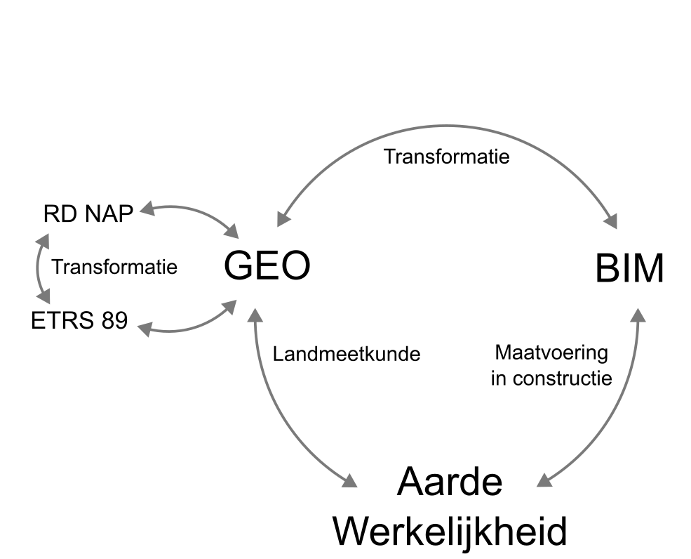

# Methodes voor Georeferentie

## Routes voor georeferentie

Wanneer men een BIM-model daadwerkelijk gaat realiseren op de bouwplaats, worden de coördinaten uit het model uitgezet in de werkelijkheid. Dit betekent dat het digitale coördinatensysteem van het BIM-model wordt gekoppeld aan vaste referentiepunten op de bouwplaats. Vanuit deze koppeling worden assen, stramienen (hulplijnen), hoogtes en punten vanuit het BIM-model uitgezet met meetapparatuur zoals een total station. De posities daarvan markeert men fysiek in het veld, bijvoorbeeld met piketten of andere markeringen. Voor omvangrijke projecten kan dit proces ook worden ondersteund door machinebesturing. Een BIM-model vormt zo de basis voor de maatvoering in constructie in de werkelijkheid. Met bijvoorbeeld een rolmaat, of laser doet men snelle metingen en detailcontrole op de bowplaats. 

Om de gecreëerde fysieke werkelijkheid vast te leggen in een coördinatensysteem meet men objecten weer in, met meetapparatuur zoals een total station en RTK-GNSS. Hiervoor meet men o.a. de hoekenpunten en dakranden van gebouwen in. Alle gemeten punten worden omgerekend naar RD (x,y) met de hoogte in NAP. Vervolgens worden de punten in GIS/CAD-software verbonden tot polygonen, classificeert men de objecten en voegt men attributen toe.  

<figure id="Routes voor georefereren" style="display: block; text-align: center; margin: 0 auto;">
  
  <figcaption><a class="self-link" href="#fig-Afwijking-door-aardkromming"></bdi></a>Routes voor georefereren</figcaption>
</figure>
<mark>verkeerde self-link in de code?</mark>

Wanneer men een BIM-model, dat gemodelleerd is in een lokaal cartesisch CRS (engineering CRS), in <a>geo-software</a> wil importeren, zonder de route uitzetten en inmeten, moet men een transformatie doen. Afhankelijk van de situatie zijn er verschillende methodes beschikbaar om  BIM-modellen en geodata samen te voegen op de kaart. Een in RD ingemeten (as-built) gebouwgeometrie kan men bijvoorbeeld vergelijken met een XYZ (as-designed) BIM-gebouwgeometrie, na een 2D gelijkvormigheidstransformatie en hoogtecorrectie, waarin translaties, rotatie en schaal aangegeven dienen te worden. 

## 1D, 2D en 3D GEO- en BIM-modellen
Zowel BIM-modellen als geoodata kunnen een 2D, 3D of samengesteld coördinatenstelsel gebruiken. Om een juiste transformatie te verkrijgen kunnen verschillende transformatiemethoden worden toegepast.  

<mark>tabel past in breedte niet op bladzijde</mark>  
<table>
<caption>Transformatie tussen 2D, 3D en samengestelde coördinatenstelsel van BIM-modellen en/of geodata</caption>
  <thead>
    <tr>
      <th>Source/Target <mark>vertalen naar Bron/Doel?</mark></th>
      <th>2D RD</th>
      <th>2D lokaal</th>
      <th>2D ETRS89</th>
      <th>2D+1D RDNAP</th>
      <th>3D lokaal</th>
      <th>3D ETRS89</th>
      </tr>
  </thead>
  <tbody>
    <tr>
      <td><strong>2D RD</strong></td>
      <td>Nultransformatie</td>
      <td><a href="#2D-gelijkvormigheidstransformatie">2D Helmerttransformatie</a></td>
      <td>RDNAPTRANS zonder hoogte</td>
      <td>Nultransformatie en interpolatie naar NAP-hoogte van target</td>
      <td><a href="#2D-gelijkvormigheidstransformatie">2D Helmerttransfomatie</a> en interpolatie naar Z-waarde van target</td>
      <td>RDNAPTRANS</td>
    </tr>
    <tr>
      <td><strong>2D lokaal</strong></td>
      <td><a href="#2D-gelijkvormigheidstransformatie">2D Helmerttransformatie</a></td>
      <td>Nultransformatie</td>
      <td><a href="#3D-gelijkvormigheidstransformatie">3D Helmerttransformatie</a> met Z=0 (zonder gebruik elipsoïdische hoogte)</td>
      <td><a href="#2D-gelijkvormigheidstransformatie">2D Helmerttransfomatie</a> en interpolatie naar NAP-hoogte van target</td>
      <td>Nultransformatie en interpolatie naar Z-waarde van target</td>
      <td><a href="#3D-gelijkvormigheidstransformatie">3D Helmerttransformatie</a> met Z=0 en interpolatie naar ellipsoïdische hoogte van target</td>
    </tr>
    <tr>
      <td><strong>2D ETRS89</strong></td>
      <td>RDNAPTRANS zonder hoogte</td>
      <td><a href="#3D-gelijkvormigheidstransformatie">3D Helmerttransformatie</a> met h=43 m (zonder gebruik Z-waarde)</td>
      <td>Nultransformatie</td>
      <td>RDNAPTRANS zonder hoogte en interpolatie naar NAP-hoogte van target</td>
      <td><a href="#3D-gelijkvormigheidstransformatie">3D Helmerttransformatie</a> met h=43 m en interpolatie naar Z-waarde van target</td>
      <td>Nultransformatie en interpolatie naar elipsoidische hoogte van target</td>
    </tr>
    <tr>
      <td><strong>2D+1D RDNAP</strong></td>
      <td>Nultransformatie (zonder gebruik NAP-hoogte)</td>
      <td><a href="#2D-gelijkvormigheidstransformatie">2D Helmerttransformatie</a> (zonder gebruik NAP-hoogte)</td>
      <td>RDNAPTRANS zonder hoogte</td>
      <td>Nultransformatie</td>
      <td><a href="#2D-gelijkvormigheidstransformatie">2D Helmerttransformatie</a> en 1D Helmerttransformatie van hoogte</td>
      <td>RDNAPTRANS</td>
    </tr>
    <tr>
      <td><strong>3D lokaal</strong></td>
      <td><a href="#2D-gelijkvormigheidstransformatie">2D Helmerttransformatie</a></td>
      <td>Nultransfomatie (zonder gebruik Z-waarde)</td>
      <td><a href="#3D-gelijkvormigheidstransformatie">3D Helmerttransformatie</a> (zonder gebruik elipsoïdische hoogte)</td>
      <td><a href="#2D-gelijkvormigheidstransformatie">2D Helmerttransformatie</a> en 1D Helmerttransformatie van hoogte</td>
      <td>Nultransformatie</td>
      <td><a href="#3D-gelijkvormigheidstransformatie">3D Helmerttransformatie</a></td>
    </tr>
    <tr>
      <td><strong>3D ETRS89</strong></td>
      <td>RDNAPTRANS zonder hoogte</td>
      <td><a href="#3D-gelijkvormigheidstransformatie">3D Helmerttransformatie</a> (zonder gebruik Z-waarde)</td>
      <td>Nultransformatie (zonder gebruik elipsoïdische hoogte)</td>
      <td>RDNAPTRANS</td>
      <td>3D gelijkvormigheidstransformatie</td>
      <td>Nultransformatie</td>
    </tr>
</table>

<figure id="2D-en-3D-Geo-of-BIM-combineren">
      
    <figcaption><a class="self-link" href="#fig-2D-en-3D-Geo-of-BIM-combineren"></bdi></a>2D en 3D BIM-model en geodata combineren</figcaption>
</figure>

## Methodes voor georeferentie 

<mark>overlap met paragraaf "Coördinatentransformatie tussel lokaal CRS en geodetisch CRS?</mark>

### RD-gemodelleerd BIM naar RDNAP 
Het is mogelijk om "RD bewust" te modelleren in BIM. Wanneer men dit doet moet men rekening houden met de schaalcorrectie voor RD. Een project in de stad Amersfoort zal vanwege projectie, in RD ca. 9 mm per 100 meter kleiner getekend worden dan hoe het in werkelijkheid moet worden. Een lijn van 400 meter zal dan als een lijn van +/- 396,4 meter gemodelleerd moeten worden. De vergroting of reductie geldt niet voor verticale lijnen en NAP-hoogtes in het model. Dit vereist grote zorgvuldigheid van de modelleur. Of men moet de afwijking accepteren. 
De transformatie van XYZ-BIM als RDNAP in BIM naar RDNAP is een "nultransformatie". 

### XYZ gemodeleerd BIM als RD naar RDNAP 
Het is mogelijk dat de transformatie van XYZ in BIM naar RDNAP-coördinaten door BIM-software wordt ondersteund. In dit geval zal de software bij een commando om een lijn van 400 meter te maken in BIM in Amersfoort eigenlijk een lijn van 396,4 meter in RD maken die overeen komt met een lijn van 400 m in werkelijkheid. Deze methode komt overeen met de methode hierboven beschreven. Het verschil in de methode zit in het feit dat niet de modelleur, maar de software de schaalcorrectie doet om het model in RD te tekenen. 
De transformatie van RDNAP in BIM naar RDNAP is een "nultransformatie". 

### XYZ gemodelleerd BIM via een 2D gelijkvormigheidstransformatie naar RDNAP 
Een andere methode is om een in lokaal cartesisch XYZ gemodelleerd BIM-model met een 2D gelijkvormigheidstransformatie naar RD met NAP-hoogte te transformeren. Een schaalparameter is, afhankelijk van de locatie in Nederland, vaak nodig. Belangrijk hierbij is dat de hoogte-waarde geen schaalcorrectie dient te krijgen. 

Zonder schaalcorrectie kan op land een afwijking tot 1 cm op 100 meter optreden (10 cm op 1 km). Bij toepassing van een RD-schaalcorrectie voor XY en dezelfde schaalcorrectie voor Z, dan is de afwijking 1 cm bij een model van 500 meter en maximaal 100 meter hoogteverschil (&Delta;H), of 10 cm bij een model van 5 km. Bij toepassing van de RD-schaalcorrectie op XY en niet voor Z, dan is de afwijking vergelijkbaar door vervorming door het RD-correctiegrid en de aardkromming. Voordeel van deze laatste methode is dat deze ook voor modellen met een kleinere lengte (L) en een groter hoogteverschil (&Delta;H) en op zee te gebruiken is, bijvoorbeeld L=200 m en &Delta;H=320 m.

### XYZ gemodelleerd BIM via een 3D gelijkvormigheidstransformatie naar ETRS89 
Een volgende methode is om een in lokaal cartesisch XYZ gemodelleerd BIM-model met een 3D gelijkvormigheidstransformatie te transformeren naar cartesisch XYZ in het geocentrische ETRS89-coördinatenstelsel. Dit getransformeerde model kan men vervolgens converteren naar breedte, lengte en hoogte in geografisch 3D ETRS89 en transformeren naar RDNAP. 

Doordat het model niet met de aardkromming meebuigt onstaat er een hoogtefout bij deze methode. De hoogtefout is na 360 meter 1 cm en na 1,1 km 10 cm. Deze afwijking neemt quadratisch toe met de afstand.  

### XYZ gemodeleerd BIM via 3D een 3D gelijkvormigheidstransformatie naar ETRS89 en hoogte naar NAP 
Deze methode waarbij men BIM via een 3D gelijkvormigheidstransformatie naar ETRS89 brengt en de hoogte naar NAP lijkt op de hiervoor beschreven methode. Het verschil zit erin dat in deze methode XYZ met een 3D gelijkvormigheidstransformatie naar ETRS89 getransformeerd wordt. De hoogte transformeert men daarna apart als 1D-transformatie naar NAP. De breedte en lengte in ETRS89 kan men vervolgens transformeren naar RD en er de NAP-hoogte aan toevoegen voor RDNAP-coördinaten.

Deze optie geeft een oplossing voor de hoogteafwijking zoals in de hiervoor beschreven methode optreedt. Wel genereert deze methode vervorming van het orgineel model. Deze afwijking is 1 cm bij een model dat zich maximaal 2 km strekt en een maximale hoogte heeft van 32m. De afwijking is ook 1cm bij een model dat zich 200m uitstrekt met een hoogte van maximaal 320 meter.

### XYZ met lokale projectie naar ETRS89 
<mark>Deze methode voegt niet zo veel toe voor de nauwkeurigheid en is niet eenvoudig toepasbaar: beter weglaten?

De laatste methode is om een BIM-model in lokaal cartesisch XYZ te modelleren en met een lokale projectie naar ETRS89 breedte en lengte te transformeren. De lokale projectie is zo opgestelde dat afwijkingingen minimaal zijn. Het is mogelijk om voor de hoogte daarnaast een 1D transformatie te doen naar NAP.</mark>

### Conclusie 
Om bovenstaande methodes uit te voeren is een bepaald level aan georeferentie-informatie nodig. Met het hieronder beschreven level 50 Level of Georeferentie-informatie zijn de nultransformaties, en 2D + 1D Helmert transformaties te voorzien van informatie. Een 3D Helmertransformatie en de 3D + 1D Helmerttransformatie kan bij uitbreiding van Level 50 impliciete aannames omdat er 7 transformatieparameters nodig zijn. Bij gebruik van level 60 is geen uitbreiding nodig, mits de software de 7 parameters zelf kan berekenen uit de referentiepunten.

## Levels van georeferentie-informatie
Voor gegeorefereerde data zijn verschillende referentiegegevens of transformatieparameters nodig. Deze gegevens beschrijven bijvoorbeeld het gebruikte coördinatenstelsel, transformatieparameters of referentiepunten - informatie die nodig is om de brondata correct te koppelen aan een geografische locatie.

Deze gegevens kunnen op verschillende manieren beschikbaar zijn. Soms zijn deze aanwezig in de brondata waarin informatie voor georeferentie reeds opgenomen is, of in metadata of in gekoppelde bestanden zoals een prj-bestand. Hierdoor kan de positionering grotendeels automatisch plaatsvinden. Wanneer parameters voor een bepaalde methode (gedeeltelijk) ontbreken kan men dit aanvullen. De gegevens daarvoor kan men verzamelen uit externe bronnen of door handmatige interpretatie van referentiekaarten of bekende referentiepunten. Dit proces vergt extra validatie om de nauwkeurigheid en betrouwbaarheid van de georeferentie te waarborgen.

De kwaliteit van deze parameters heeft directe invloed op het georefereringsproces en de uiteindelijke bruikbaarheid van de ruimtelijke data. In een onderzoek van Clemen Christian [[Christian2019]] worden verschillende levels van georeferentie-informatie beschreven. De verschillende levels faciliteren verschillende methodes van georeferentie en verschillen in de te behalen nauwkeurigheid en mogelijkheid voor het samenvoegen van modellen. Dit wordt door  beschreven als <mark><a>LoGeoRef</a></mark> oftwel Levels of Georeferencing (niveaus van georeferentie-informatie) .

Het is mogelijk om een BIM-model te voorzien van georeferentie-informatie door alleen het adres, van waar het BIM-model dient te komen, te velmelden. Deze informatie geeft hiermee een grove indicatie van waar het model moet komen. De informatie is niet toereikend om het model exact te plaatsen (transleren, roteren en schalen). Een ander level van informatie dat het BIM-model relateert aan een officieel coördinatenstelsel is hiervoor wel geschikt. Afhankelijk van de behoefte zijn verschillende levels van georeferentie-informatie geschikt.

De beschikbaarheid van informatie voor het berekenen van georeferentie-parameters voor de verschillende methoden is onderzocht door de TU Delft [[Hakim2024]]. 

<table>
  <caption> Levels van georeferentie </caption>
  <tr>
    <th> Methode  </th>
    <th> Level </th>
    <th> Translatie XY </th>
    <th> Translatie Z </th>
    <th> Rotatie </th>
    <th> Schaal  XY </th>
    <th> Schaal Z </th>
  </tr>
      <tr>
          <td colspan="7">  Een locatienaam opgeven:</td>
  </tr>
  <tr>
    <td>
      
    </td>
    <td> 10</td>
    <td> Niet mogelijk </td> 
    <td> Niet mogelijk </td> 
    <td> Niet mogelijk </td>
    <td> Niet mogelijk </td>
    <td> Niet mogelijk </td>
    </tr> 
      <tr>
        <td colspan="7"> Met dit informatielevel wordt alleen de locatie waar een model moet komen benoemd. Bijvoorbeeld een adres als "Barchman Wuytierslaan 10, Amersfoort" in een model op te nemen. Men weet hierdoor op welk adres het model moet komen, maar exacte plaatsing, rotatie en schaling is hier niet uit te bepalen.</td>
  </tr>
  <tr>
  <tr>
        <td colspan="7">  Voor één punt coördinaten opgeven: </td>
  </tr>
    <td>
      
    </td>
    <td> 20</td>
    <td> Mogelijk </td> 
    <td> Mogelijk </td> 
    <td> Niet mogelijk </td>
    <td> Niet mogelijk </td> 
    <td> Niet mogelijk </td> 
    </tr> 
      <tr>
        <td colspan="7"> Met dit informatielevel duidt men één enkel punt (breedte- en lengtegraad) waar het model geplaatst moet worden. Bijvoorbeeld met het coordinaat "52.15249407, 5.37205549". Plaatsing van het model op de juiste plek, zowel in 2D als 3D wordt hiermee mogelijk. Rotatie en schalen van het model blijft niet mogelijk.</td>
  </tr>
  <tr>
    <td colspan="7"> De positie en richting van het grondvlak specificeren: </td>
    

  </td>
  </tr>
  <tr>
    <td>
      <mark>rotatie ontbreekt in de afbeelding
    </td>
    <td> 30</td>
    <td> Mogelijk </td> 
    <td> Mogelijk </td>
    <td> Optioneel </td> 
    <td> Niet mogelijk </td> 
    <td> Niet mogelijk </td> 
  </tr>
  </tr>
        <tr>
        <td colspan="7"> Met dit informatielevel wordt aan het grondvlak van een model een verplaatsing ten opzichte van het model 0-punt toegekend die overeenkomt met het beoogd coordinaatrefentiesysteem. Objectplaatsing wordt gebruikt als georeferentie. Doordat elementen een ruimtelijke relatie hebben met het grondvlak worden deze elementen ook juist geplaatst en kunnen coordinaten van deze elementen klein gehouden worden. Ook is het mogelijk om de rotatie ten opzichte van het Noorden te duiden. Het schalen van het model is niet mogelijk. Ook is het niet mogelijk om het CRS waarvoor het coordinaat geldt te duiden.</td>
  </tr>
  <tr>
    <td colspan="7">De positie en richting van het model duiden: </td>
    

  </td>
  <tr>
    <td>
      <mark>translatie ontbreekt in de afbeelding
    </td>
    <td> 40</td>
    <td> Mogelijk </td> 
    <td> Mogelijk </td>
    <td> Optioneel </td> 
    <td> Niet mogelijk </td> 
    <td> Niet mogelijk </td> 
  </tr>
          <tr>
        <td colspan="7"> Met dit informatielevel wordt aan het <strong>totaalmodel</strong> een coordinaat toegekend, en ook de rotatie ten opzichte van Noorden kan men duiden. De georeferentie is een aparte entiteit, en is daarmee expliciet geduid. De methode komt overeen met LevelOfGeoreferencing Het schalen van het model is niet mogelijk. Ook is het niet mogelijk om het CRS waarvoor het coordinaat geldt te duiden.</td>
  </tr>
  <tr>
    <td colspan="7"> De positie en richting van het grondvlak duiden: </td>
    

  </td>
  <tr>
  <tr>
    <td>
      <mark>N en E zijn geen Nederlandse afkortingen voor RD gebruiken we x en y; Waarom staan er 2 rotaties rond X- en Y-as in plaats van 1 rotatie rond de Z-as?
    </td>
    <td> 50 </td>
    <td> Mogelijk </td> 
    <td> Mogelijk </td>
    <td> Mogelijk </td> 
    <td> Mogelijk </td> 
    <td> Optioneel </td> 
  </tr>
           <tr>
        <td colspan="6"> Met dit informatielevel geeft men aan wat het oorspronkelijk coordinatenstelsel is waarin het model is gemodelleerd. Daarnaast geeft men in het model aan naar welk coordinatenstelsel een coversie gedaan  wordt. Heeft men bijvoorbeeld gemodelleerd vanuit een lokaal assenstelsel (0,0,0) dan kan men beschrijven welke translatie, rotatie en verschaling men moet toepassen om te kunnen combineren met data in RD-coördinaten.</td>
  </tr>
  <tr>
    <td colspan="7"> Coörinaten van referentiepunten in het BIM-model en een CRS: </td>
    

  </td>
  <tr>
  <tr>
    <td>
      
    </td>
    <td> 60 </td>
    <td> Mogelijk </td> 
    <td> Mogelijk </td> 
    <td> Mogelijk </td> 
    <td> Mogelijk </td>
    <td> Mogelijk </td>
  </tr>
             <tr>
        <td colspan="6"> Met dit informatielevel koppelt men punten in model aan ingemeten punten tijdens constructie aan coördinaten in een specifiek coordinatenstelsel.</td>
  </tr>
</table>

Een hoger LoGeoRef-niveau geeft een model expliciteitere, completere en betere gestructureerde georeferentie-informatie. Dit geeft meer mogelijkheden in gebruik. Een hoger level van georeferentie stelt ook hogere eisen aan datakwaliteit en expertise. Men kan in sommige situaties besluiten een lager level van georeferentie aan te houden. De hierboven beschreven methodes van georeferentie kunnen worden toegepast onderstaande situaties. Bij een hoger level georefentiemodel blijven de toepassingsvoorbeelden van lager niveaus ook werken. 
<table>
  <tr>
    <th width ="50"> Level </th>
    <th> Georeferentie-informatie </th>
    <th> Toepassingsvoorbeeld </th>
  </tr>
  <tr>
    <td> 10 </td>
    <td> Benoemen adres </td>
    <td> Voor administratieve analyses of voor navigatie naar de locatie van het BIM-model</td>
  </tr>
  <tr>
    <td> 20 </td>
    <td> Het specificeren van één punt </td>
    <td> Voor het weergeven van een model als punt op de kaart en analyses zonder geometrische context </td>
  </tr>
  <tr>
    <td> 30 </td>
    <td> Het specificeren van punt en verdraaiing van het grondvlak </td>
    <td> Voor niet-geometrische analyses <mark>of controle van rotatie </td>
  </tr>
  <tr>
    <td> 40 </td>
    <td> Het specificeren van punt en verdraaiing van het totaalmodel </td>
    <td> Voor niet geometrische analyses, <mark>controle van rotatie </td>
  </tr>
  <tr>
    <td> 50 </td>
    <td> Aangeven van Source-CRS en 2D+1D-Helmerttransformatie naar target-CRS </td>
    <td> Voor het combineren van geodata en BIM-modellen in applicaties t.b.v. visualisatie en analyse<mark>, coördinatie of integratie </td>
  </tr>
  <tr>
    <td> 60 </td>
    <td> Koppeling van punten in BIM, Geo en op het fysiek terrein </td>
    <td> Als het BIM-model gebruikt moet worden voor constructie of andere toepassingen waarbij de positie van het model in het terrein landmeetkundig aanwijsbaar moet zijn. </td>
  </tr>
</table>

<aside class="note" title="Gebruik van level van Georefereren">
  
<strong>AANBEVELING:</strong> Gebruik voor integratie van BIM-modellen en geodata level 50 en voor constructiedoeleinden level 60 van georefereren.  

</aside>
<aside class="note" title="Gebruik tooling om modellen te verrijken">

<strong>AANBEVELING:</strong> Gebruik tooling om modellen die nog niet voldoen aan georeferentie 50, wanneer nodig, te verrijken met georeferentie-informatie conform level 50. 

</aside>

## Schaal en correctie op basis van gebruikte eeenheden
Geodata of een BIM-model kan in een andere eenheid zijn opgesteld dan het coördinatenstelsel waarnaar het moet worden worden getransformeert. Het is daarom essentieel om de gebruikte eenheden expliciet te specificeren in het model. Wanneer een source bijvoorbeeld in millimeters is gemodelleerd en de target meters gebruikt, moet er een eenheidsconversie worden toegepast. 

Een mogelijke workaround, wanneer software geen correcte eenheidsconversie uitvoert, is het toepassen van een schaalfactor binnen de georeferentie-informatie, bijvoorbeeld 0.001 voor millimeter naar meter of 0.0254 voor inch naar meter. Het risico van deze aanpak is dat software die de eenheden wél correct interpreteert, deze schaalcorrectie opnieuw toepast, wat leidt tot een dubbele conversie en dus foutieve geometrie.

<aside class="note" title="Gebruik van LoGeoRef en schaal"> 
<strong>AANBEVELING:</strong> Gebruik de schaalparameter binnen georeferentie uitsluitend voor geometrische transformaties binnen het coördinatensysteem (bijvoorbeeld CRS-transformaties), en niet voor eenheidsconversies. Definieer eenheden altijd expliciet via de daarvoor bestemde attributen, zoals <a href="https://ifc43-docs.standards.buildingsmart.org/IFC/RELEASE/IFC4x3/HTML/lexical/IfcUnitAssignment.htm">IfcUnitAssignment</a>.
 </aside>
