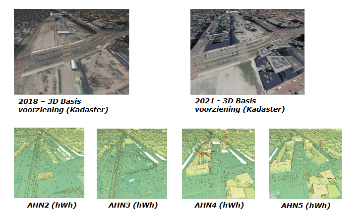

# Gebruik van geo-datasets voor georeferenties
De beschreven methodes van georeferentie, gefocused op gebouwen, kunnen worden opgeschaald naar infrastructuur projecten. Zodoende kunnen de voorbeelden van Figuur YY, vertaald worden naar de volgende 3 onderdelen: (1) Gebruik van survey points, (2) Footprint alignment en (3) scan-to-BIM. Om deze methodes te kunnen toepassen legt dit hoofdstuk uit, welke datasets, kwaliteitsparameters en toepassingen nodig zijn om een BIM te kunnen georefrenen. 

## Geo datasets voor het refereren van modellen
Voor het refereren van datasets naar een geo domein, zijn de volgende datasets beschikbaar, die zijn weergegeven in Tabel YY. Hier is de bestandsnaam, eigenaar, nauwkeuigheid, dimensie en locatie weergegeven. 

<table id="tabel-overzicht-nationale-datasets">
   <caption>Overzicht van nationale datasets beschikbaar voor geo-referentie van project data of modelen</caption>
  <thead>
    <tr>
      <th>Naam</th>
      <th>Nauwkeurigheid</th>
      <th>Dimensie</th>
      <th>Domein</th>
    </tr>
  </thead>
  <tbody>
    <tr>
      <td><a href="https://www.pdok.nl/introductie/-/article/digitaal-topografisch-bestand-dtb-"><strong>DTB / 1GiS</strong></a></td>
      <td>cm-nauwkeurig op objectniveau</td>
      <td>2.5D</td>
      <td>Landelijk, beheerde water/wegen-infrastructuur</td>
    </tr>
    <tr>
      <td><a href="https://www.pdok.nl/introductie/-/article/basisregistratie-grootschalige-topografie-bgt-"><strong>BGT</strong></a></td>
      <td>cm-nauwkeurig op objectniveau</td>
      <td>2D</td>
      <td>Landelijk</td>
    </tr>
    <tr>
      <td><a href="https://www.ahn.nl/dataroom"><strong>AHN</strong></a></td>
      <td>10–15 cm (verticaal) &amp; 13–18 cm</td>
      <td>3D</td>
      <td>Landelijk</td>
    </tr>
    <tr>
      <td><strong>PMG</strong></td>
      <td>± 2 cm (relatief)</td>
      <td>3D</td>
      <td>RWS-wegennet, selectieve locaties</td>
    </tr>
    <tr>
      <td><a href="https://www.nationaalwegenbestand.nl/nwb-downloaden"><strong>NWB</strong></a></td>
      <td>± 1 m (topologisch)</td>
      <td>2D</td>
      <td>Landelijk, wegennet (NL)</td>
    </tr>
    <tr>
      <td><a href="https://spoorinbeeld.nl/"><strong>SpoorInBeeld</strong></a></td>
      <td>± 2 cm (relatief)</td>
      <td>3D</td>
      <td>Spoortracés Nederland</td>
    </tr>
    <tr>
      <td><a href="https://www.beeldmateriaal.nl/dataroom"><strong>Beeldmateriaal</strong></a></td>
      <td>± 5–10 cm (projectie)</td>
      <td>2.5D</td>
      <td>Landelijk / stedelijk</td>
    </tr>
    <tr>
      <td><a href="https://maps.rijkswaterstaat.nl/geoweb55/index.html?viewer=NAPinfo"><strong>NAP-netwerk</strong></a></td>
      <td>&lt; 1 cm (verticaal)</td>
      <td>1D (Z)</td>
      <td>Landelijk meetnet (peilmerken)</td>
    </tr>
    <tr>
      <td><a href="https://www.pdok.nl/introductie/-/article/basisregistratie-adressen-en-gebouwen-ba-1"><strong>BAG</strong></a></td>
      <td>± 10 cm (objectpositie)</td>
      <td>2D/2.5D</td>
      <td>Landelijk (NL)</td>
    </tr>
  </tbody>
</table>

Naast primaire geo datasets, kunnen gemeentes, provicies en centrale overheden andere datasets beschikbaar hebben, die kleiner van scope zijn. Ook zijn er datasets die zijn geextraheerd uit de bovenbenoemde datasets. Een voorbeeld is de 3DBAG, waar het <a>AHN</a> de basis is voor het maken van deze dataset. Een analyse is in de verschillende hoogtedatasets in Nederland [source] en vanuit europa zijn de volgende hoogte datasets beschikbaar, die terug te vinden zijn via de volgende link. [https://3d.bk.tudelft.nl/europeantopography]

## Kwaliteits kenmerken voor geobestanden naar BIM
De verschillende datasets die gebruikt kunnen worden, zijn van elkaar te onderscheiden. Het planimetrische en hoogtecomponent in een geo-databestand vormt een fundamenteel onderdeel van de dataset. Afwijkingen in deze informatie, of verschillen tussen diverse momenten van inwinning of ontwerp, kunnen een grote impact hebben. Het correct refereren van het bestand ten opzichte van deze assen is daarom essentieel om de juiste stappen te kunnen nemen.

Het doel van het refereren van een model binnen het geo-domein is het positioneren ervan in de echte wereld. Deze echte wereld bestaat uit een lokaal en een globaal coördinatensysteem. Zoals eerder beschreven, wordt een BIM-model in de toegepaste softwarepakketten vaak in een 0,0,0-referentiesysteem geplaatst. Daarentegen bevatten globale coördinaten aanzienlijk grotere waarden, wat ertoe kan leiden dat een dataset vastloopt binnen een applicatie. De documentatie van het gebruikte coördinatensysteem is eveneens van cruciaal belang. Wanneer dit systeem niet correct is vastgelegd, kunnen er problemen ontstaan tijdens de conversie van de hoogtecomponent. De meest gebruikte coördinatenstelsels in Nederland zijn weergegeven in Tabel YY. 

<!--
**Tabel YY.** Overzicht van de globale coordinatensystemen gebruikt in Nederland
| Naam      | Orientatie | EPSG      | Toelichting                                                                                                                                                              |
| --------- | ---------- | --------- | ------------------------------------------------------------------------------------------------------------------------------------------------------------------------ |
| **RDNAP** | XYZ        | **7415**  | Dit is een *compound coordinate reference system* (CRS) dat RD (XY, EPSG:28992) combineert met NAP (Z, EPSG:5709). Dus: X=Easting (RD), Y=Northing (RD), Z=hoogte (NAP). |
| **RD**    | XY         | **28992** | Planimetrisch systeem (Rijksdriehoeksstelsel) — X is oost, Y is noord.                                                                                                   |
| **NAP**   | Z          | **5709**  | Verticaal referentiesysteem, hoogte in meters t.o.v. Normaal Amsterdams Peil.                                                                                            |

*Voor meer informatie naar het gebruik van coordinaatreferentie systemen, zie de handreiking: https://docs.geostandaarden.nl/crs/crs/ *
-->

## Primaire kwaliteits kenmerken voor geobestanden naar bim
Voor het gebruik van een dataset uit het **GIS-domein** zijn verschillende kenmerken van belang voor de toepassing binnen een **BIM-systeem**. Niet alle data is even geschikt om gebruikt te worden, naast het gerbuik van het juiste coordinaten systeem, spelen er kwailiteits kenmerken mee die van invloed zijn op zowel de ingewonnen als de gerbruikte referenetie data. Op basis van de onderzoeken en initiatieven  
*[Bron: IHN / Geonovum / DigiGo]* kunnen de volgende componenten worden meegenomen, let wel er zijn meer componenten die van invloed zijn op de kwaliteit en bruikbarheid van de data. 

### 1. Geografische distributie van de meet punten
Afhankelijk van de inwin methode, is de geografische distributie van de meetpunten van belang. Dit heeft namelijk een direct effect van het onderscheiden van objecten in het terrein, maar ondersteunt ook in correct vinden van de refrenetie punten. De distributie wordt omschreven door de hoeveelheid punten per vierkante meter of door de minimale afstand tussen de punten. De leert praktijk is een hoge puntdichtheid gekoppeld aan een hoger detailniveau van het 3D-model.

### 2. De absolute en relatieve nauwkeurigheid van een geo-dataset
In de literatuur en uitvraag­specificaties wordt een onderscheid gemaakt tussen de **absolute** en **relatieve** nauwkeurigheid van een geo-dataset. De **absolute nauwkeurigheid** beschrijft de afwijking tussen de inwinning of het model en de werkelijkheid, terwijl de **relatieve nauwkeurigheid** vaak wordt gebruikt om de afwijking tussen meetpunten binnen overlappende inwinningen te omschrijven. Een voorbeeld hiervan is een dwarsprofiel over een ingewonnen stuk snelweg. Beide typen nauwkeurigheden worden uitgedrukt in een planimetrische (XY) en een altimetrische (Z) component. De verschillende uitvraag­specificaties laten zien dat de relatieve nauwkeurigheid altijd kleiner is dan de absolute nauwkeurigheid.

### 3. De classificatieparameters in een geo-dataset
De wijze waarop objecten binnen een geo-dataset worden geclassificeerd, is essentieel voor de bruikbaarheid binnen een BIM-context. De toegepaste classificatiemethode vormt een belangrijke kwaliteitsparameter, bijvoorbeeld wanneer classificatie wordt uitgevoerd door kunstmatige intelligentie (AI) of door menselijke experts. Daarnaast zijn de gebruikte definities een cruciaal startpunt binnen dit proces. Zo kan de classificatie van vegetatie in de referentiedataset niet automatisch dezelfde definitie hebben als in de ingewonnen dataset, wat kan leiden tot interpretatieverschillen of inconsistenties in het uiteindelijke model.

### 4. De inwindatum van de geo-dataset
Het moment van inwinning bepaalt de bruikbaarheid van de dataset, aangezien iedere geo-dataset die wordt weergegeven in een GIS-omgeving een momentopname is. Een geo-dataset vertegenwoordigt nooit de volledige werkelijkheid, maar vormt slechts een benadering van de omgeving. Hierdoor kan de omgeving, afhankelijk van de mate van verandering, in de loop van de tijd sterk of minder sterk afwijken van de oorspronkelijke weergave. Dit wordt geïllustreerd in de onderstaande figuren aan de hand van de stationsregio van Delft, zoals weergegeven in het Actueel Hoogtebestand Nederland en de 3D Basisvoorziening, waarbij de bouw van de stationsregio een ingrijpende verandering in het terrein laat zien.

<figure id="Leefttijd-van-verschillende-puntenwolken-van-de-stations-regio-in Delft">
      
    <figcaption><a class="self-link" href="#fig-Leefttijd-van-verschillende-puntenwolken-van-de-stations-regio-in Delft"></bdi></a>Leefttijd van verschillende puntenwolken van de stationsregio in Delft</figcaption>
</figure>
