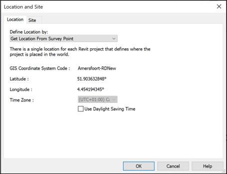

# Handleiding Software

# Software

## Revit
*Begrippen*

*Internal Origin:* De oorsprong in Revit. Dit punt is niet te verplaatsen.

*Project Basepoint:* Lokaal Coördinatiepunt. Dit punt wordt gebruikt om modellen op elkaar af te stemmen en als de positie op de aardbol niet relevant is, b.v. tijdens engineering.
Survey Point: CRS-Coördinatiepunt . Dit punt wordt gebruikt om de relatie te leggen met een coördinatenstelsel en zo de positie van het model op de aardbol vast te leggen.

*Project Units:* De instelling van de standaard eenheden binnen het project. Hier kan b.v. opgegeven worden of er met meters of met millimeters wordt gewerkt.

*Methode 1:* link dwg
1.	Gebruik een DXF of een DWG die op de juiste coördinaten is gemaakt als onderlegger en link die in Revit. Het is handig om bij het linken op te geven dat het bestand in meters is.
2.	Verplaats en roteer het bestand naar een bekend punt of het model zodat het bestand op de juiste positie staat. Je verplaatst dus niet het model naar de juiste plek maar je schuift de locatie onder het model.
3.	Gebruik ‘Aquire Coordinates’ en selecteer het bestand om de coördinaten over te nemen.
4.	Selecteer het Survey Point, unclip het en verplaatst het naar de gekozen X- en Y-waarden van het CRS-Coördinatiepunt en geef als Z-waarde de hoogte ten opzichte van N.A.P. op.
5.	Plaats een coördinatiekubus van 1x1x1m met een hoekpunt op de plek van het Project Basepoint, bij voorkeur zo dat de kubus in het negatieve kwadrant valt ten opzichte van het Project Basepoint.
6.	Als er, zoals bij de start van een project, nog geen model is dan is het handig om in de onderlegger de positie van het CRS-Coördinatiepunt op te geven (kies een plek met hele X- en Y-waarden in het coördinatenstelsel). Link, verplaats en roteer dan het bestand zodat het CRS-Coördinatiepunt overeenkomt met het Survey Point.
7.	Gebruik ‘Aquire Coordinates’ en selecteer het bestand om de coördinaten over te nemen.
8.	Selecteer het Survey Point, unclip het en geef als Z-waarde de hoogte ten opzichte van N.A.P. op.
9.	Als het ontwerp zover is dat de stramienen vaststaan dan kan het Project Basepoint verplaatst worden zodat die op 5m van de eerste stramienen staat zoals gebruikelijk. Vóór het verplaatsten van het Project Basepoint moet hij ge-unclipt worden.
10.	Plaats een coördinatiekubus van 1x1x1m met een hoekpunt op de plek van het Project Basepoint, bij voorkeur zo dat de kubus in het negatieve kwadrant valt ten opzichte van het Project Basepoint.

*Methode 2: Project Basepoint en Survey Point aanpassen*
Hoekverdraaiing en negatieve waardes voor hoeken
*Units*
*Export naar IFC*
 
 

 

## ArchiCAD
--- 

## VectorWorks
--- 

## BricsCAD
--- 

## Sketchup
--- 

## Bonsai (BlenderBIM)
--- 

## Illustrator
--- 

## Definities
<dfn>Definitie</dfn>: Een definitie is een beschrijving van een woord. Een ander woord voor _definitie_ is betekenis of beschrijving.

