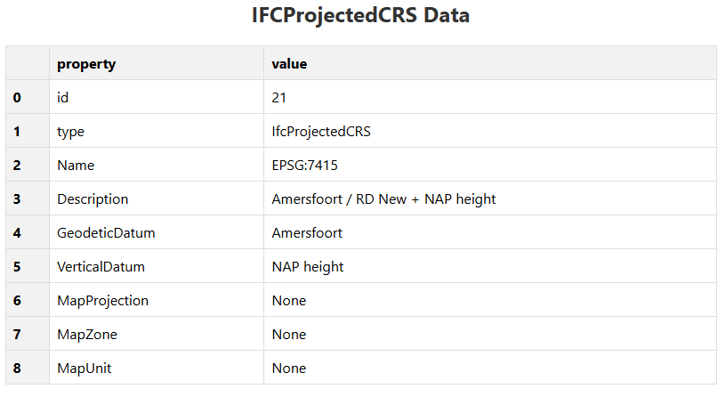
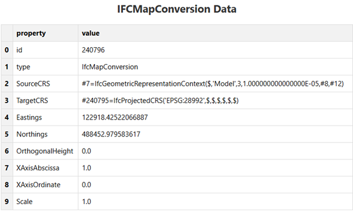
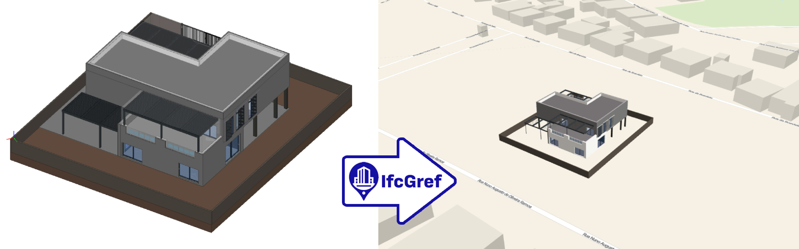

# Tooling
--- 

## IfcGref
IfcGref is a web-based software tool designed to set, enhance, and visualize the georeferencing of IFC (Industry Foundation Classes) models. IFC models often contain varying levels of georeferencing detail and geo information, ranging from a simple postal address (LoGeoRef10) to full projected coordinate reference system definitions (LoGeoRef50). The first step in IfcGref’s workflow is to detect the current geo information of an IFC file and determine what data is already georeferenced at the LoGeoRef50.

To improve accuracy, IfcGref allows users to input surveyed points. These are common points that exist both in the BIM model’s local Cartesian coordinates and in real-world coordinates from a chosen CRS. By aligning these two sets of points, IfcGref establishes a reliable link between the BIM environment and the Earth’s surface projection. The software then applies a Helmert transformation, which computes translations, rotation, and scale factors to align the two coordinate systems. This transformation is solved using the least squares method (via the SciPy library), ensuring that errors are minimized, especially when multiple surveyed points are provided.

Depending on the initial level of georeferencing in the IFC file, IfcGref can upgrade the model to LoGeoRef50. For example, two surveyed points are sufficient to georeference files that originally contain no geoinformation (LoGeoRef0–10), while only one additional surveyed point is required for models that already include partial georeferencing metadata (LoGeoRef20–40). To handle transformations between different geographic and projected coordinate systems, IfcGref uses the pyproj library, making the process robust across different regions and CRS definitions.

Finally, the IFC file is updated with georeferencing attributes, which the user can download and directly visualize on a map through IfcGref’s web interface. This allows users to verify the spatial alignment immediately.

## IfcGref (Dutch)
IfcGref is een webgebaseerde softwaretool die is ontwikkeld om de georeferentie van IFC (Industry Foundation Classes)-modellen vast te leggen, te verbeteren en te visualiseren. IFC-modellen bevatten vaak uiteenlopende niveaus van georeferentie en geo-informatie, variërend van een eenvoudig postadres (LoGeoRef10) tot volledige projectie- en coördinatenstelselspecificaties (LoGeoRef50). De eerste stap in de workflow van IfcGref is het detecteren van de bestaande geo-informatie in een IFC-bestand en het vaststellen welke gegevens reeds op het niveau LoGeoRef50 zijn gegeorefereerd.

Ter verbetering van de nauwkeurigheid biedt IfcGref de mogelijkheid om ingemeten punten in te voeren. Dit zijn gemeenschappelijke punten die zowel in de lokale Cartesiaanse coördinaten van het BIM-model als in reële coördinaten binnen een gekozen CRS (Coordinate Reference System) aanwezig zijn. Door deze twee puntensets op elkaar af te stemmen, legt IfcGref een betrouwbare koppeling tussen de BIM-omgeving en de aardoppervlakteprojectie. Vervolgens past de software een Helmert-transformatie toe, waarbij translaties, rotaties en schaalfactoren worden berekend om de twee coördinatenstelsels op elkaar af te stemmen. Deze transformatie wordt opgelost met behulp van de kleinste-kwadratenmethode (via de SciPy-bibliotheek), waardoor de fouten tot een minimum worden beperkt, vooral wanneer meerdere ingemeten punten beschikbaar zijn.

Afhankelijk van het initiële georeferentieniveau van het IFC-bestand kan IfcGref het model upgraden tot LoGeoRef50. Zo volstaan twee ingemeten punten om bestanden die oorspronkelijk geen geo-informatie bevatten (LoGeoRef0–10) te georefereren, terwijl slechts één aanvullend ingemeten punt nodig is voor modellen die reeds gedeeltelijke georeferentie-metagegevens bevatten (LoGeoRef20–40). Voor de omzetting tussen verschillende geografische en geprojecteerde coördinatenstelsels maakt IfcGref gebruik van de pyproj-bibliotheek, wat het proces robuust maakt voor uiteenlopende regio’s en CRS-definities.

Tot slot wordt het IFC-bestand bijgewerkt met georeferentieattributen, die de gebruiker kan downloaden en direct kan visualiseren op een kaart via de webinterface van IfcGref. Hierdoor kunnen gebruikers de ruimtelijke uitlijning onmiddellijk controleren.

## IfcGeoRefChecker

https://github.com/dd-bim/City2BIM/tree/master/IFCGeoRefCheckerGUI
