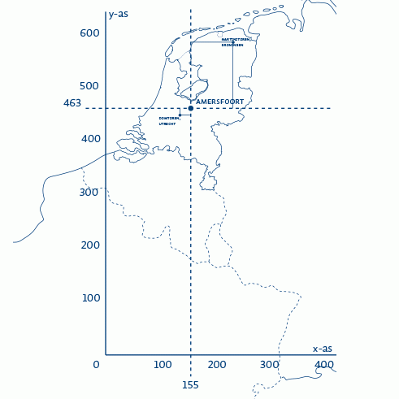

# Tooling
--- 

## Ifc2Gref
Wanneer nog geen geo-locatie is vastgelegd kan de bim modelleur gebruik maken van de tool: IFCgref. Ten minste één bekend RD punt als invoer om de translatie te beschrijven. Geldige waarden Easting, Northing (X,Y) voor Nederland vallen in dit bereik (in km.)

## Referenties

Referentie uit locale lijst [[SemVer]]. Lijst staat in `organisation-config.js`. Alleen referenties die in de tekst voorkomen worden getoond.

We gebruiken een <a>definitie</a> om een woord te omschrijven.

