# Handleiding Software

## CAD Onderlegger 
Voor het Georefereren van BIM-modellen kan het handig zijn om een CAD-bestand van de locatie te gebruiken als onderlegger. Wanneer men zelf een onderlegger wil maken kan met het volgende doen:

Optie 1: 2D 
1. Ga naar PDOK en selecteer in de [BGT download-viewer](https://app.pdok.nl/lv/bgt/download-viewer/) de gewenste locatie.
2. Unzip het downloadbestand. 
3. Drag-drop de bestanden in [QGIS](https://qgis.org/download/).
4. In QGIS selecteer Project>Import/Export>Export Project to DXF. De CRS zal EPSG:28992 (RD NEW) tonen.

<figure id="QGIS-DXF-Export-2D">
      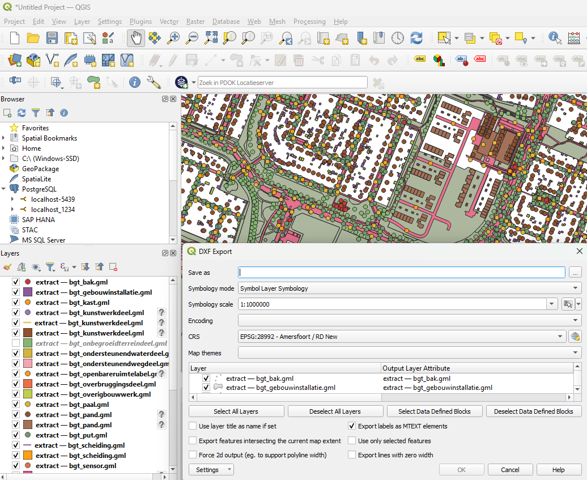
    <figcaption><a class="self-link" href="#fig-QGIS-DXF-Export-2D"></bdi></a>Export 2D project naar DXF in QGIS</figcaption>
</figure>

Optie 2: 3D 
1. Ga naar [3D BAG](https://www.3dbag.nl/nl/download) en selecteer je gewenste locatie (tegel).
2. Download je bestand en kies Geopackage (GPKG) als bestandformaat. 
3. Drag-drop je bestanden in QGIS.
4. In QGIS ga naar Project>Import/Export>Export Project to DXF. De CRS zal EPSG:74152 (RD NEW + NAP height) tonen.
<figure id="QGIS-DXF-Export-3D">
      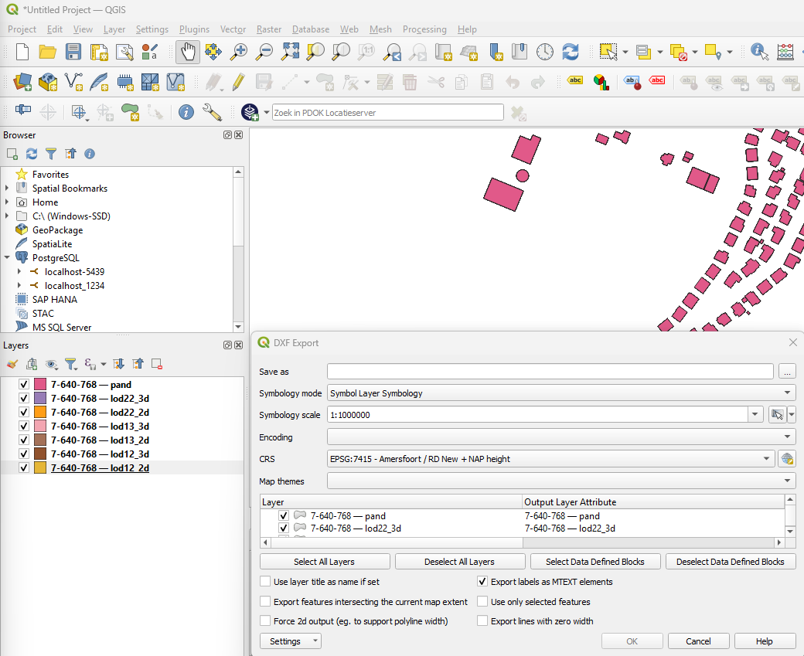
    <figcaption><a class="self-link" href="#fig-QGIS-DXF-Export-3D"></bdi></a>Export 2D project naar DXF in QGIS</figcaption>
</figure>

## Revit
Revit kent het begrip <a>Internal Origin</a>. Dit is de oorsprong in Revit die niet verplaatsbaar is. Daarnaast bestaat er een *<a>Project Basepoint</a>:*, ook wel Lokaal Coördinatiepunt. Dit punt wordt gebruikt om gemodelleerde elementen te positioneren en uitwisseling met andere modellen mogelijk te maken. tijdens engineering en/of wanneer Georeferentie niet relevant is. Ook kent Revit een <a>Survey Point</a>. Dit punt, een soort CRS-coordinatiepunt, wordt gebruikt om de relatie te leggen met een coördinatenstelsel (CRS) en zo de positie van het model op de aardbol vast te leggen.
Revit kent <a>Project Units</a>. De project units bevat de instelling van de standaard eenheden die men binnen het project gebruikt. Hier kan men bijvoorbeeld opgegeven of er met meters of met millimeters wordt gewerkt of volume in liters of m3. 
<figure id="Scherm-in-Revit-dat-Lokaal-Coordinatiepunt-en-CRS-Coordinatiepunt-laat-zien">
      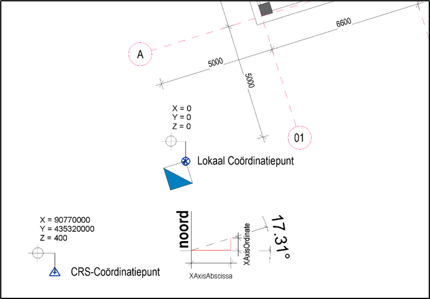
    <figcaption><a class="self-link" href="#fig-Scherm-in-Revit-dat-Lokaal-Coordinatiepunt-en-CRS-Coordinatiepunt-laat-zien"></bdi></a>Scherm in Revit dat Lokaal Coordinatiepunt en CRS-Coordinatiepunt laat zien</figcaption>
</figure>

**Methode 1: link DXF, DWG of RVT**
1. Gebruik een DXF, DWG of een RVT in de gewenste CRS-coördinaten als onderlegger en link die in Revit. Daarbij is het aan te raden om bij het linken op te geven dat de eenheid van het bestand meters. Gebruik bij voorkeur een onderlegger die CRS-informatie in de bron bevat zodat Revit de EPSG-code overneemt en je die niet handmatig hoeft toe te voegen.
2. Wanneer er, zoals bij de start van een project, nog geen ontwerpmodel is, dan is het verstandig om in de onderlegger de positie van een nieuw CRS-Coördinatiepunt op te geven. Kies daarvoor een plek met hele X- en Y-waarden in het coördinatenstelsel.
3. Verplaats en roteer de onderlegger naar een referentie-punt waarvan je de positie zeker weet of naar het model, zodat de onderlegger op de juiste positie staat. Verplaats daarbij niet het getekend model naar de juiste locatie op de onderlegger, maar verplaats de onderlegger naar het model.
4. Gebruik ‘Aquire Coordinates’ en selecteer de onderlegger om de coördinaten over te nemen. Gebruik daarbij niet “Save Position” van de DXF of DWG. Revit maakt anders een Shared Coordinates bestand aan en wijzigt de locatie van de DXF of DWG waardoor die niet meer correct is.
5. Selecteer het Survey Point, unclip het en verplaatst het naar de gekozen X- en Y-waarden van het CRS-Coördinatiepunt (hele X- en Y-waarden in het RD-stelsel) en geef als Z-waarde de hoogte ten opzichte van NAP op. Clip vervolgens het Survey Point en verplaats het Survey Point in de Z-richting terug naar 0.
6. Plaats een coördinatie-object op het Survey Point.
7. Plaats een coördinatie-object op het <a>Project Basepoint</a>.
8. Als het ontwerp zover is dat de stramienen vaststaan dan kan het Project Basepoint verplaatst worden zodat die op 5 of 10m van de eerste stramienen staat zoals gebruikelijk. Vóór het verplaatsten moet het Project Basepoint ge-unclipt worden. Verplaats vervolgens ook een coördinatie-object naar de nieuwe positie van het Project Basepoint.

**Methode 2: Project Basepoint en Survey Point aanpassen** 
1. Geeft het Revit bestand of een DWG-export uit het Revit bestand aan een landmeter of een BIM- of GIS-specialist en vraag om de RD-coördinaten van het Lokaal Coördinatiepunt (Project Basepoint) en vraag om een voorstel voor het CRS-Coördinatiepunt (Survey Point). 
2. Zet in Revit de Project Units op meter.
3. Unclip het Survey Point en verplaats het naar de opgegeven coördinaten van het Lokaal Coördinatiepunt (Project Basepoint). (NB: N/S=Y en E/W=X).
4. Clip het Survey Point en verplaats het naar het Project Basepoint.
9. Unclip het Survey Point en verplaats het naar de opgegeven coördinaten van het CRS-Coördinatiepunt (Survey Point) en geef als Z-waarde de hoogte ten opzichte van N.A.P. op. Clip vervolgens het Survey Point en verplaats het Survey Point in de Z-richting terug naar 0.
5. Selecteer het Project Basepoint en geef de hoekverdraaiing ten opzichte van Grid-noord (True North) op. Het gaat hier om de hoekverdraaiing van Project North naar True North waarbij positief = tegen de klok in en negatief is met de klok mee. Revit zal negatieve hoekverdraaiingen omrekenen naar een positieve hoekverdraaiing.
6. Zet eventueel de Project Units terug naar millimeter.

<figure id="Controle-in-Revit">
      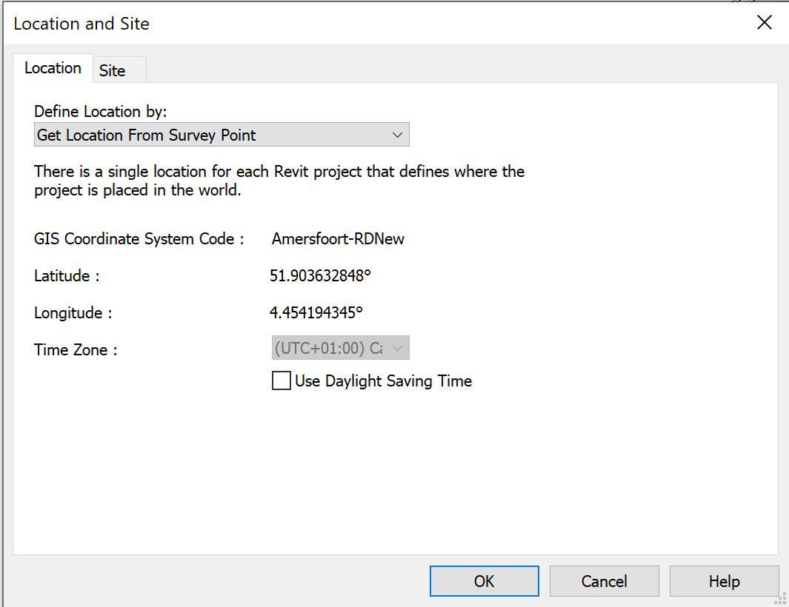
    <figcaption><a class="self-link" href="#fig-Controle-in-Revit"></bdi></a>Controle van georeferentie in Revit. Het venster "Location and Site" geeft aan of alles goed is gegaan</figcaption>
</figure>

**Units**
Door een omissie in de IFC-exporter van Revit moet voorafgaand aan het exporteren naar IFC de Project Units Length op meter ingesteld worden.

**Export naar IFC**

1.	Lokaal Coördinatiepunt: exporteer een IFC (4 of hoger) met Project Basepoint als Coordinate Base. 
De IFC is niet ge-georefereerd (alleen de coordinaten van Project Basepoint zijn correct) en niet Grid-noord gericht (Project North in Revit). 

<figure id="Setup-in-Revit">
      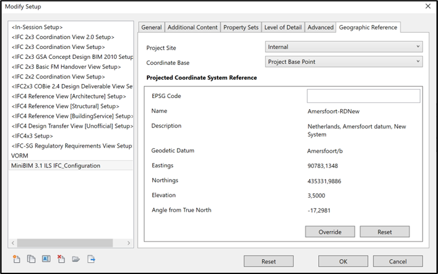
    <figcaption><a class="self-link" href="#fig-Setup-in-Revit"></bdi></a>Controle van georeferentie in Revit. Het venster "Location and Site" geeft aan of alles goed is gegaan</figcaption>
</figure>

2.	CRS-Coördinatiepunt: exporteer een IFC (4 of hoger) met Survey Point als Coordinate Base. 
Vul bij EPSG Code in: <mark> 28992</mark> **opmerking, waarom geen 7415**. De IFC is ge-Georefereerd en is Grid-noord gericht (True North in Revit) 

<mark> dit is dezelfde figuur. Klopt dit? </mark>

<figure id="Controle-in-Revit-2">
      
    <figcaption><a class="self-link" href="#fig-Controle-in-Revit"></bdi></a>Controle van georeferentie in Revit. Het venster "Location and Site" geeft aan of alles goed is gegaan</figcaption>
</figure>

<figure id="Setup-in-Revit-Survey-Point">
      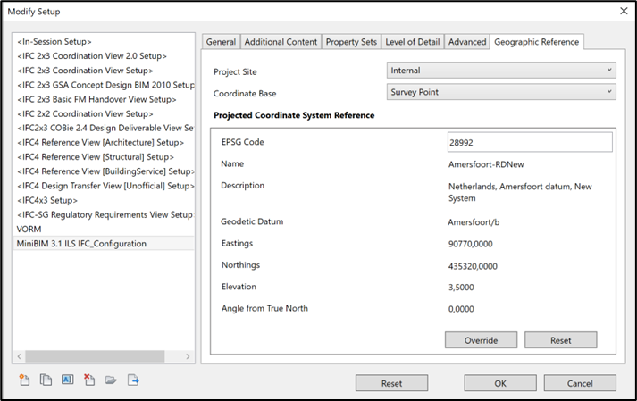
    <figcaption><a class="self-link" href="#fig-Setup-in-Revit-Survey-Point"></bdi></a>Scherm in Revit met instellingen voor IFC export met Survey Point als Coordinate Base</figcaption>
</figure>

<mark> Vanwaar deze bron, kunnen we dit toelichten?</mark>

[Hans Hendriks (2022)](https://github.com/Hans-Lammerts/Sample-Test-Files/blob/master/Geolocation%20information%20from%20Revit%20to%20IFC_v1.0.pdf)

## Autocad Civil 3D

Er zijn momenteel 2 manieren om een Export te maken in Civil3D. De oude manier middels het commando “IFCEXPORT”. Hiermee worden alle Solids in het huidige model geëxporteerd. Dit maakt echter geen gebruikt van de nieuwe functionaliteiten van IFC4x3. Met de oude manier is het ook nodig om een Corridor eerst als solids te exporteren voordat je deze naar IFC exporteert. 
Sinds enige tijd heeft Autodesk een plugin gemaakt welke het commando “IFCINFRAEXPORT” toevoegen aan Civil3D. Hiermee kan een IFC gemaakt worden welke de nieuwe functionaliteiten van IFC4x3 gebruikt. 
Deze [link](https://www.autodesk.com/support/technical/article/caas/sfdcarticles/sfdcarticles/Where-to-download-Civil-3D-IFC-4-3-Import-Export-Extension.html) beschrijft hoe je deze plugin kan downloaden van Autodesk. Voor de rest van deze handleiding wordt er vanuit gegaan dat deze plugin geïnstalleerd is.
 
Stappenplan IFC Export Civil3D “IFCINFRAEXPORT”
1. Maak je Civil3D model zoals je dit altijd doen. Uiteraard rekening houdend met werken op RD-Coördinaten
2. Controleer of het RD stelsel correct is ingesteld met de het commando “EDITDRAWINGSETTING” of het commando “MAPCSASSIGN”

<figure id="Cordinate_system_Civil3D">
      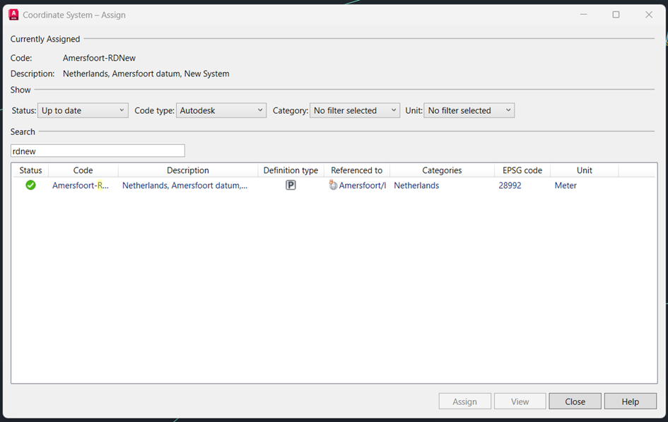
    <figcaption><a class="self-link" href="#fig-Cordinate_system_Civil3D"></bdi></a>Controle van instellingen van RD-stelsel in Civil 3D</figcaption>
</figure>

3. Spreek een BIM Base Point af binnen je project af. In het voorbeeld is X=93000, Y=441000 gekozen. Het is slim om dit punt te markeren met een symbool
4. Gebruik het commando “IFCInfraSetProjectBasePoint” om het zojuist afgestemde basepoint te selecteren als basispunt voor de IFC Export. Er wordt een COGO point aangemaakt op deze locatie.
5. Gebruik nu het commando “IFCINFRAEXPORT” om alle objecten in het DWG bestand te exporteren. Het commando “IFCINFRAEXPORTSELECTED” kan gebruikt worden om een beperkt aantal objecten te exporteren.
In deze [link](https://help.autodesk.com/view/CIV3D/2024/ENU/?guid=GUID-FBA4D6BE-3879-4D95-9DC3-B479F7FCFF41) is extra informatie te vinden over de "IFC4.3 IFC Exporter" voor Civil3D.

## ArchiCAD
Instellen Georeferentie (via de IFC4 “MapConversion” methode) voor het exporteren vanuit ArchiCAD. De exacte benamingen kunnen iets afwijken afhankelijk van de versie (AC 23, 24, …), maar de kernstappen blijven gelijk.

1. Projectlocatie instellen

    Ga naar Options > Project Preferences > Project Location….
    Vul hier de geografische coördinaten (latitude/longitude), eventueel hoogte, en stel de juiste kaartprojectie (indien van toepassing) in. 

    Plaats in het model een Survey Point (Meetpunt) op de juiste locatie in het terrein waarmee je het coördinatenreferentiepunt vastlegt. 

    In de instellingen van de Survey Point kun je bij “Geo-referencing Map…” de waarden invullen voor datum, coördinatensysteem etc. 

  <figure style="text-align:center; margin:0;" id="Cordinate_system_ArchiCAD">
    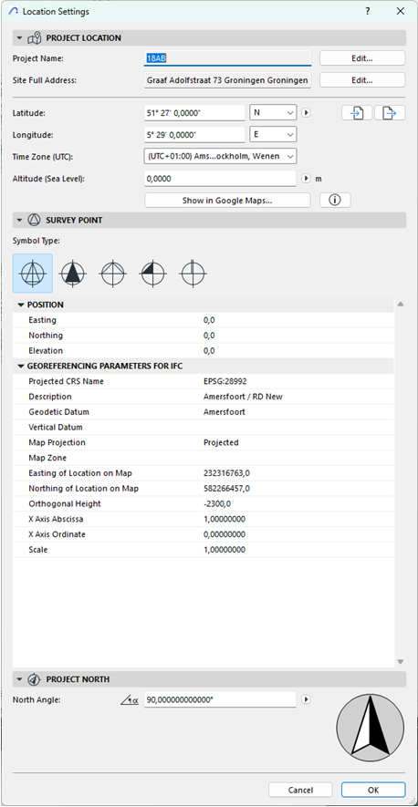
    <figcaption>Controle van instellingen van RD-stelsel in ArchiCAD</figcaption>
  </figure>

  <figure style="text-align:center; margin:0;" id="Cordinate_system_ArchiCAD_2">
    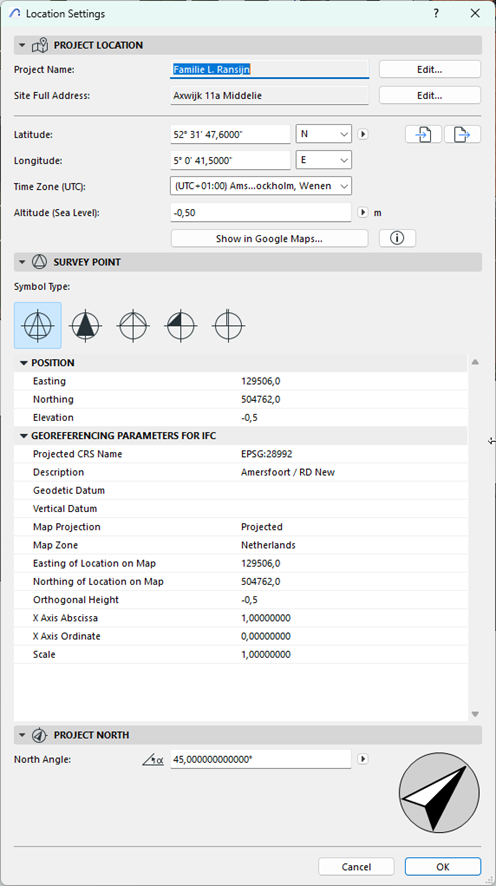
    <figcaption>Tweede figuur: voorbeeld</figcaption>
  </figure>

<aside class="note" title="Werk dicht op de project-oriëntatie in ArchiCAD">
  
<strong>AANBEVELING:</strong> Werk het liefst zo dicht mogelijk op de project-oriëntatie in ArchiCAD zodat grote offset-waarden in het IFC-bestand worden vermeden.   

</aside>

2. Instellen van de IFC-exporttranslator

    - Ga naar File > Interoperability > IFC > IFC Translators  
    - Maak een nieuwe translator aan of dupliceer een bestaande (bijv. “General Export”) zodat de wijzigingen veilig te testen zijn.  

    In de translator instellingen: 
    - Kies bij IFC Schema voor IFC4. 
    - Kies het juiste Model View Definition (MVD) zoals “Design Transfer View” indien vereist. 
    In de tab “Geometry Conversion” (of gelijknamige):
    - Kies de juiste plaatsing voor de “IfcSite” entiteit. 
    
    Bij IFC4 wordt de positie van het site-entiteit gekoppeld aan het Survey Point of het Project Origin. 

<aside class="example" title="Match IFC Site location with Survey Point position">
"Match IFC Site location with Survey Point position” → gebruikt het Survey Point als coördinaatreferentie.
“Match IFC Site location with Project Origin” → gebruikt het ArchiCAD Project Origin als referentie.   
Controleer in de Data Conversion/Units sectie dat de exportunits correct zijn ingesteld en dat “IFC Base Quantities” aangevinkt is indien gewenst. 
</aside>

3. Specifieke instellingen voor georeferentie (IFC4 MapConversion)  
    Bij IFC4 is georeferentie op LoGeoRef 50 opgenomen via de entiteiten IfcMapConversion en IfcProjectedCRS. In IFC2x3 gebeurde dit op basis van losse property sets. Zorg ervoor dat in de Project Location en Survey Point de juiste coördinaten en datum/kaartprojectie zijn ingevuld.
    In de translator instellingen de “Match IFC Site location …” correct staat (zoals hierboven).
    Bij export wordt gecontroleerd of de outputbestand de entiteit IfcMapConversion bevat (dit kun je openen als tekst in een IFC-viewer of teksteditor).

4. Export uitvoeren en controle
    - Sla het project op.
    - Onder File > Save As… of via File > Interoperability > IFC > Save as IFC…, selecteer de gekozen translator.
    - Exporteer het bestand.  
    - Open het geëxporteerde IFC bestand in een IFC-viewer (bijv. BIMcollab ZOOM of Blender) en controleer of:  
        - De georeferentie informatie aanwezig is (IfcMapConversion / IfcProjectedCRS).  
        - Het model correct gepositioneerd is t.o.v. de verwachte coördinaten.  
    - Test eventueel import in een andere software (bijv. GIS-omgeving of BIM coördinatie tool) om zeker te zijn dat de locatie klopt.

5. Aandachtspunten / valkuilen  
    De ingevoerde coördinaten in Project Location verplaatsen niet automatisch de geometrie in ArchiCAD: ze worden opgenomen als metadata voor export. 
    Werken met zeer grote coördinaatwaarden (bijv. UTM meters ver weg van 0,0) kan leiden tot precisieproblemen in export/import workflows. Probeer het model origin zo dicht mogelijk bij projectlocatie te houden. Bij import in andere software kan de “site origin” verkeerd worden geïnterpreteerd indien de instellingen van “Match IFC Site location” niet goed staan. Controleer altijd dat de gebruikte translator versie compatibel is met IFC4 en de gewenste MVD.

## Tekla Structures
In Tekla Structures kan met behulp van **Basispunten** een coördinatensysteem voor uitwisselbaarheid worden gebruikt. Bijvoorbeeld voor het importeren en exporteren van IFC-bestanden. Deze basispunten worden gebruikt om het model nauwkeurig te positioneren en uit te lijnen binnen een groter coördinatensysteem. Ze zorgen voor consistente samenwerking en correcte uitwisseling van modellen tussen verschillende partijen. 

1. Basispunten definiëren  
    Basispunten kunnen gedefinieerd worden in de **Projecteigenschappen** van Tekla Structures. 
    Klik op _Bestand > Projecteigenschappen > Basispunten_ om het dialoogvenster **Basispunt** te openen.  
    Definieer de benodigde gegevens zoals de coördinaten (1) en een eventuele hoek bij de optie Hoek naar het noorden (2) 
    en sla het basispunt op onder een naam door op de “+” knop te klikken (3): 

<figure id="Basispunt_in_Tekla">
    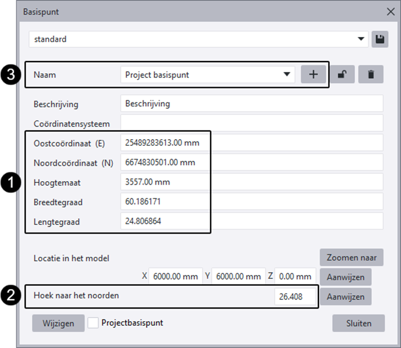
    <figcaption>
      Basispunt in Tekla
    </figcaption>
</figure>

2. IFC exporteren  
    Klik op Bestand > Exporteren > IFC4 om het dialoogvenster **IFC exporteren** te openen.
    Selecteer bij Locatie door het gedefinieerde basispunt:
<figure id="IFC_Export_in_Tekla">
  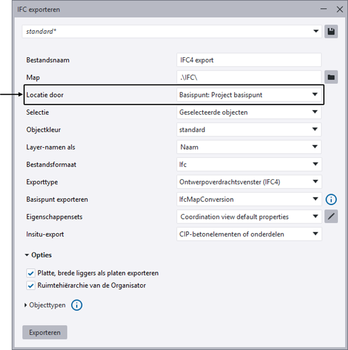
   <figcaption>
      IFC exporteren in Tekla
    </figcaption>
</figure>

Definieer vervolgens de overige benodigde gegevens. Bij de optie _Basispunt exporteren_ kan gekozen worden voor de methode _IfcMapConversion_ of _IfcSite_ als export-setting van dit betreffende Basispunt.

3. IFC importeren  
   Voor het importeren van IFC-modellen wordt in Tekla Structures de functionaliteit **Referentiemodellen** gebruikt.
   Klik in het zijpaneel op Referentiemodellen:
<figure id="IFC_importeren_in_Tekla">
  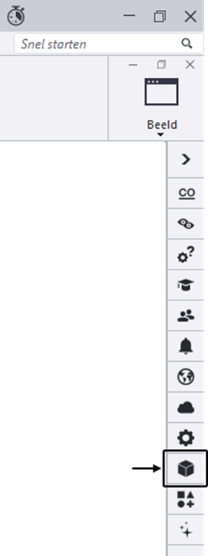
   <figcaption>
      IFC importeren in Tekla
    </figcaption>
</figure>

Klik vervolgens op de knop **+ Model toevoegen** om het dialoogvenster **Model toevoegen** te openen. Selecteer bij Locatie door het gedefinieerde basispunt:

<figure id="Model_toevoegen_in_Tekla">
  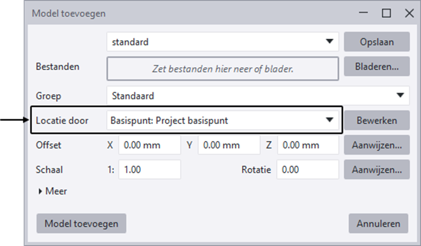
   <figcaption>
      Model toevoegen in Tekla
    </figcaption>
</figure>

Blader vervolgens naar het betreffende IFC-bestand en klik op de knop **Model toevoegen** om het IFC-model in te voegen.
 
Meer informatie over basispunten in Tekla Structures vindt men in: 
Een uitgebreide uitleg over basispunten in de [Tekla User Assistance](https://support.tekla.com/nl/doc/tekla-structures/2025/int_base_point)  
Een webinar [basispunten](https://www.youtube.com/watch?v=iAdi_x3enPE&t=900s) (2020) 
 

## Sketchup

**Methode 1** 
  Druk op File > Add Location
  In dit venster is het mogelijk om het model, op het oog, op een locatie te plaatsen. Daarnaast is het mogelijk om een specifieke locatie in te typen. 
  Druk op Continue
  Kies voor een 2D Plane of 3D Mesh als ondergrond en kies een density.
  Kies een ondergrond
  Druk op import Site Context 

**Methode 2** 
  Druk op Window > Model Info
  Selecteer Geo-locatie als optie 
  Druk op add-location 

Zie [geolocation functie in Sketchup](https://help.sketchup.com/en/sketchup/modeling-terrain-and-other-rounded-shapes)  
Zie [Tutorial Add Location in Sketchup](https://www.youtube.com/watch?v=-jOXDByVnVM)

**Exporteer in open formaat** 
Zie voor [exporteren vanuit Sketchup](https://help.sketchup.com/en/sketchup-education/exporting-model)
Het is mogelijk om een KMZ of DXF te exporteren. <mark>Deze zullen de coordinaten mee kunnen nemen? Is dat zo met DXF? Vragen aan Jan om te testen</mark>

Zie voor [exporteren naar IFC](https://help.sketchup.com/en/importing-and-exporting-ifc-files)
Het is in de huidige versie van Sketchup momenteel nog niet mogelijk om op hoog detail in RD NAP te georefereren. De coordinaten vanuit Sketchup zijn uitgedrukt in UTM-coordinaten. Dit kan men (nog) niet aanpassen. 

De verwachting is dat dit op korte termijn verbeterd aangezien er in de laatste releases veel ontwikkeling is op IFCExport functie voor Sketchup. Wanneer hier plugins of wijzigingen in komen wordt dit toegevoegd aan de praktijkrichtlijn. 

Er is een [Sketchup-IFC-Manager Plugin](https://github.com/BIM-Tools/SketchUp-IFC-Manager) die en goede export maakt naar IfcMapConversion. Hierin worden momenteel ook alleen UTM-coordinaten geexporteert. 

Zie voor [exporteren naar CityGML](https://support.tygron.com/wiki/Converting_a_Sketchup_model_to_CityGML_format)

## Blender

Zorg ervoor dat de addons [Bonsai](https://bonsaibim.org/) en [BlenderGIS](https://github.com/domlysz/BlenderGIS) in Blender geinstalleerd zijn. 

Methode is numeriek, de waarde die wilt gebruiken moet je vooraf hebben bepaald. 
Vanuit de service [IFC2Perceel](https://bim-tools.github.io/perceel2ifc/) kan men een kadastraal perceel als IFC downloaden. 
Deze site geeft een actueel kadastrale perceel op NAP hoogte met een <a>GEO Coördinatiepunt</a>

<figure id="Perceel_2_IFC">
    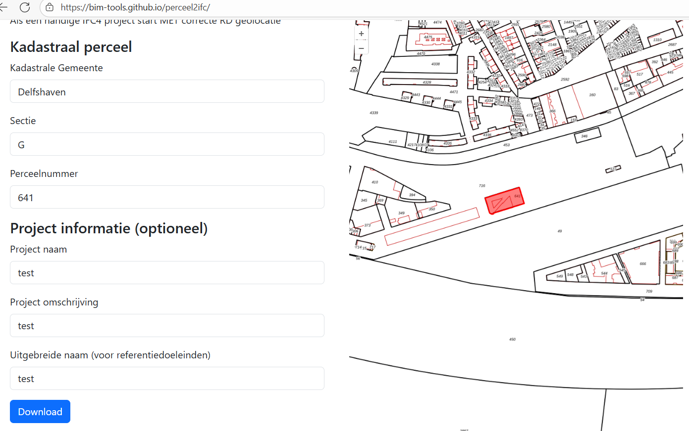
    <figcaption>
      Perceel2IFC 
    </figcaption>
</figure>

Waarden voor de geografische plaatsing van het model <a>nulpunt</a> kun je bekijken en aanpassen onder Project Setup > Geometry > Georeferencing
Dit zijn exact dezelfde waarden als IFCmapconversion. 

<figure id="Georeferentie_van_IFC_in_Blender">
    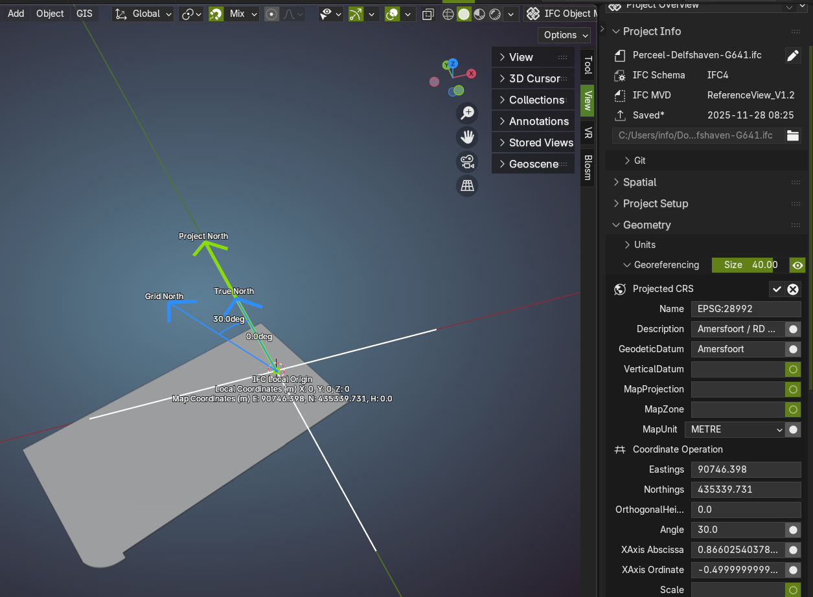
    <figcaption>
      Georeferentie van IFC bekijken in Blender 
    </figcaption>
</figure>

Gebruik het oog symbooltje en size om het visueel te laten weergeven

<figure id="Georeferentie_van_IFC_in_Blender_2">
    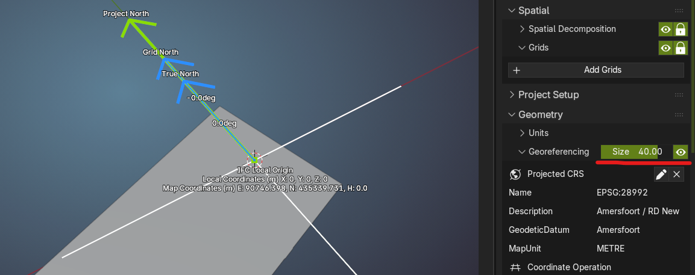
    <figcaption>
      Georeferentie van IFC bekijken in Blender 
    </figcaption>
</figure>

Handig is ook dat je de rotatie met Grid North kunt laten berekenen

<figure id="Georeferentie_van_IFC_in_Blender_3">
    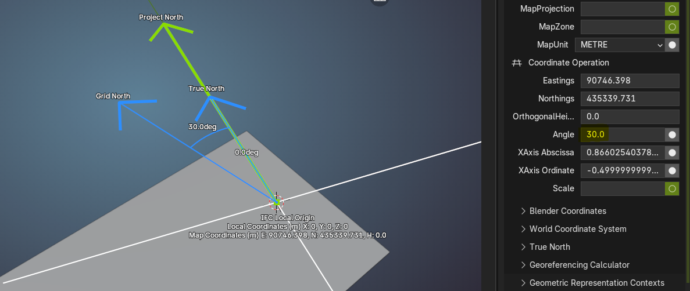
    <figcaption>
      Georeferentie van IFC bekijken in Blender 
    </figcaption>
</figure>

Op basis van deze georeferentie kan men verder modelleren in Blender. 

Het is ook mogelijk om voor een project eigen IFC Mapconversion waarden toe te voegen. Om deze te achterhalen kan men een referentie-object in een andere toepassing, bijvoorbeeld QGIS maken waarmee de RD-coordinaten en de rotatiehoek achterhaald kan worden. Open de attribuuttabel van de gecreëerde geometrie en klik op open veldberekening. Voeg nieuwe velden in decimalen toe. Met het commando: x(start_point($geometry)) kan een kolom met de x-waarde (Easting) worden toegevoegd, met y(start_point($geometry)) een kolom voor de y waarde (Northing) en met het commando degrees(azimuth( start_point($geometry),end_point($geometry))) de hoekverdraaiing (Angle). 

Deze waarden kan men invullen bij het attribuut IfcMapconversion. 

Start hiervoor een nieuw Ifc Project, het liefst in meters: 

<figure id="Georeferentie_van_IFC_in_Blender_4">
    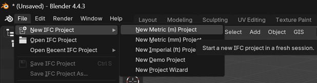
    <figcaption>
      Nieuw ifc-project, in meters, in Blender  
    </figcaption>
</figure>

Druk op het "+" teken naast IfcMapConversion en vul de juiste gegevens in.

<table id="tabel-Blender-ifcmapconversion">
  <tbody>
    <tr>
      <td></td>
      <td></td>
      <td></td>
 </table>

Sla het model op als ifc en gebruik tooling zoals ifcgref of andere toepassingen om de georeferentie te controleren. 

Importeren van Geo
Het is ook mogelijk om met de extensie BlenderGIS shapefiles in te laden. Deze worden op het Blender 0,0,0 punt gepositioneerd. Wel kan de geometrie gebruikt worden voor modellering. 

CityGML kan men importeren met de extensie: [CityGML](https://github.com/ppaawweeuu/Import_CityGML). Op deze github staat ook beschreven hoe positionering goed te krijgen. 

## Illustrator/Inkscape

In Illustrator/Inkscape werkt men op digitaal papierformaat. Zorg ervoor dat voorafgaand aan het ontwerp er een onderlegger kaartlaag gebruikt wordt met bekende punten (zoals de BGT). Download deze onderlegger in DXF. Zie [CAD-onderlegger](#cad-onderlegger) of [QGIS](#qgis) hoe dit te doen. Laad deze DXF in Illustrator/Inkscape: 

<figure id="Import_DXF_in_Inkscape">
    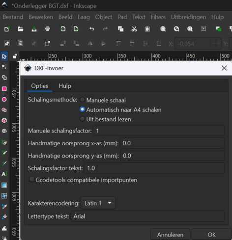
    <figcaption>
      Importeren van DXF-onderlegger in Inkscape.
    </figcaption>
</figure>

Na ontwerp kunnen de ontwerplagen inclusief de onderlegger als DXF opgeslagen worden. 

<figure id="Opslaan_Inkscape_ontwerp_als_DXF">
    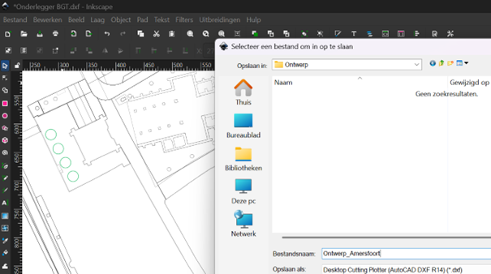
    <figcaption>
      Opslaan van een ontwerp in Inkscape als DXF
    </figcaption>
</figure>

Zonder georeferentie zal de DXF op een verkeerde locatie op de kaart getoond worden. 

<figure id="Ontwerp_Naast_Parijs">
    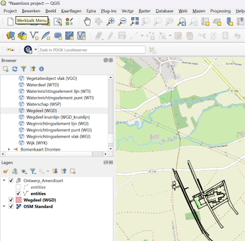
    <figcaption>
      Ontwerp wordt geplaatst naast Parijs zonder Georeferentie
    </figcaption>
</figure>

Voer de stappen van Georeferentie in QGIS uit om het DXF bestand op de juiste plaats te krijgen. 

<figure id="Ontwerp_op_de_juiste_plek_na_georeferentie">
    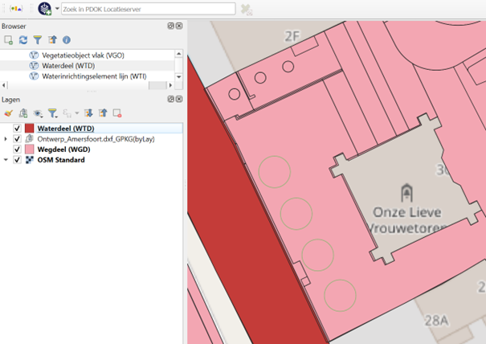
    <figcaption>
      Ontwerp op de gewenste plek na georeferentie
    </figcaption>
</figure>

Het is ook mogelijk om aanvullende objecten in DXF terug naar de ontwerptekening te converteren. Dit doet men met het inverse georefereren zoals in het QGIS hoofdstuk beschreven. Dit zorgt ervoor dat men bestaande objecten kan hergebruiken en opwerken. 

<figure id="Extra_element_naar_Inkscape">
    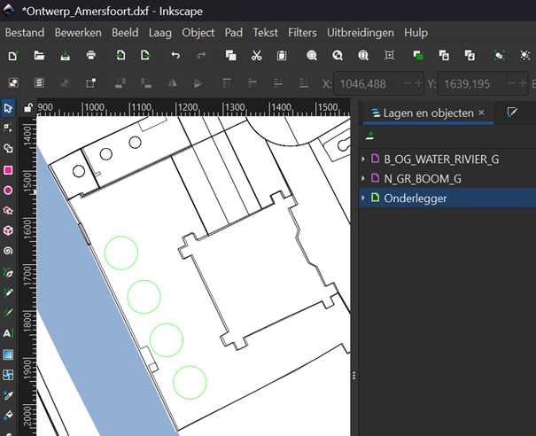
    <figcaption>
      Extra waterelement aan ontwerptekening toegevoegd door inverse georeferentie.
    </figcaption>
</figure>

In Illustrator kan dezelfde functionaliteit gebruikt worden. 

### Illustrator MAPublisher
Illustrator kent een extensie [MAPublisher](https://www.avenza.com/mapublisher/) waarmee Georeferentie in Illustrator ondersteund wordt. Er is een [handeleiding](http://download.avenza.com/Downloads/Docs/MAPublisher/MP90_TutorialGuide.pdf) beschikbaar waarin beschreven staat hoe dit werkt.

## ESRI ArcGIS

## QGIS
Voor modellen die niet geogerefereerd zijn kan men de Georeferencer in QGIS gebruiken. Dit is een methode voor 2D georeferentie. 

Laad eerst de 2D Vector-modellen in. Voor 2D autocad kan dit DXF zijn. 
Gebruik in dit geval de plug-in DXF-AnotherDXFImporter

<figure id="QGIS_Georeferencer">
    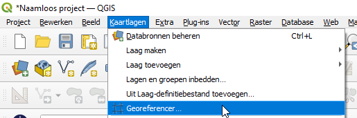
    <figcaption>
      QGIS Georeferencer
    </figcaption>
</figure>

Door bekende punten uit het model in te voeren of te positoneren op de kaart, worden de waardes voor Helmert transformatie berekend.   

<figure id="QGIS_Georeferentie_resultaat">
    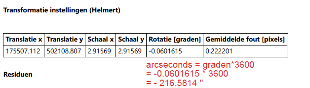
    <figcaption>
      QGIS Georeferentie rapportage
    </figcaption>
</figure>

De proj-parameters worden door QGIS ingevuld zodat hiermee een 2D BIM-model juist geogerefereerd wordt. 
<figure id="QGIS_Vector_Conversie_2">
    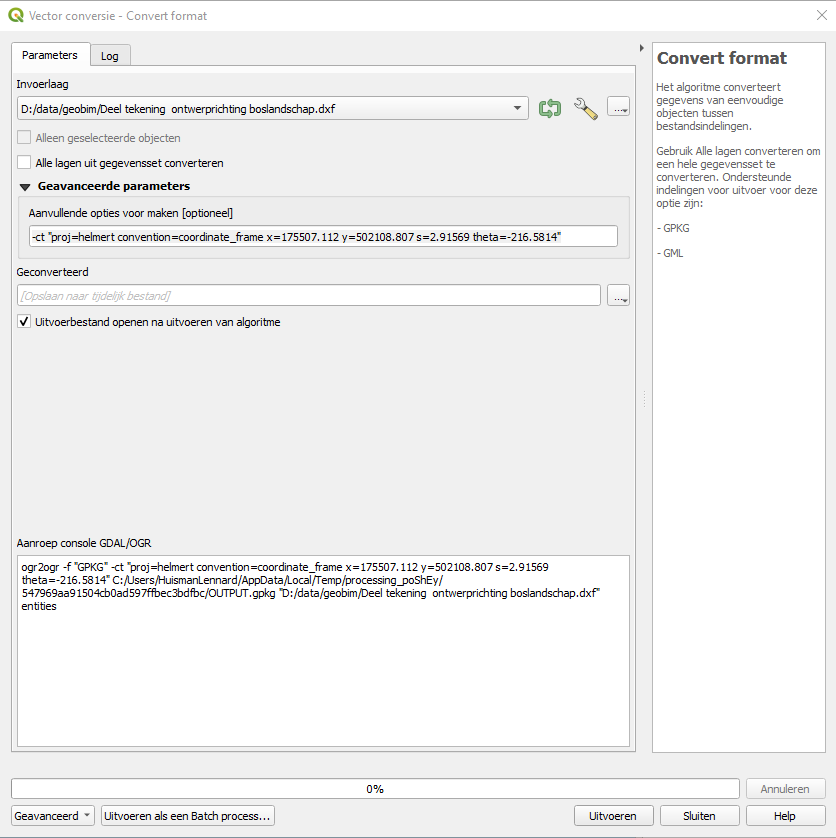
    <figcaption>
      QGIS Vector Conversie 
    </figcaption>
</figure>

Door een inverse van de proj-parameter te gebruiken kunnen ook objecten uit een geogerefereerde set, zoals de BGT (RD) naar een Lokaal coordinatenstelsel worden geconverteerd. 
<figure id="QGIS_Inverse-Vector_Conversie">
    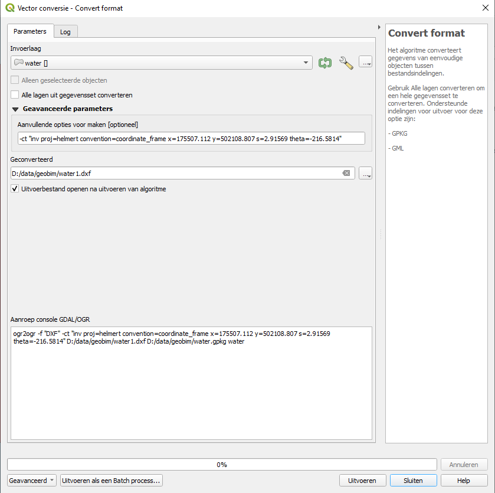
    <figcaption>
      QGIS Inverse Vector Conversie 
    </figcaption>
</figure>

<mark> Nog onderzoeken of 3D Georeferentie ook mogelijk is </mark>

**Controle van 3D Georeferentie van een IFC in QGIS:**
Converteer IFC naar GeoJSON, bijvoorbeeld met [ifc2gis](https://citygeometrix.com/ifc2gis/) en download de file. Maak eventueel de GeoJSON file kleiner door een beperkte selectie van de IFC-elementen te maken. Bijvoorbeeld alleen de slabs en walls. 

Voeg een nieuwe vectorlaag toe in QGIS en selecteer de GeoJSON-file. 

Open, bijvoorbeeld met de PDOK-Locatieserver-plugin, vanuit de PDOK de BAG en de BGT. 

Open een nieuwe 3D-kaartweergave. 
Druk met de rechter muisknop op de 3D geoJSON file en klik op eigenschappen. 
Klik op de 3D-weergave en selecteer Enkel Symbool.
<figure id="QGIS_Georeferentie_controle">
    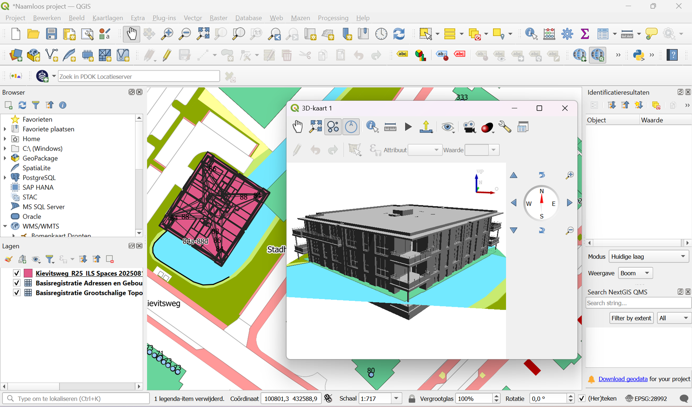
    <figcaption>
      QGIS Georeferentie controle
    </figcaption>
</figure>

Het is hiermee mogelijk om visueel te controleren hoe het model positioneert ten opzichte van de BAG en BGT. Houdt hiermee rekening met de nauwkeurigheid van de BAG en BGT, zie <a href="04%20Gebruik%20van%20geo-datasets%20voor%20georeferentie.md#geo-datasets-voor-het-refereren-van-modellen">Geo datasets voor georefereren</a>

<mark> Onderstaande nog </mark>
GDAL - Toolbox processing
GDAL Vetor Converse Covert Format 

Kaartlagen, georeferencer: DXF - openen - Ground Contro Punt Toevoegen - Kaart in de kaart toeveogen (of handmatig invoeren)
Dit voor 4 punten doen. Druk op run 

Hiermee krijg je de affine transformatie (Dat is een super-klasse van helmert)

Zie: [IFC2GIS procedure video van Hans Lammerts](https://www.youtube.com/watch?v=pBAhAcyTLSY&t=86s)
https://forums.buildingsmart.org/t/ifc-to-gis/6115/8
