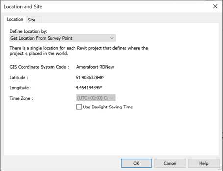

# Handleiding Software

# Software

## CAD Onderlegger 
Voor het Georefereren van BIM-modellen kan het handig zijn om een CAD-bestand van de locatie te gebruiken als onderlegger. Je kan je opdrachtgever vragen een onderlegger aan te leveren maar je kan er ook zelf een maken:

Optie 1: 2D 1. Ga naar Pdok en selecteer in de [BGT download-viewer](https://app.pdok.nl/lv/bgt/download-viewer/) je gewenste locatie.

2. Unzip je downloadbestand. 3. Drag-drop je bestanden in [QGIS](https://qgis.org/download/).

4. In QGIS ga naar Project>Import/Export>Export Project to DXF…

Optie 2: 3D 1. Ga naar [3D BAG](https://www.3dbag.nl/nl/download) en selecteer je gewenste locatie (tegel).

2. Download je bestand en kies Geopackage (GPKG) als bestandformaat. 3. Drag-drop je bestanden in QGIS.

4. In QGIS ga naar Project>Import/Export>Export Project to DXF…

## Revit

*Begrippen*

*Internal Origin:* De oorsprong in Revit. Dit punt is niet te verplaatsen.

*Project Basepoint:* Lokaal Coördinatiepunt. Dit punt wordt gebruikt om modellen op elkaar af te stemmen b.v. tijdens engineering en/of wanneer Georeferentie niet relevant is.
*Survey Point:* CRS-Coördinatiepunt. CRS-Coördinatiepunt . Dit punt wordt gebruikt om de relatie te leggen met een coördinatenstelsel en zo de positie van het model op de aardbol vast te leggen.

*Project Units:* De instelling van de standaard eenheden binnen het project. Hier kan b.v. opgegeven worden of er met meters of met millimeters wordt gewerkt.

*Methode 1:* link DXF, DWG of RVT
1.	Gebruik een DXF, DWG of een RVT die op de juiste coördinaten is gemaakt als onderlegger en link die in Revit. (NB: het is handig om bij het linken op te geven dat het bestand in meters is). Gebruik bij voorkeur een onderlegger die gegeorefereerd is zodat Revit de EPSG-code overneemt en je die niet handmatig hoeft toe te voegen.
2.	Als er, zoals bij de start van een project, nog geen model is dan is het handig om in de onderlegger de positie van het CRS-Coördinatiepunt op te geven (kies een plek met hele X- en Y-waarden in het coördinatenstelsel).
3.	Verplaats en roteer de onderlegger naar een bekend punt of naar het model zodat de onderlegger op de juiste positie staat. Je verplaatst dus niet het model naar de juiste locatie maar je verplaatst de locatie naar het model.
4.	Gebruik ‘Aquire Coordinates’ en selecteer de onderlegger om de coördinaten over te nemen. (NB: “Save Position” van de DXF of DWG niet gebruiken, Revit maakt anders een Shared Coordinates bestand aan en wijzigt de locatie van de DXF of DWG waardoor die niet meer correct is.
5.	Selecteer het Survey Point, unclip het en verplaatst het naar de gekozen X- en Y-waarden van het CRS-Coördinatiepunt (hele X- en Y-waarden in het RD-stelsel) en geef als Z-waarde de hoogte ten opzichte van N.A.P. op. Clip vervolgens het Survey Point en verplaats het Survey Point in de Z-richting terug naar 0.
6.	Plaats een coördinatie-object op het Survey Point.
7.	Plaats een coördinatie-object op het Project Basepoint.
8.	Als het ontwerp zover is dat de stramienen vaststaan dan kan het Project Basepoint verplaatst worden zodat die op 5 of 10m van de eerste stramienen staat zoals gebruikelijk. Vóór het verplaatsten moet het Project Basepoint ge-unclipt worden. Verplaats vervolgens ook een coördinatie-object naar de nieuwe positie van het Project Basepoint.

*Methode 2: Project Basepoint en Survey Point aanpassen*
1.	Geeft het Revit bestand of een DWG-export uit het Revit bestand aan een landmeter of een BIM- of GIS-specialist en vraag om de RD-coördinaten van het Lokaal Coördinatiepunt (Project Basepoint) en vraag om een voorstel voor het CRS-Coördinatiepunt (Survey Point). 
2.	Zet in Revit de Project Units op meter.
3.	Unclip het Survey Point en verplaats het naar de opgegeven coördinaten van het Lokaal Coördinatiepunt (Project Basepoint). (NB: N/S=Y en E/W=X).
4.	Clip het Survey Point en verplaats het naar het Project Basepoint.
9.	Unclip het Survey Point en verplaats het naar de opgegeven coördinaten van het CRS-Coördinatiepunt (Survey Point) en geef als Z-waarde de hoogte ten opzichte van N.A.P. op. Clip vervolgens het Survey Point en verplaats het Survey Point in de Z-richting terug naar 0.
5.	Selecteer het Project Basepoint en geef de hoekverdraaiing ten opzichte van Grid-noord (True North) op. Het gaat hier om de hoekverdraaiing van Project North naar True North waarbij positief = tegen de klok in en negatief is met de klok mee. Revit zal negatieve hoekverdraaiingen omrekenen naar een positieve hoekverdraaiing.
6.	Zet eventueel de Project Units terug naar millimeter.

 *Controle*
 Het venster "Location and Site" geeft aan of alles goed is gegaan.
 

*Units*

Door een omissie in de IFC-exporter van Revit moet voorafgaand aan het exporteren naar IFC de Project Units Length op meter ingesteld worden.

*Export naar IFC*
1.	Lokaal Coördinatiepunt: exporteer een IFC (4 of hoger) met Project Basepoint als Coordinate Base. De IFC is niet ge-Georefereerd (alleen de coordinaten van Project Basepoint zijn correct) en niet Grid-noord gericht (Project North in Revit).

2.	CRS-Coördinatiepunt: exporteer een IFC (4 of hoger) met Survey Point als Coordinate Base. Vul bij EPSG Code in: 28992. De IFC is ge-Georefereerd en is Grid-noord gericht (True North in Revit)

Hans Hendriks (2022)
https://github.com/Hans-Lammerts/Sample-Test-Files/blob/master/Geolocation%20information%20from%20Revit%20to%20IFC_v1.0.pdf

## Autocad Civil 3D

## ArchiCAD
Instellen Georeferentie (via de IFC4 “MapConversion” methode) voor het exporteren vanuit ArchiCAD. De exacte benamingen kunnen iets afwijken afhankelijk van de versie (AC 23, 24, …), maar de kernstappen blijven gelijk.

1. Projectlocatie instellen

Ga naar Options > Project Preferences > Project Location….
Vul hier de geografische coördinaten (latitude/longitude), eventueel hoogte, en stel de juiste kaartprojectie (indien van toepassing) in. 
Plaats in het model een Survey Point (Meetpunt) op de juiste locatie in het terrein waarmee je het coördinatenreferentiepunt vastlegt. 
In de instellingen van de Survey Point kun je bij “Geo-referencing Map…” de waarden invullen voor datum, coördinatensysteem etc. 

Tip: Werk het liefst zo dicht mogelijk op de project-oriëntatie in ArchiCAD zodat grote offset-waarden in het IFC-bestand worden vermeden. 

2. Instellen van de IFC-exporttranslator

Ga naar File > Interoperability > IFC > IFC Translators
Maak een nieuwe translator aan of dupliceer een bestaande (bijv. “General Export”) zodat je wijzigingen veilig kunt testen. 
In de translator instellingen:
Kies bij IFC Schema voor IFC4. 
Kies het juiste Model View Definition (MVD) zoals “Design Transfer View” indien vereist. 
In de tab “Geometry Conversion” (of gelijknamige) kies je de juiste plaatsing voor de “IfcSite” entiteit. Bij IFC4 wordt de positie van het site-entiteit gekoppeld aan het Survey Point of het Project Origin. 

Bijvoorbeeld:

“Match IFC Site location with Survey Point position” → gebruikt het Survey Point als coördinaatreferentie.
“Match IFC Site location with Project Origin” → gebruikt het ArchiCAD Project Origin als referentie.
Controleer in de Data Conversion/Units sectie dat de exportunits correct zijn ingesteld en dat “IFC Base Quantities” aangevinkt is indien gewenst. 

3. Specifieke instellingen voor georeferentie (IFC4 MapConversion)

Bij IFC4 wordt de georeferentie opgenomen via de entiteiten IfcMapConversion en IfcProjectedCRS in plaats van slechts losse property sets zoals in IFC2x3. Zorg ervoor dat:In de Project Location en Survey Point de juiste coördinaten en datum/kaartprojectie zijn ingevuld.
In de translator instellingen de “Match IFC Site location …” correct staat (zoals hierboven).
Bij export wordt gecontroleerd of de outputbestand de entiteit IfcMapConversion bevat (dit kun je openen als tekst in een IFC-viewer of teksteditor).

4. Export uitvoeren en controle

Sla je project op.
Onder File > Save As… of via File > Interoperability > IFC > Save as IFC…, selecteer je de gekozen translator.
Exporteer het bestand.
Open het geëxporteerde IFC bestand in een IFC-viewer (bijv. BIMcollab ZOOM) en controleer of:
De georeferentie informatie aanwezig is (IfcMapConversion / IfcProjectedCRS).
Het model correct gepositioneerd is t.o.v. de verwachte coördinaten.
Test eventueel import in een andere software (bijv. GIS-omgeving of BIM coördinatie tool) om zeker te zijn dat de locatie klopt.

5. Aandachtspunten / valkuilen

De ingevoerde coördinaten in Project Location verplaatsen niet automatisch de geometrie in ArchiCAD: ze worden opgenomen als metadata voor export. 
Werken met zeer grote coördinaatwaarden (bijv. UTM meters ver weg van 0,0) kan leiden tot precisieproblemen in export/import workflows: probeer model origin zo dicht mogelijk bij projectlocatie te houden. Bij import in andere software kan de “site origin” verkeerd worden geïnterpreteerd indien de instellingen van “Match IFC Site location” niet goed staan. Controleer altijd dat de gebruikte translator versie compatibel is met IFC4 en de gewenste MVD.

## Tekla Structures
In Tekla Structures kan met behulp van **Basispunten** een coördinatensysteem voor uitwisselbaarheid worden gebruikt. Bijvoorbeeld voor het importeren en exporteren van IFC-bestanden. Deze basispunten worden gebruikt om het model nauwkeurig te positioneren en uit te lijnen binnen een groter coördinatensysteem. Ze zorgen voor consistente samenwerking en correcte uitwisseling van modellen tussen verschillende partijen.

1. Basispunten definiëren
   
Basispunten kunnen gedefinieerd worden in de **Projecteigenschappen** van Tekla Structures. 
Klik op _Bestand > Projecteigenschappen > Basispunten_ om het dialoogvenster **Basispunt** te openen. Definieer de benodigde gegevens zoals de coördinaten (1) en een eventuele hoek bij de optie Hoek naar het noorden (2) en sla het basispunt op onder een naam door op de “+” knop te klikken (3):

2. IFC exporteren
   
Klik op Bestand > Exporteren > IFC4 om het dialoogvenster **IFC exporteren** te openen.
Selecteer bij Locatie door het gedefinieerde basispunt:

Definieer vervolgens de overige benodigde gegevens. Bij de optie _Basispunt exporteren_ kan gekozen worden voor de methode _IfcMapConversion_ of _IfcSite_ als export-setting van dit betreffende Basispunt.

3. IFC importeren
   
Voor het importeren van IFC-modellen wordt in Tekla Structures de functionaliteit **Referentiemodellen** gebruikt.
Klik in het zijpaneel op Referentiemodellen:

Klik vervolgens op de knop **+ Model toevoegen** om het dialoogvenster **Model toevoegen** te openen. Selecteer bij Locatie door het gedefinieerde basispunt:

Blader vervolgens naar het betreffende IFC-bestand en klik op de knop **Model toevoegen** om het IFC-model in te voegen.

Meer informatie over basispunten in Tekla Structures:

Een uitgebreide uitleg over basispunten in de Tekla User Assistance:
https://support.tekla.com/nl/doc/tekla-structures/2025/int_base_point

Een webinar (2020) over basispunten: https://www.youtube.com/watch?v=iAdi_x3enPE&t=900s

--- 

## Sketchup

georeference: https://www.youtube.com/shorts/G2dFYtu4daI
geolocation: https://www.youtube.com/shorts/SZ47268CLI8

--- 

## Blender
--- 
Methode is numeriek, de waarde die wilt gebruiken moet je vooraf hebben bepaald. 
Een goed begin is de site IFC2Perceel https://bim-tools.github.io/perceel2ifc/

Waarden voor de geografische plaasing van het model nulpunt kun je bekijken en aanpassen onder Project Setup > Geometry > Georeferencing
Dit zijn extat dezelfde waarden als IFCmapconersion. 

Gebruik het oog symbooltje en size om het visueel te laten weergeven

Handig is ook dat je de rotatie met Grid North kunt laten berekenen

Meer achtergrond over de andere mogelijkheden van georeferencing in Bonsai: https://docs.bonsaibim.org/guides/authoring/advanced_modeling/georeferencing.html

## Illustrator/Inkscape
--- 
The workflow is to:

Georeference the raster in QGIS
Digitize/Vectorize in QGIS
Depending on your map, the above workflow will still be faster than attempting to georeference the vectors you created, compare: How to georeference a vector layer with control points?

https://gis.stackexchange.com/questions/195527/qgis-use-svg-file-as-a-layer

### Illustrator MapPublisher
https://www.youtube.com/watch?v=SfBNL8TvAC8

## QGIS
Plug-in DXF - AnotherDXFImporter

https://opengislab.com/blog/tag/Convert+DXF+DWG

GDAL - Toolbox processing
GDAL Vetor Converse Covert Format 

Kaartlagen, georeferencer: DXF - openen - Ground Contro Punt Toevoegen - Kaart in de kaart toeveogen (of handmatig invoeren)
Dit voor 4 punten doen. Druk op run 

Hiermee krijg je de affine transformatie (Dat is een super-klasse van afine)
