# Validatie van gegeorefereerde IFC-modellen
Dit hoofdstuk beschrijft hoe de gegeorefereerde IFC-modellen zijn getest in verschillende GIS-omgevingen om de interoperabiliteit en bruikbaarheid te beoordelen.

## Doel van de validatie 
Het doel van deze validatie is om te beoordelen in hoeverre de informatie van de gegeorefereerde IFC-modellen over komen in gangbare GIS-omgevingen. Door de modellen te testen in zowel ArcGIS Pro als QGIS wordt inzicht verkregen in welke mate de volgende informatie mee komt:
-	Locatie
-	Hoogte
-	Oriëntatie
-	Schaal

De gebruikte datasets zijn:

- Van Brienenoordbrug-IFC4X3.ifc
- ifcbridge-model01_georeferenced.ifc
- ifcbridge-model02_georeferenced.ifc
- ifcbridge-model03_georeferenced.ifc
- Kievitsweg_R25_ILS Spaces 20250815_LoGeoRef.ifc
- Kievitsweg_R25_ILS Spaces 20250815_LoGeoRef10.ifc
- Kievitsweg_R25_ILS Spaces 20250815_LoGeoRef20.ifc
- Kievitsweg_R25_ILS Spaces 20250815_LoGeoRef30.ifc
- Kievitsweg_R25_ILS Spaces 20250815_LoGeoRef40.ifc
- Kievitsweg_R25_ILS Spaces 20250815_LoGeoRef50.ifc

## Resultaten in ArcGIS
De IFC modellen zijn direct ingelezen in ArcGIS Pro zonder extra tools of andere (referentie) bestanden. De validatie is uitgevoerd met ArcGIS Pro 3.5.

<table style="width:100%; table-layout:fixed;">
  <tr>
    <th style = "width:100px;"> Naam</th>
    <th style = "width:200px;"> Afbeelding </th>
    <th style = "width:50px;"> Locatie </th>
    <th style = "width:50px;"> Hoogte </th>
    <th style = "width:50px;"> Oriëntatie </th>
    <th style = "width:50px;"> Schaal </th>
    <th> Opmerkingen</th>
  </tr>
  <tr>
    <td>Van Brienenoordbrug-IFC4X3.ifc </td>
    <td>
      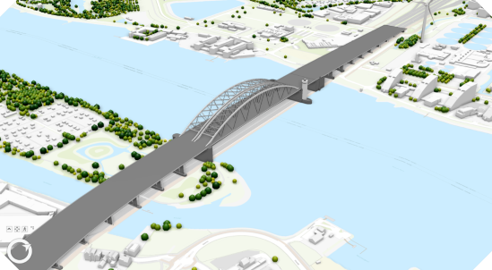
    </td>
    <td> ✅ </td><td> ✅ </td><td> ✅ </td><td> ✅ </td> <td> Komt goed over </td>
  </tr>
  <tr>
    <td>ifcbridge-model01_georeferenced.ifc </td>
    <td>
      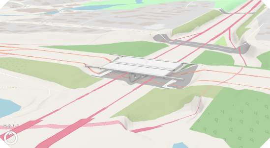
    </td>
    <td> ✅ </td><td> ✅ </td><td> ✅ </td><td> ✅ </td> <td> Komt goed over </td>
  </tr>
  <tr>
    <td>ifcbridge-model02_georeferenced.ifc </td>
    <td>
      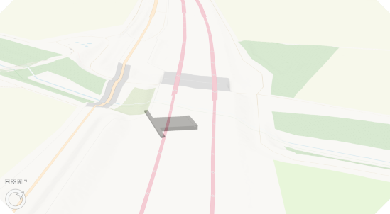
    </td>
    <td> ✅ </td><td> ❌ </td><td> ❌ </td><td> ✅ </td> <td> Ligt onder maaiveld </td>
  </tr>
  <tr>
    <td>ifcbridge-model03_georeferenced.ifc </td>
    <td>
      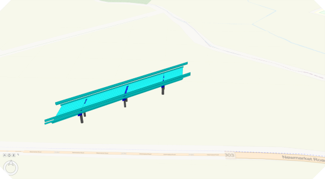
    </td>
    <td> 🔶 </td><td> ❌ </td><td> 🔶 </td><td> 🔶 </td> <td> Ligt ver boven het maaiveld, mogelijk verkeerde locatie </td>
  </tr>
  <tr>
    <td>Kievitsweg_R25_ILS Spaces 20250815_LoGeoRef.ifc</td>
    <td>
      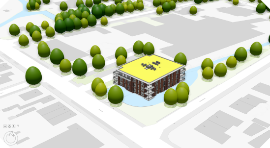
    </td>
    <td> 🔶 </td><td> ❌ </td><td> 🔶 </td><td> 🔶 </td> <td> Komt goed over </td>
  </tr>
  <tr>
    <td>Kievitsweg_R25_ILS Spaces 20250815_LoGeoRef10.ifc</td>
    <td>
      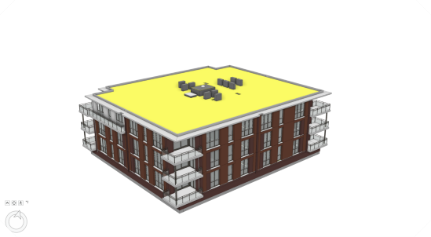
    </td>
    <td> ❌ </td><td> 🔶 </td><td> ✅ </td><td> ✅ </td> <td> 0,0 punt van RD </td>
  </tr>
  <tr>
    <td>Kievitsweg_R25_ILS Spaces 20250815_LoGeoRef20.ifc</td>
    <td>
      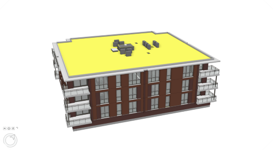
    </td>
    <td> ❌ </td><td> 🔶 </td><td> ✅ </td><td> ✅ </td> <td> 0,0 punt van RD </td>
  </tr>
  <tr>
    <td>Kievitsweg_R25_ILS Spaces 20250815_LoGeoRef30.ifc</td>
    <td>
      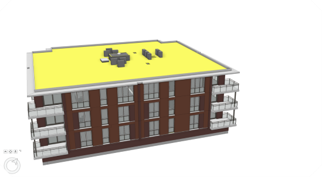
    </td>
    <td> ❌ </td><td> 🔶 </td><td> ✅ </td><td> ✅ </td> <td> 0,0 punt van RD </td>
  </tr>
  <tr>
    <td>Kievitsweg_R25_ILS Spaces 20250815_LoGeoRef40.ifc</td>
    <td>
      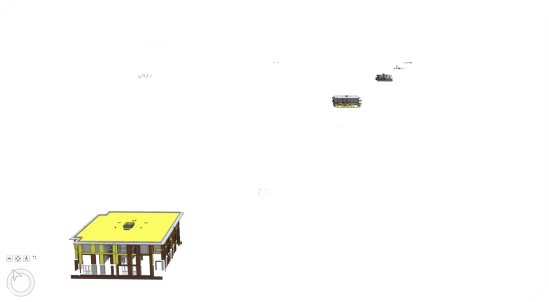
    </td>
    <td> ❌ </td><td> 🔶 </td><td> ✅ </td><td> ✅ </td> <td>  0,0 punt van RD en het gebouw is ‘exploded’ </td>
  </tr>
  <tr>
    <td>Kievitsweg_R25_ILS Spaces 20250815_LoGeoRef50.ifc</td>
    <td>
      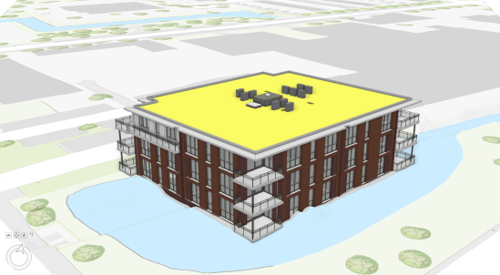
    </td>
    <td> ✅ </td><td> ✅ </td><td> ✅ </td><td> ✅ </td> <td>  0,0 punt van RD en het gebouw is ‘exploded’ </td>
  </tr>
</table>

✅ = volledige support
🔶 = gedeeltelijke/non-standaard support
❌ = geen support

De validatie toont aan dat zodra een IFC-model correct is gegeorefereerd op level 50, zoals aanbevolen in dit paper, het model probleemloos wordt ingelezen in ArcGIS Pro. Het model verschijnt op de juiste geografische locatie, met correcte hoogte, rotatie en schaal, waardoor de ruimtelijke context volledig behouden blijft. Dit bevestigt dat het toepassen van de georeferentie op het juiste niveau cruciaal is voor een consistente integratie van BIM-data in GIS-omgevingen. 

## Resultaten in QGIS
De IFC modellen zijn ingelezen in QGIS, waarbij er gerbuik is gemaakt van de [ifcGeoBIM](https://colab.research.google.com/drive/1KsXuZU7zbsblhQcmUekDEG9VMCSjN_SB?usp=sharing) notebook zonder gebruik te maken van andere (referentie) bestanden. De modellen zijn gevalideerd aan de hand van de volgende criteria: de aanwezigheid van een referentievermelding en de correcte vastlegging van hoogte, locatie, oriëntatie en schaal. Eventuele opmerkingen die tijdens de inspectie van de modellen in QGIS zijn vastgesteld, zijn opgenomen in de kolom opmerking.

<table style="width:100%; table-layout:fixed;">
  <tr>
    <th style = "width:100px;"> Naam</th>
    <th style = "width:200px;"> Afbeelding </th>
    <th style = "width:50px;"> Referentie </th>
    <th style = "width:50px;"> Locatie </th>
    <th style = "width:50px;"> Hoogte </th>
    <th style = "width:50px;"> Oriëntatie </th>
    <th style = "width:50px;"> Schaal </th>
    <th> Opmerkingen</th>
  </tr>
  <tr>
    <td>Van Brienenoordbrug-IFC4X3.ifc </td>
    <td>
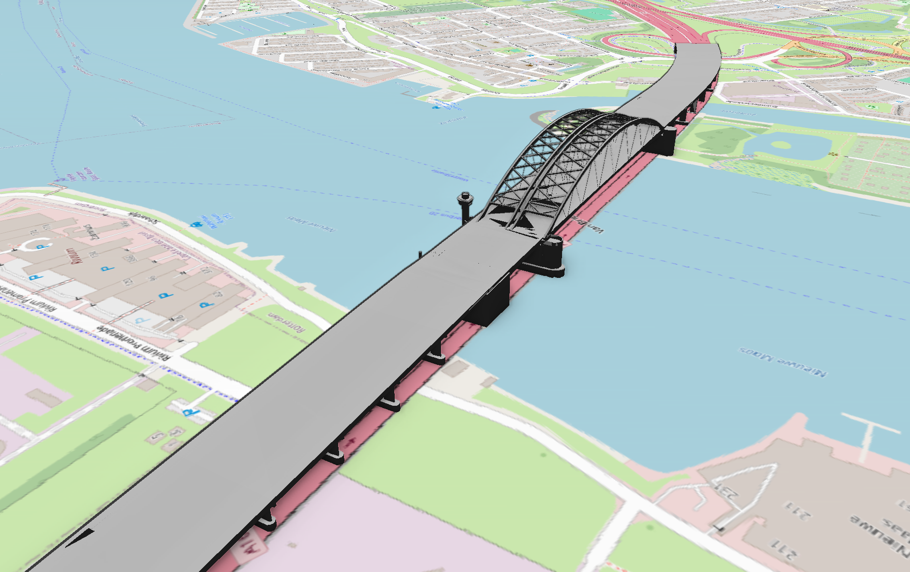
    </td>
    <td> EPSG:28992 </td><td> ✅ </td><td> ✅</td><td> ✅ </td> <td> ✅</td> <td> Kleine verschuiving in XYZ is zichtbaar tov het AHN zie onderstaande <a class="self-link" href="#AHN4vsIFC">figuur</a></td>
  </tr>
  <tr>
    <td>ifcbridge-model01_georeferenced.ifc </td>
    <td>
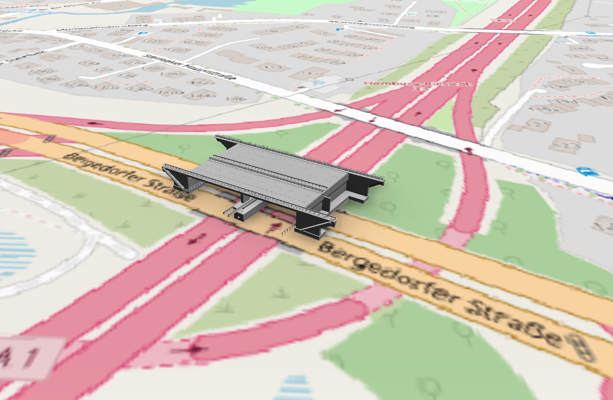
    </td>
   <td> EPSG:8395 </td><td> ✅ </td><td> ✅ </td><td> ✅ </td> <td> ✅ </td><td>-</td>
  </tr>
  <tr>
    <td>ifcbridge-model02_georeferenced.ifc </td>
    <td>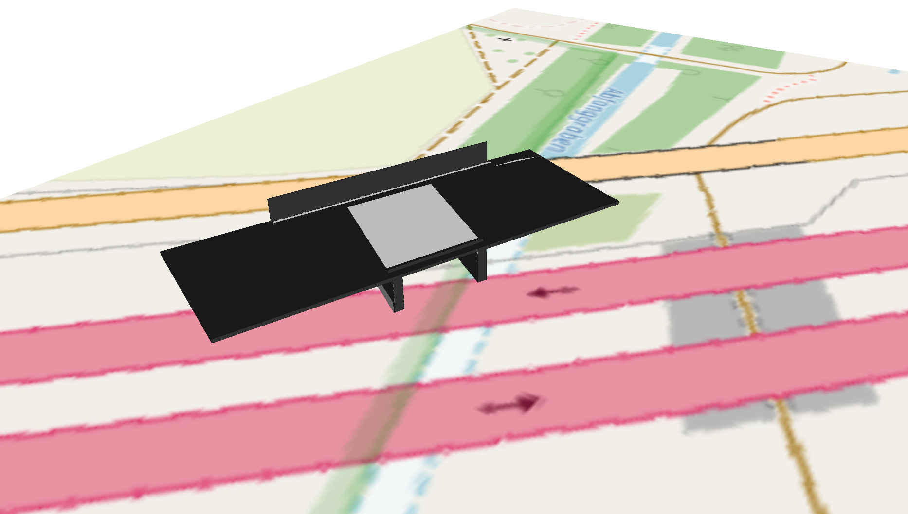</td>
<td> EPSG:31468 </td></td><td> ✅ </td><td> 🔶 </td><td> 🔶 </td> <td> 🔶</td><td>Er zijn correcties toegepast voor de schaal (0,001) en de hoogte (-10 m). Voor deze praktijktoets zijn geen geo-referentiegegevens beschikbaar ter verificatie.</td>
  </tr>
  <tr>
    <td>ifcbridge-model03_georeferenced.ifc </td>
    <td>
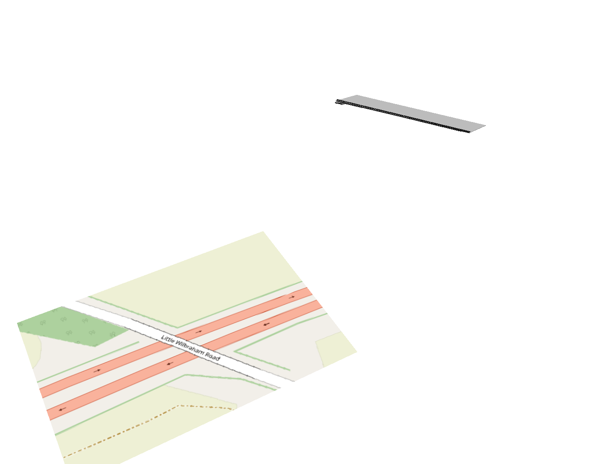
    </td>
       <td> EPSG:27700 </td><td> ✅ </td><td> 🔶 </td><td> 🔶 </td> <td> 🔶</td><td>De schaalcorrectie bedraagt 0,001 en de oriëntatie is -1,0. Voor deze praktijktoets zijn geen geo-referentiegegevens beschikbaar ter verificatie. Tevens is geen MapUnit gedefinieerd in het model.</td>
  </tr>
  <tr>
    <td>Kievitsweg_R25_ILS Spaces 20250815_LoGeoRef_Totaal.ifc</td>
    <td>
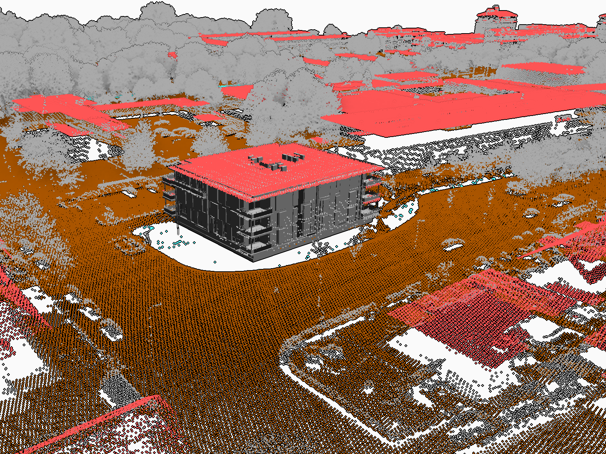
    </td>
       <td> Real </td><td> ✅ </td><td> ✅  </td><td> ✅  </td> <td> ✅ </td><td> In de orientie is er een kleine verschuiving zichtbaar tov het AHN </td>
  </tr>
  <tr>
    <td>Kievitsweg_R25_ILS Spaces 20250815_LoGeoRef10.ifc</td>
    <td> 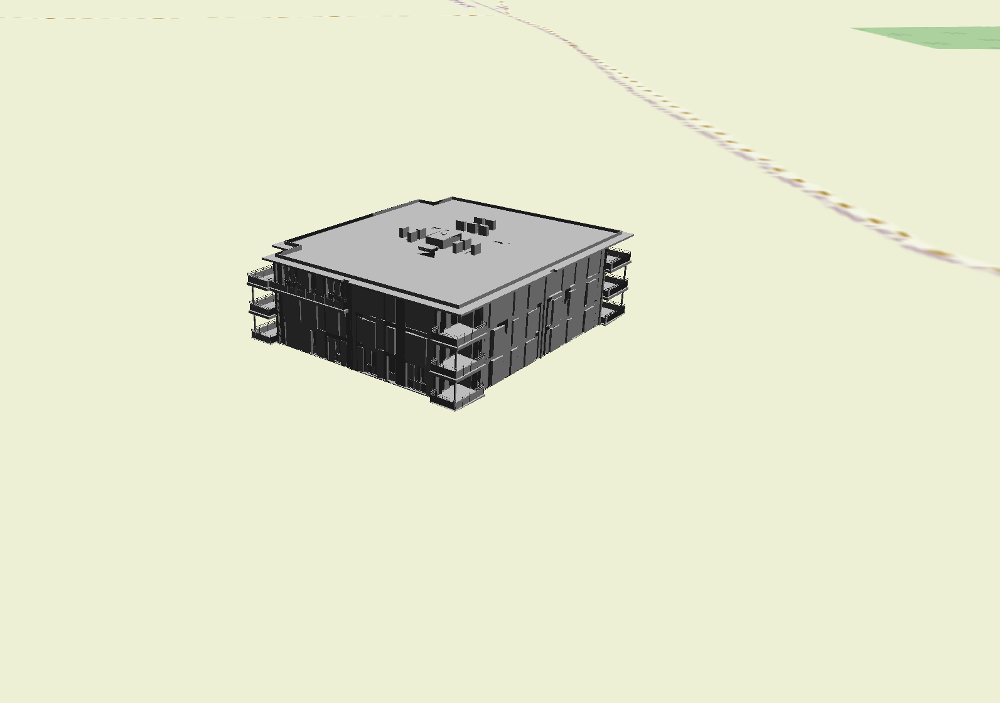
    </td>
      <td>EPSG:28992 (Fake) </td><td> ❌ </td><td>✅ </td><td>✅ </td> <td> 🔶 </td><td>Het coördinatensysteem is correct gespecificeerd. Echter ontbreken correcte northing- en easting-waarden in de IFC. De schaal is niet expliciet gedefinieerd in het model, maar dit heeft geen consequenties vanwege de correcte hoogte-informatie</td>
  </tr>
  <tr>
    <td>Kievitsweg_R25_ILS Spaces 20250815_LoGeoRef20.ifc</td>
    <td>
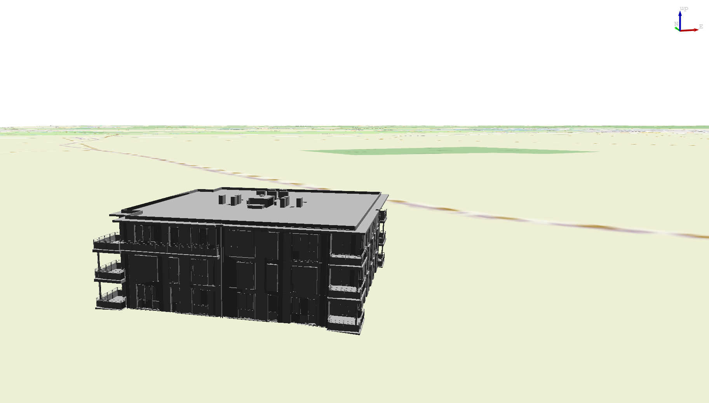
    </td>
       <td> EPSG:28992 (Fake) </td><td>❌ </td><td> ✅ </td><td>✅ </td> <td>🔶 </td><td>Het coördinatensysteem is correct gespecificeerd. Echter ontbreken correcte northing- en easting-waarden in de IFC. De schaal is niet expliciet gedefinieerd in het model, maar dit heeft geen consequenties vanwege de correcte hoogte-informatie </td>
  </tr>
  <tr>
    <td>Kievitsweg_R25_ILS Spaces 20250815_LoGeoRef30.ifc</td>
    <td>
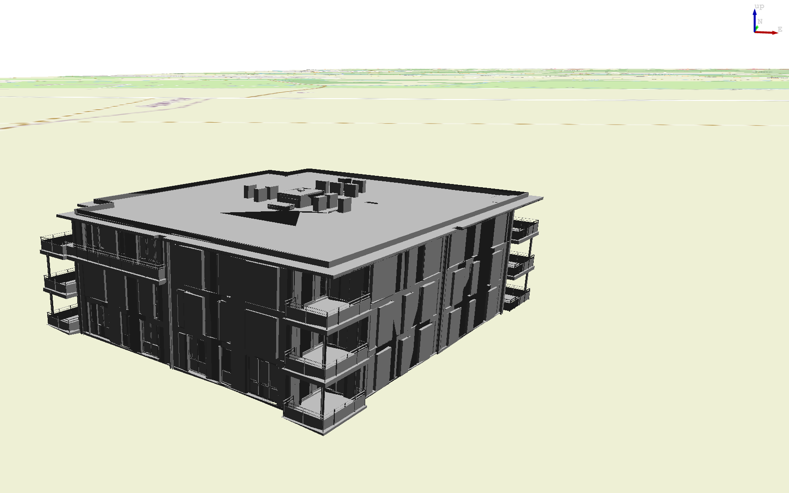
    </td>
       <td> EPSG:28992 (Fake) </td><td> ❌ </td><td> ✅ </td><td> ✅ </td> <td> 🔶 </td><td>Het coördinatensysteem is correct gespecificeerd. Echter ontbreken correcte northing- en easting-waarden in de IFC. De schaal is niet expliciet gedefinieerd in het model, maar dit heeft geen consequenties vanwege de correcte hoogte-informaties</td>
  </tr>
  <tr>
    <td>Kievitsweg_R25_ILS Spaces 20250815_LoGeoRef40.ifc</td>
    <td>
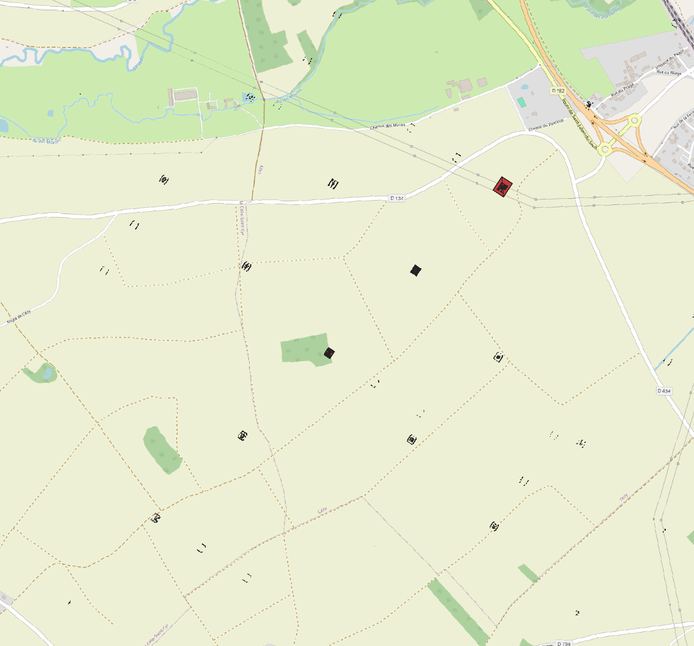
    </td>
       <td> EPSG:28992 (Fake) </td><td> ❌ </td><td> ✅ </td><td> ✅ </td> <td> ?</td><td>coordinaten systeem goed aangegeven, maar geen correct northing en easting in de ifc aanwezig;schaal niet aangegeven in het model, verder is dit model uit geklapt.. </td>
  </tr>
  <tr>
    <td>Kievitsweg_R25_ILS Spaces 20250815_LoGeoRef50.ifc</td>
    <td>
 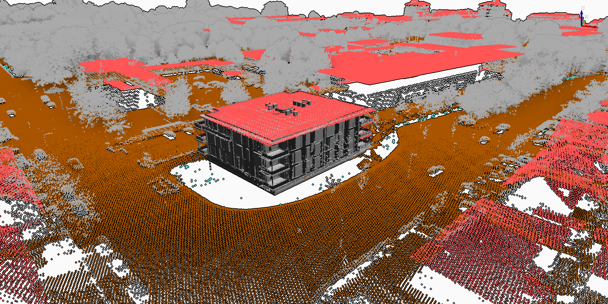
    </td>
       <td> EPSG:28992 </td><td> ✅ </td><td> ✅ </td><td> ✅ </td> <td> ✅ </td><td>-</td>
  </tr>
</table>

✅ = Volledig geodetisch Correct
🔶 = Geeltelijk correct, maar bevat fouten.
❌ = Niet correct

Figuur ter verduideling van de opmerking, geplaatst bij de brienenoord brug.
<figure id="AHN4vsIFC" style="text-align: center; margin: 0 auto;">
  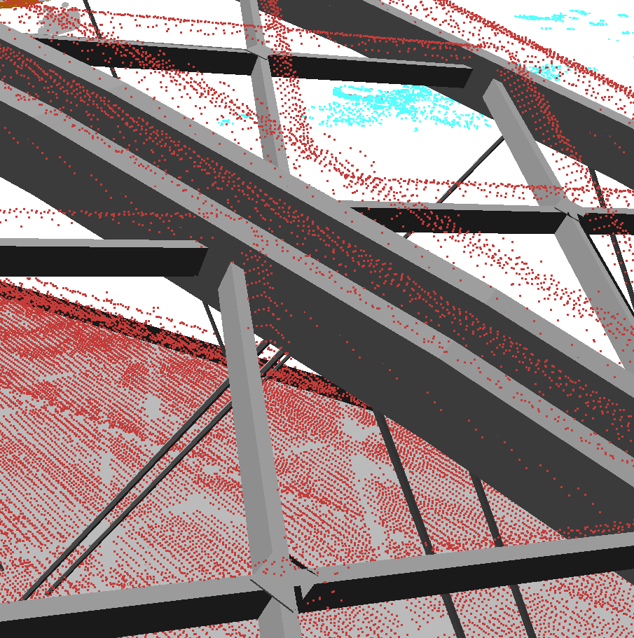
  <figcaption style="font-size: 0.9em;">
    AHN4 (rood) vergeleken met het IFC model (grijs)
  </figcaption>
</figure>

